<!--
Hero carousel for index.qmd. Four feature illustrations, each labelled and
linked to the page it describes. Self-contained: no Bootstrap carousel.

To add or remove a slide, add or remove a matching `pt-carousel__slide`,
`pt-carousel__seg`, and `pt-carousel__captionItem` (in that order). The rail
divides itself evenly, so no CSS change is needed. Styles live under
"HERO CAROUSEL" in css/theme.scss.
-->

```{=html}
<div
  class="pt-carousel"
  data-pt-carousel
  data-interval="6000"
  aria-roledescription="carousel"
  aria-label="Positron feature tour"
>
  <div class="pt-carousel__stage">
    <figure class="pt-carousel__slide is-active" role="group" aria-roledescription="slide" aria-label="1 of 4">
      
    </figure>
    <figure class="pt-carousel__slide" role="group" aria-roledescription="slide" aria-label="2 of 4" hidden>
      
    </figure>
    <figure class="pt-carousel__slide" role="group" aria-roledescription="slide" aria-label="3 of 4" hidden>
      
    </figure>
    <figure class="pt-carousel__slide" role="group" aria-roledescription="slide" aria-label="4 of 4" hidden>
      
    </figure>
  </div>

  <!-- Segmented rail: one button per slide, doubling as a progress indicator -->
  <div class="pt-carousel__rail" role="tablist" aria-label="Choose a feature">
    <button class="pt-carousel__seg is-active" type="button" role="tab" aria-selected="true" data-index="0" aria-controls="pt-caption">
      <span class="pt-carousel__segTrack"><span class="pt-carousel__segFill"></span></span>
      <span class="pt-carousel__segName">Posit Assistant</span>
    </button>
    <button class="pt-carousel__seg" type="button" role="tab" aria-selected="false" data-index="1" aria-controls="pt-caption">
      <span class="pt-carousel__segTrack"><span class="pt-carousel__segFill"></span></span>
      <span class="pt-carousel__segName">Interactive Analysis</span>
    </button>
    <button class="pt-carousel__seg" type="button" role="tab" aria-selected="false" data-index="2" aria-controls="pt-caption">
      <span class="pt-carousel__segTrack"><span class="pt-carousel__segFill"></span></span>
      <span class="pt-carousel__segName">Data Explorer</span>
    </button>
    <button class="pt-carousel__seg" type="button" role="tab" aria-selected="false" data-index="3" aria-controls="pt-caption">
      <span class="pt-carousel__segTrack"><span class="pt-carousel__segFill"></span></span>
      <span class="pt-carousel__segName">Data Apps</span>
    </button>
  </div>

  <!-- Captions are all in the markup so the copy and links survive without JS,
       and so Quarto rewrites each .qmd href per profile. Only the active one
       is shown. The names are <p>, not headings: the rail already exposes them
       as tab labels, and Quarto's anchorJS injects an empty, unnamed anchor
       link into every heading it finds. -->
  <div class="pt-carousel__caption" id="pt-caption" aria-live="polite">
    <div class="pt-carousel__captionItem is-active">
      <div class="pt-carousel__captionText">
        <p class="pt-carousel__name">Posit Assistant</p>
        <p class="pt-carousel__line">A data science centric agent, it connects to your live R or Python sessions, sees your data, and helps you explore, visualize, build, and debug.</p>
      </div>
      <a class="pt-carousel__link" href="assistant.qmd" aria-label="Learn more about Posit Assistant">Learn more &rarr;</a>
    </div>
    <div class="pt-carousel__captionItem" hidden>
      <div class="pt-carousel__captionText">
        <p class="pt-carousel__name">Interactive Analysis</p>
        <p class="pt-carousel__line">Seamlessly pivot between the exploratory narrative of a notebook and the power of a persistent, multi-session R or Python console.</p>
      </div>
      <a class="pt-carousel__link" href="welcome.qmd" aria-label="Learn more about interactive analysis">Learn more &rarr;</a>
    </div>
    <div class="pt-carousel__captionItem" hidden>
      <div class="pt-carousel__captionText">
        <p class="pt-carousel__name">Data Explorer</p>
        <p class="pt-carousel__line">Explore and manipulate large local or remote datasets with an intuitive, fast, and interactive UI.</p>
      </div>
      <a class="pt-carousel__link" href="data-explorer.qmd" aria-label="Learn more about the Data Explorer">Learn more &rarr;</a>
    </div>
    <div class="pt-carousel__captionItem" hidden>
      <div class="pt-carousel__captionText">
        <p class="pt-carousel__name">Data Apps</p>
        <p class="pt-carousel__line">Develop, generate, or preview local apps, APIs, notebooks, or reports, then publish in one click.</p>
      </div>
      <a class="pt-carousel__link" href="develop-data-apps.qmd" aria-label="Learn more about developing data apps">Learn more &rarr;</a>
    </div>
  </div>
</div>

<script>
(function () {
  function init(root) {
    var slides   = Array.prototype.slice.call(root.querySelectorAll('.pt-carousel__slide'));
    var segs     = Array.prototype.slice.call(root.querySelectorAll('.pt-carousel__seg'));
    var captions = Array.prototype.slice.call(root.querySelectorAll('.pt-carousel__captionItem'));
    if (!slides.length) return;

    var duration = parseInt(root.getAttribute('data-interval'), 10) || 6000;
    var reduced  = window.matchMedia('(prefers-reduced-motion: reduce)').matches;

    var index = 0, elapsed = 0, paused = false, stopped = reduced;
    var rafId = null, lastTs = null;

    function progressFrac() {
      return stopped ? 1 : Math.min(1, elapsed / duration);
    }

    // scaleX is compositor-only, so the fill animates without layout work.
    function setFill(i, frac) {
      var fill = segs[i] && segs[i].querySelector('.pt-carousel__segFill');
      if (fill) fill.style.transform = 'scaleX(' + frac + ')';
    }

    function toggle(el, on) {
      el.hidden = !on;
      el.classList.toggle('is-active', on);
      if (on) { // restart the fade
        el.style.animation = 'none';
        void el.offsetWidth;
        el.style.animation = '';
      }
    }

    function paint() {
      slides.forEach(function (s, i) { toggle(s, i === index); });
      captions.forEach(function (c, i) { toggle(c, i === index); });

      segs.forEach(function (b, i) {
        var on = i === index;
        b.classList.toggle('is-active', on);
        b.setAttribute('aria-selected', on ? 'true' : 'false');
        b.tabIndex = on ? 0 : -1;
        setFill(i, i < index ? 1 : (on ? progressFrac() : 0));
      });
    }

    function goTo(i) {
      index = (i + slides.length) % slides.length;
      elapsed = 0;
      paint();
    }

    // requestAnimationFrame keeps the fill in step with display refresh;
    // measuring real elapsed time avoids drift from timer throttling.
    function frame(ts) {
      if (lastTs == null) lastTs = ts;
      var dt = ts - lastTs;
      lastTs = ts;
      if (!paused) {
        elapsed += dt;
        if (elapsed >= duration) goTo(index + 1);
        else setFill(index, progressFrac());
      }
      rafId = requestAnimationFrame(frame);
    }

    function start() {
      if (stopped || rafId) return;
      rafId = requestAnimationFrame(frame);
    }

    segs.forEach(function (b, i) {
      b.addEventListener('click', function () { goTo(i); });
      b.addEventListener('keydown', function (e) {
        if (e.key === 'ArrowRight') { e.preventDefault(); goTo(index + 1); segs[index].focus(); }
        if (e.key === 'ArrowLeft')  { e.preventDefault(); goTo(index - 1); segs[index].focus(); }
      });
    });

    // Pause on hover and on keyboard focus; resume when the user leaves.
    ['mouseenter', 'focusin'].forEach(function (ev) {
      root.addEventListener(ev, function () { paused = true; });
    });
    ['mouseleave', 'focusout'].forEach(function (ev) {
      root.addEventListener(ev, function () {
        if (ev === 'focusout' && root.contains(document.activeElement)) return;
        paused = false;
      });
    });

    // Don't burn cycles off-screen.
    if ('IntersectionObserver' in window) {
      new IntersectionObserver(function (entries) {
        paused = !entries[0].isIntersecting;
      }, { threshold: 0.2 }).observe(root);
    }

    paint();
    start();
  }

  function boot() {
    document.querySelectorAll('[data-pt-carousel]').forEach(init);
  }

  if (document.readyState === 'loading') {
    document.addEventListener('DOMContentLoaded', boot);
  } else {
    boot();
  }
})();
</script>
```
