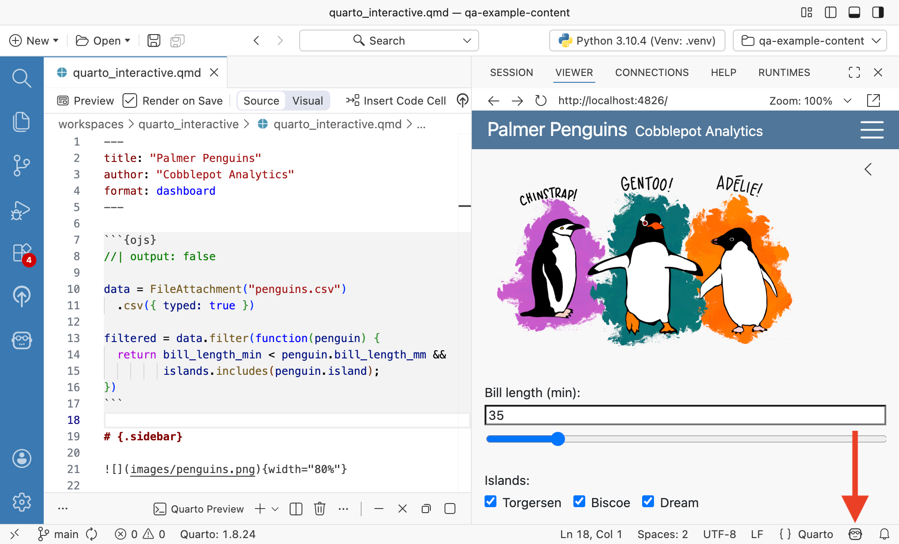

Code completions are text suggestions that appear inline as you type in an editor. These suggestions can be lines or blocks of code based on the context of what you're writing. Other names for code completions include inline suggestions, ghost text, or inline completions.

::: {.callout-important}
Completions are powered by Posit AI or GitHub Copilot. Ensure you have added one or both of these as a language model provider:

- [Add Posit AI as a language model provider](assistant-providers.qmd#posit-ai)
- [Add GitHub Copilot as a language model provider](assistant-providers.qmd#github-copilot)
:::

## Using code completions

When code completions are available, ghost text appears in your editor as you type. The ghost text represents the suggested completion.

Interact with suggestions by:

- Pressing the  key to accept the entire suggestion.
- Pressing  to accept the suggestion word-by-word for a single-line suggestion, or line-by-line for multi-line suggestions.
- Pressing  or continuing to type to dismiss the suggestion.

### Commands

The following commands apply to both providers:

| Command | Description |
| --- | --- |
| _Snooze Inline Suggestions_ | Pause inline suggestions temporarily for a specified duration. |
| _Cancel Snooze Inline Suggestions_ | Resume snoozed inline suggestions immediately. |

### Settings {#shared-settings}

The following settings apply to both providers:

- [`positron.assistant.aiExcludes`](positron://settings/positron.assistant.aiExcludes): Files matching these patterns will not have their contents sent to AI providers for code completions or chat context.
- [`editor.inlineSuggest.minShowDelay`](positron://settings/editor.inlineSuggest.minShowDelay): Delay in milliseconds before showing inline suggestions. For example, setting this to `500` will show suggestions half a second after typing.
- [`editor.inlineSuggest.enabled`](positron://settings/editor.inlineSuggest.enabled): Set to `false` to turn off inline suggestions altogether, regardless of provider.

## Posit AI Next Edit Suggestions (NES) {#posit-ai-nes}

When using Posit AI as your completions provider, code completions take the form of Posit AI Next Edit Suggestions (NES), a preview feature. Posit AI NES proposes edits anywhere in the file, not just at the cursor. It responds to your recent changes, including insertions, deletions, and modifications to existing code.

Posit AI NES suggestions appear inline in the editor. You can accept, navigate, or dismiss them using the same keybindings as other code completions.

### Enable

Posit AI NES is enabled by default once you have [signed in to the Posit AI provider](assistant-providers.qmd#posit-ai). No additional setting changes are required.

### Restrict to specific languages

Posit AI NES skips `plaintext`, `markdown`, and `scminput` unless you configure otherwise. Use the [`nextEditSuggestions.enabled`](positron://settings/nextEditSuggestions.enabled) setting to change which languages Posit AI NES applies to.

### Disable

To disable Posit AI NES, do any of the following:

- Sign out of Posit AI in Positron via the Accounts menu or the _Accounts: Manage Accounts_ command. This also affects chat and other features that rely on the account.
- Set [`nextEditSuggestions.enabled`](positron://settings/nextEditSuggestions.enabled) to `{ "*": false }` to disable Posit AI NES everywhere. To disable only some languages, set those entries to `false`.

To exclude specific files from Posit AI NES regardless of language, [use the shared `aiExcludes` setting](#shared-settings).

## GitHub Copilot

When using GitHub Copilot as your completions provider, code completions appear as ghost text at the cursor position as you type. To learn more, visit the GitHub Copilot [inline suggestions](https://code.visualstudio.com/docs/copilot/ai-powered-suggestions#_getting-your-first-suggestions) documentation.

GitHub Copilot also has its own Next Edit Suggestions, separate from the ghost-text completions described here and from [Posit AI NES](#posit-ai-nes). It is available whenever you sign in to GitHub Copilot as a provider.

### Enable

GitHub Copilot completions are enabled after you [sign in to the GitHub Copilot provider](assistant-providers.qmd#github-copilot). No additional setting changes are required.

### Restrict to specific languages

GitHub Copilot completions skip `plaintext`, `markdown`, and `scminput` unless you configure otherwise. Use the [`github.copilot.enable`](positron://settings/github.copilot.enable) setting to change which languages Copilot completions apply to.

### Disable

If you have enabled GitHub Copilot as a model provider, you can disable completions by doing any of the following:

- Set [`github.copilot.enable`](positron://settings/github.copilot.enable) to `{ "*": false }` to disable both ghost-text completions and Next Edit Suggestions, without having to sign out. To disable only some languages, set those entries to `false` instead of `*`.
- Set [`github.copilot.nextEditSuggestions.enabled`](positron://settings/github.copilot.nextEditSuggestions.enabled) to `false` to disable Next Edit Suggestions on their own, while keeping ghost-text completions on.
- Sign out of GitHub in Positron via the Accounts menu or the _Accounts: Manage Accounts_ command. This also affects other features and extensions that rely on the GitHub account. Without a signed-in GitHub account, GitHub Copilot Chat cannot be used, and GitHub Copilot cannot provide completions, Next Edit Suggestions, or be used as a provider for Posit Assistant.

To exclude specific files from Copilot completions regardless of language, use the shared [`aiExcludes`](#shared-settings) setting.

### Status bar icon

The Assistant status bar icon indicates the current state of GitHub Copilot completions.

{fig-alt="The Assistant status bar icon in the Positron status bar, showing the current state of GitHub Copilot completions." width=750}

To manage Copilot completions using the status bar icon:

1. Select the status bar icon to open the menu.
2. From the menu, enable or disable completions for the current file type or for all files, or view the remaining time for snoozed completions.

## Troubleshooting

If you are not receiving suggestions:

- Check that [`ai.enabled`](positron://settings/ai.enabled) is not set to `false`. When it is, Positron disables all AI features including code completions, regardless of other settings.
- Confirm you are signed in to your completions provider in the [language model provider configuration](assistant-getting-started.qmd#configure-a-language-model-provider).
- Check that your completions provider's per-language settings do not disable the current language (see [Posit AI Next Edit Suggestions](#posit-ai-nes) or [GitHub Copilot](#github-copilot)).
- Check that [`positron.assistant.aiExcludes`](positron://settings/positron.assistant.aiExcludes) does not match the current file.
- Refer to the [Troubleshooting](assistant-troubleshooting.qmd) guide for more help.
