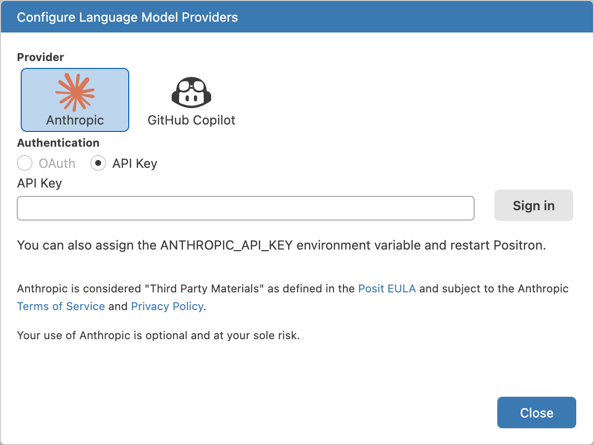
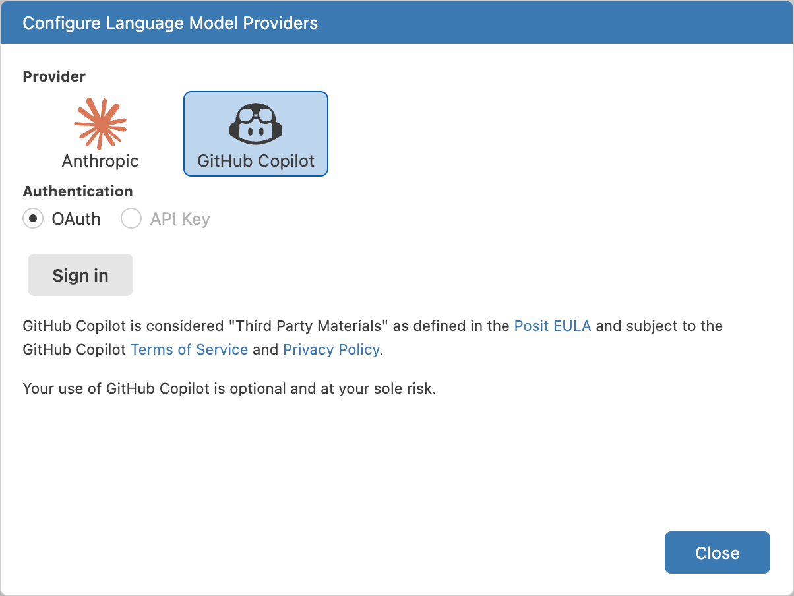
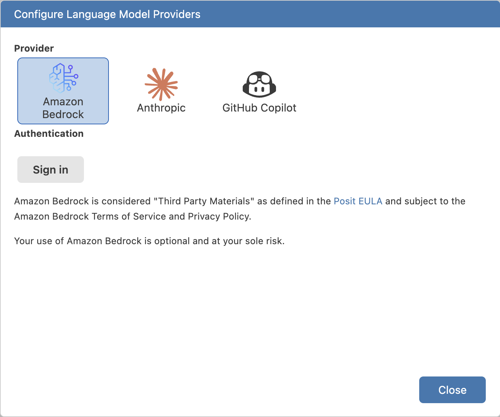
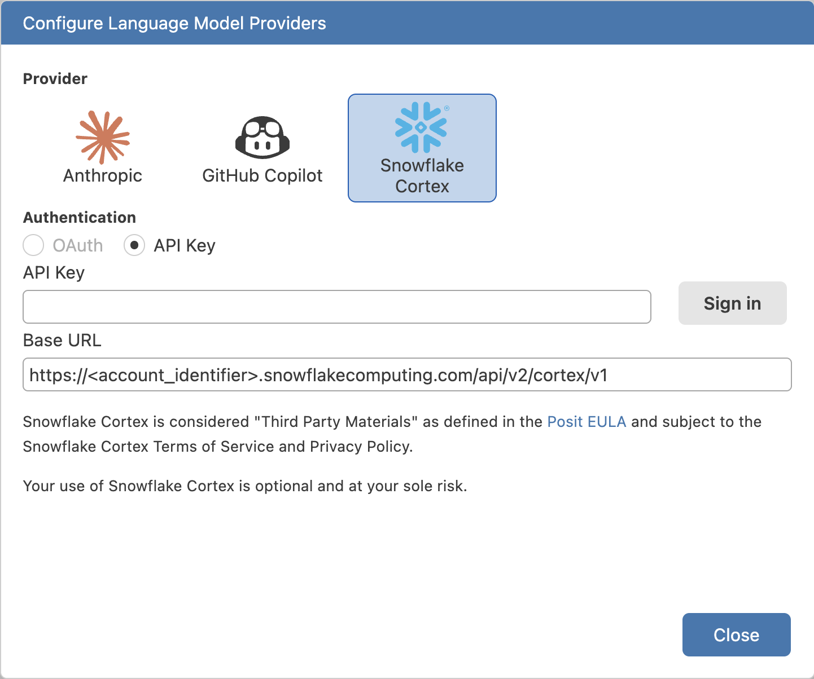
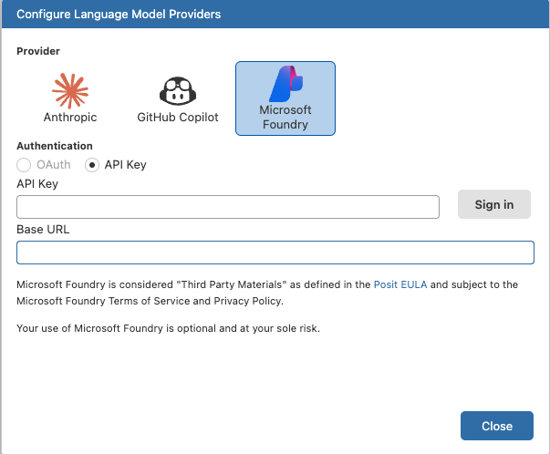
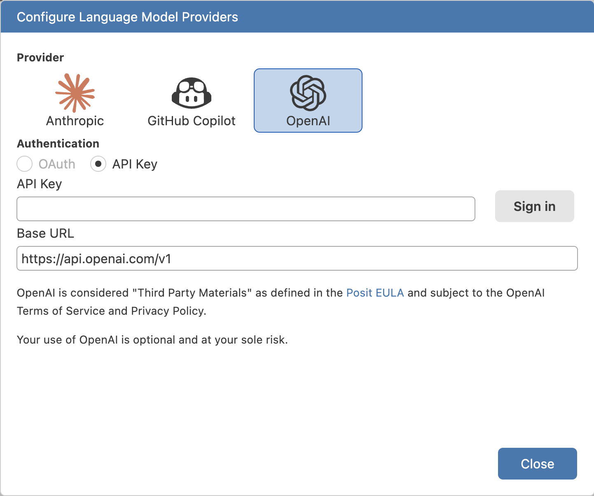
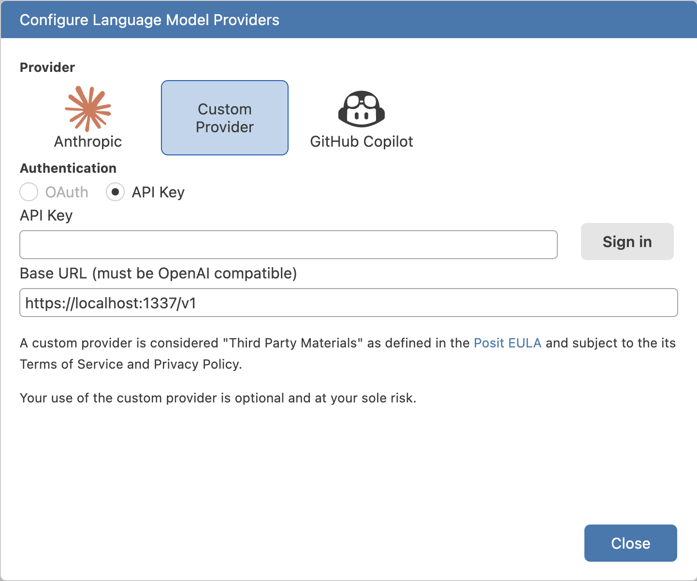

Positron Assistant supports the following language model providers:

| Provider | Chat | Code Completions | Authentication |
|------|:--:|:---:|---------|
| Anthropic |  | | API Key |
| GitHub Copilot (Preview) |  |  | GitHub OAuth |
| Amazon Bedrock (Preview) |  | | AWS CLI or Posit Workbench Managed Credentials |
| Snowflake Cortex (Preview) |  | | API Key or Posit Workbench Managed Credentials |
| Microsoft Foundry (Preview) |  | | API Key or Posit Workbench Managed Credentials |
| OpenAI (Preview) |  | | API Key |
| Custom Provider (Experimental) |  | | API Key |

We're actively expanding provider support and welcome your [feedback](https://github.com/posit-dev/positron/discussions) and [issue reports](https://github.com/posit-dev/positron/issues/new/choose)!

Please ensure you consult your provider's privacy policy for information on the data they collect and how it is used. For reference links, see the [Positron Assistant Provider Information](assistant-provider-info.qmd) guide.



## Step 1: Enable Positron Assistant

1. Enable the setting [`positron.assistant.enable`](positron://settings/positron.assistant.enable).
1. Restart Positron or run the _Developer: Reload Window_ command in the Command Palette.

## Step 2: Configure language model providers

Anthropic and GitHub Copilot are enabled by default. Other providers are in preview or experimental status and must be enabled through settings.

::: {.panel-tabset group="providers"}

## Anthropic

::: {.callout-important}
Positron Assistant requires a **Claude Console account with API access**. See Anthropic's [Claude API and Console](https://support.claude.com/en/collections/5370014-claude-api-and-console) documentation for more information.

Positron Assistant **does not** support logging into Anthropic with the Claude Pro Plan, Max Plan, or other Claude subscription plans.

<details>
<summary>How to get an Anthropic API key</summary>

To use Anthropic's Claude models in Positron Assistant, you need to bring your own API key (BYOK). To obtain an API key from Anthropic:

1. Log in to or create an account for Anthropic's [Claude Console](https://platform.claude.com).
1. Navigate to the [API keys](https://platform.claude.com/settings/keys) management page.
1. Select the  **Create Key** button.
1. Fill out any required information and select **Add** to generate your API key.
1. Copy and save the API key to a password manager or another secure location.

</details>
:::

### Enable Anthropic as a provider

Anthropic is enabled by default. Opt out of the [`positron.assistant.provider.anthropic.enable`](positron://settings/positron.assistant.provider.anthropic.enable) setting to disable it.

### Add Anthropic as a language model provider

1. Run the command _Positron Assistant: Configure Language Model Providers_
1. Select **Anthropic** as the model provider.

    {width=600}

1. Paste your Claude Console API key into the input box and select **Sign in**.

::: {.callout-note}
Alternatively, set the `ANTHROPIC_API_KEY` environment variable to authenticate with Anthropic in Positron Assistant.
:::

## GitHub Copilot

::: {.callout-important}
Positron Assistant requires a **GitHub account with Copilot enabled**.

<details>
<summary>How to get GitHub Copilot access</summary>

GitHub Copilot is a proprietary tool from GitHub. If you want to use GitHub Copilot, you need a [subscription for GitHub Copilot](https://docs.github.com/en/billing/managing-billing-for-github-copilot/about-billing-for-github-copilot) in your personal GitHub account or to be assigned a seat by an organization with a subscription for GitHub Copilot for Business.

Students and faculty can use GitHub Copilot for free as part of the GitHub Education program. For more information, see the [GitHub Education page](https://education.github.com/).

</details>
:::

### Enable GitHub Copilot as a provider

GitHub Copilot is enabled by default. Opt out of the [`positron.assistant.provider.githubCopilot.enable`](positron://settings/positron.assistant.provider.githubCopilot.enable) setting to disable it.

### Add GitHub Copilot as a language model provider

1. Run the command _Positron Assistant: Configure Language Model Providers_
1. Select **GitHub Copilot** as the model provider.

    {width=600}

1. Select the **Sign in** button to initiate GitHub's OAuth authentication flow.
    - Complete the authentication flow in your browser, and return to Positron when finished.

::: {.callout-note}
You can also sign in to GitHub via the  **Accounts** icon in the Activity Bar. To sign out, use the Accounts icon or run the _Accounts: Manage Accounts_ command.

Note that the Accounts section manages your GitHub authentication for all extensions that use GitHub, not just Positron Assistant.
:::

## Amazon Bedrock

::: {.callout-important}
To use Amazon Bedrock in Positron Desktop, you must:  

1. Have an AWS account with Amazon Bedrock access
2. Have access to foundation models through the AWS Bedrock console ([request access to the foundation models](https://docs.aws.amazon.com/bedrock/latest/userguide/model-access-modify.html))
3. Sign in to your AWS account using the AWS CLI

<details>
<summary>Sign in with the AWS CLI</summary>

1. [Download and install the AWS CLI](https://docs.aws.amazon.com/cli/latest/userguide/getting-started-install.html)
1. [Configure your AWS credentials for the AWS CLI](https://docs.aws.amazon.com/cli/latest/userguide/cli-configure-files.html)
1. [Sign in with the AWS CLI](https://docs.aws.amazon.com/signin/latest/userguide/command-line-sign-in.html)

</details>

:::

### Enable Amazon Bedrock as a provider

Amazon Bedrock provider support is in preview. Opt in to the [`positron.assistant.provider.amazonBedrock.enable`](positron://settings/positron.assistant.provider.amazonBedrock.enable) setting to enable it.

<details>
<summary>(Optional) Configure AWS region and profile</summary>

Positron Assistant reads `AWS_REGION` from your environment automatically. You only need to set it here if your shell does not already have `AWS_REGION` configured and your Bedrock-enabled account is not in `us-east-1` (the default). Use the standard AWS region identifier format (for example, `us-east-1`, `eu-west-1`, `ap-southeast-1`). The [Amazon Bedrock endpoints and quotas](https://docs.aws.amazon.com/general/latest/gr/bedrock.html) reference lists the region identifier for each location. You must also ensure the models you want to use are [available in that region](https://docs.aws.amazon.com/bedrock/latest/userguide/models-regions.html).

Positron Assistant uses your `default` AWS CLI profile when no profile is specified. Set `AWS_PROFILE` if the profile you use for Bedrock is not named `default` — for example, when you have a dedicated Bedrock role separate from your general development credentials, or when your Bedrock access lives in a different AWS account. To see your available profiles, run `aws configure list-profiles` in a terminal. 

::: {.callout-note}
Do not set `AWS_PROFILE` if you use Posit Workbench managed credentials or environment variable credentials (`AWS_ACCESS_KEY_ID`/`AWS_SECRET_ACCESS_KEY`). Both of those paths bypass named profile resolution, and setting a profile name in those cases causes credential resolution to fail.
:::

To set either value, add them to the [`positron.assistant.providerVariables.bedrock`](positron://settings/positron.assistant.providerVariables.bedrock) setting. These override any matching environment variables already set on your system for Positron Assistant only; they do not affect your terminal or other tools. Changes require a restart to take effect.

</details>

<details>
<summary>(Optional) Configure inference profile region</summary>

Positron Assistant uses [cross-region inference profiles](https://docs.aws.amazon.com/bedrock/latest/userguide/inference-profiles-support.html) to route requests across multiple AWS regions for higher availability and throughput. Positron derives the inference profile region automatically from `AWS_REGION` by taking its geographic prefix:

| `AWS_REGION` | Derived inference profile region |
|---|---|
| `us-east-1`, `us-west-2` | `us` |
| `eu-west-1`, `eu-central-1` | `eu` |
| `ap-southeast-1`, `ap-northeast-1` | `apac` |

Most users do not need to change this. Use the [`positron.assistant.bedrock.inferenceProfileRegion`](positron://settings/positron.assistant.bedrock.inferenceProfileRegion) setting to override the derived value if:

- Your AWS account has Bedrock model access enabled in a different geographic pool than your `AWS_REGION` implies — for example, you connect through `us-east-1` but want to route inference through `eu` profiles.
- You want to use a `global` inference profile, which Positron cannot derive automatically from any region.

Valid values are `us`, `eu`, `apac`, and `global`. This setting requires a restart to take effect.

::: {.callout-note}
If no inference profile exists for your preferred region, Positron Assistant falls back to the first available inference profile for that model. If a model has no inference profile at all, it does not appear in the model list.
:::

</details>

### Add Amazon Bedrock as a language model provider

1. Run the command _Positron Assistant: Configure Language Model Providers_
1. Select **Amazon Bedrock** as the model provider.

    {width=600}

1. Select **Sign in** so Positron Assistant can verify your AWS CLI authentication.


## Snowflake Cortex

::: {.callout-important}

To use Snowflake Cortex in Positron Desktop, Positron Assistant requires a **Snowflake account with Cortex access**, as well as a Snowflake [account identifier](https://docs.snowflake.com/en/user-guide/admin-account-identifier) and [programmatic access token](https://docs.snowflake.com/en/user-guide/programmatic-access-tokens) (PAT).

:::

### Enable Snowflake Cortex as a provider

Snowflake Cortex provider support is in preview. Opt in to the [`positron.assistant.provider.snowflakeCortex.enable`](positron://settings/positron.assistant.provider.snowflakeCortex.enable) setting to enable it.

### Add Snowflake Cortex as a language model provider

1. Add your `SNOWFLAKE_ACCOUNT` ID to the [`positron.assistant.providerVariables.snowflake`](positron://settings/positron.assistant.providerVariables.snowflake) setting
1. Run the command _Positron Assistant: Configure Language Model Providers_
1. Select **Snowflake Cortex** as the model provider.

    {width=600}

1. Paste your Snowflake Cortex PAT into the API key box, then select **Sign in**.

## Microsoft Foundry

::: {.callout-important}
To use Microsoft Foundry in Positron Desktop, you must:

1. Have a [Microsoft Foundry](https://ai.azure.com/) resource with one or more models deployed
2. Have the endpoint URL and API key for your Foundry resource

Foundry does not support automatic model discovery. Positron Assistant defaults to the `model-router` identifier, but you can configure specific models. See [Configure custom model overrides](#configure-custom-model-overrides) below.
:::

### Enable Microsoft Foundry as a provider

Microsoft Foundry provider support is in preview. Opt in to the [`positron.assistant.provider.msFoundry.enable`](positron://settings/positron.assistant.provider.msFoundry.enable) setting to enable it.

### Add Microsoft Foundry as a language model provider

1. Run the command _Positron Assistant: Configure Language Model Providers_
1. Select **Microsoft Foundry** as the model provider.

    {fig-alt="Configure Language Model Providers modal with Microsoft Foundry selected, showing API Key and Base URL fields." width=600}

1. Enter your Foundry endpoint URL in the **Base URL** field and your API key in the **API Key** field, then select **Sign in**.

::: {.callout-note}
Positron Assistant accepts deployment-based Azure OpenAI URLs (for example, `https://<resource>.openai.azure.com/openai/deployments/<name>/chat/completions?api-version=...`) and automatically normalizes them to the supported v1 format. A message displays when this conversion occurs.
:::

### Configure custom model overrides {#configure-custom-model-overrides}

To use specific models instead of `model-router`, configure the [`positron.assistant.models.overrides.msFoundry`](positron://settings/positron.assistant.models.overrides.msFoundry) setting:

```json
"positron.assistant.models.overrides.msFoundry": [
  {
    "name": "gpt-4.1",
    "identifier": "gpt-4.1"
  },
  {
    "name": "gpt-5.3-chat",
    "identifier": "gpt-5.3-chat"
  }
]
```

Use the model name and deployment identifier from your Foundry resource for each entry.

## OpenAI

### Enable OpenAI as a provider

OpenAI provider support is in preview. Opt in to the [`positron.assistant.provider.openAI.enable`](positron://settings/positron.assistant.provider.openAI.enable) setting to enable it.

### Add OpenAI as a language model provider

1. Run the command _Positron Assistant: Configure Language Model Providers_
1. Select **OpenAI** as the model provider.

    {width=600}

1. Paste your OpenAI API key into the input box and select **Sign in**.

::: {.callout-note}

Use the OpenAI provider to connect to a provider that implements the [OpenAI Responses API](https://platform.openai.com/docs/api-reference/responses), by replacing the base URL with your compatible custom endpoint.

:::

## Custom Provider

::: {.callout-important}

Positron Assistant's custom provider support is intended for use with any [OpenAI-compatible](https://ai-sdk.dev/providers/openai-compatible-providers) API endpoint that uses the `/v1/chat/completions` endpoint for chat.

We don't recommend using a local model as a custom provider. Read more about why [local models are not there (yet)](https://posit.co/blog/local-models-are-not-there-yet/) on Posit's blog.

:::

### Enable Custom Provider as a provider

Custom provider support is experimental. Opt in to the [`positron.assistant.provider.customProvider.enable`](positron://settings/positron.assistant.provider.customProvider.enable) setting to enable it.

### Add Custom Provider as a language model provider

1. Run the command _Positron Assistant: Configure Language Model Providers_
1. Select **Custom Provider** as the model provider.

    {width=600}

1. Enter your API key and base URL into the input boxes and select **Sign in**.

::: {.callout-note}

Some OpenAI-compatible providers may not implement the `/models` endpoint, which Positron Assistant uses to list available models. If this is the case for your provider, you can manually configure a model listing using the [`positron.assistant.models.overrides.customProvider`](positron://settings/positron.assistant.models.overrides.customProvider) setting.

:::

:::

## Step 3: Use Positron Assistant!

Once you've authenticated with at least one language model provider, you're all set to use Positron Assistant.

1. Select the chat robot icon in the sidebar, or run the command _Chat: Open Chat_ in the Command Palette to open the chat:

    {height=450}

1. Chat with Assistant by typing your question or request in the chat input box at the bottom of the chat pane, then pressing  or the  send button.

To learn more about Positron Assistant's core features, check out the following guides:

::: {#chat-features}
:::
