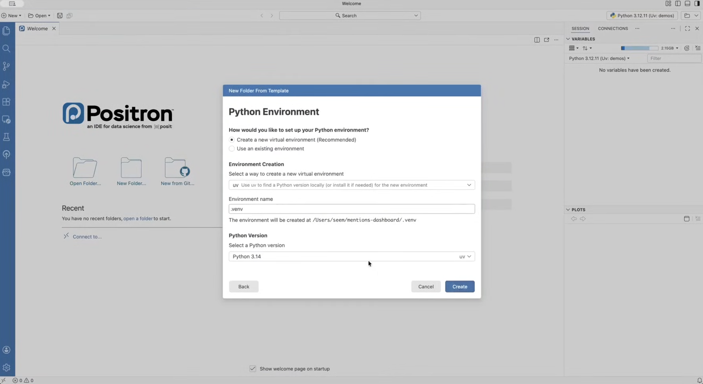
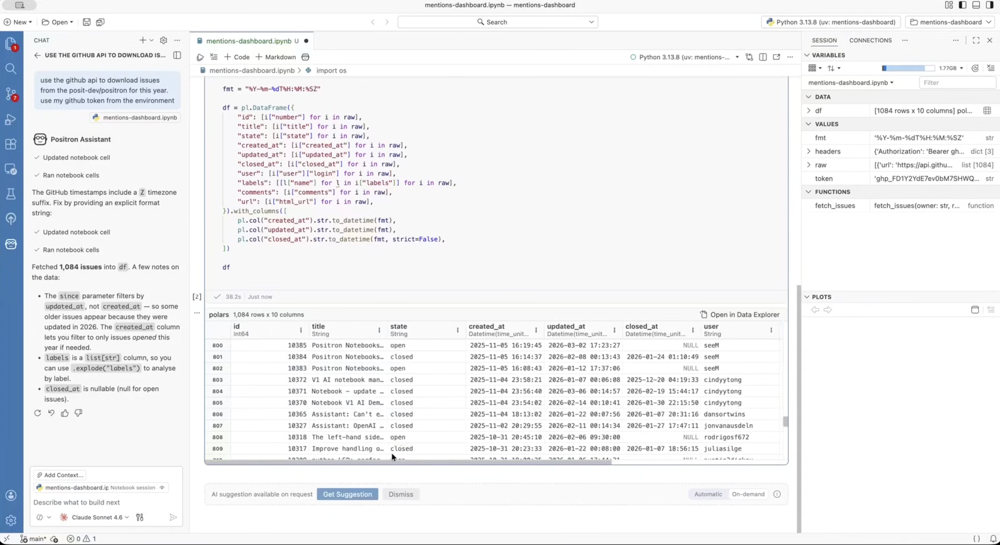
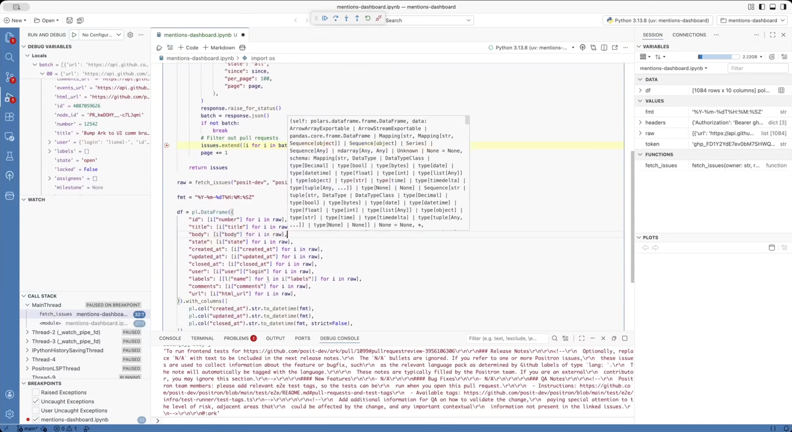
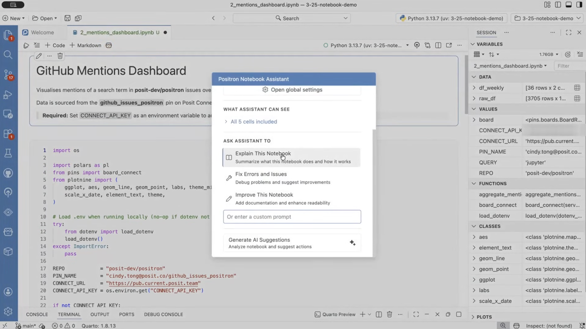
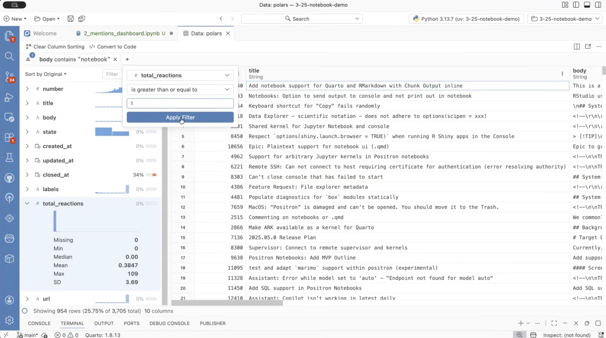
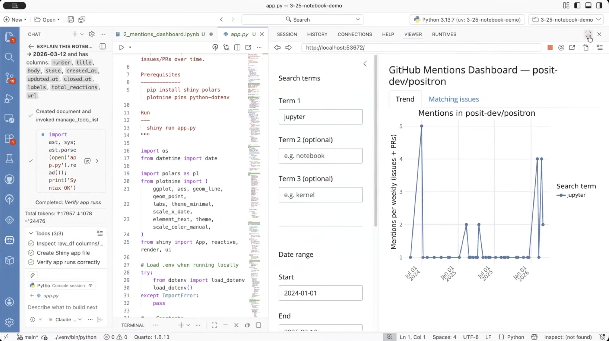
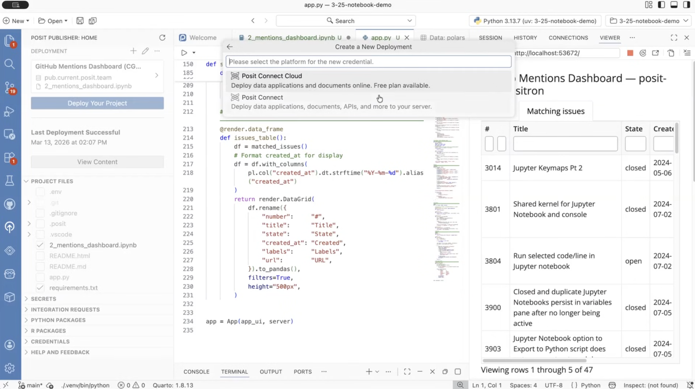
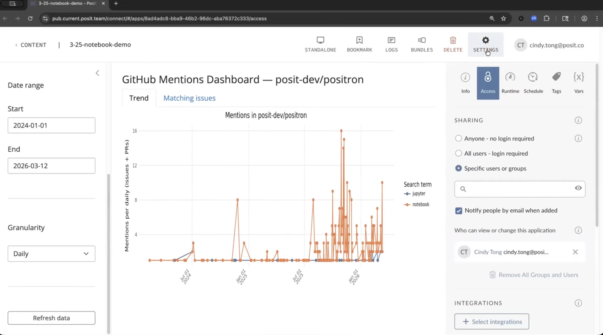

> **Watch the full demo:** [Working with Jupyter Notebooks in Positron: From Exploration to Production](https://www.youtube.com/watch?v=qrVkG89ndi8)

## The Use Case

Our product manager, Cindy, came to the engineering team with a question: how can we get a better understanding of what customers are interested in over time, based on GitHub issues and comments? GitHub's built-in UI doesn't make this easy to explore interactively, so we built our own dashboard using a Jupyter notebook in Positron and went from blank notebook to a deployed interactive app in under 30 minutes.

Here's what we set out to do:

1. Pull GitHub issue data via the API
2. Explore and clean the data
3. Create a visualization of keyword mentions over time
4. Turn the notebook into an interactive, shareable dashboard on Posit Connect

---

## Part 1: Wasim, the Data Scientist — Building the Analysis

Wasim, a former data scientist turned software engineer on the Positron team, built the initial notebook to analyze GitHub issues related to Positron.

### Step 1: Set Up the Project

We created a Python project from Positron's welcome screen. We used **UV** to manage the environment with Python 3.13. After creating a new Jupyter notebook and selecting the correct kernel, we pulled in dependencies by running the following commands in the terminal:

```bash
uv init
uv add polars pyarrow pins plotnine python-dotenv requests
```



## Step 2: Build the Analysis with the AI Assistant

Rather than writing boilerplate code to call the GitHub API, we used the built-in **AI Assistant**. It's notebook-aware because it can read your cells, edit them, execute them, and see the entire context of your notebook cells. We granted it session-level permissions so it could work autonomously, then prompted it to:

- Use the GitHub API to download all issues from the Positron repo for the current year
- Read a GitHub token from a `.env` file to avoid rate limits
- Store the results as a Polars data frame

Assistant hit a timezone string format error on the first run, noticed it automatically, proposed a fix, and retried.



### Step 3: Explore and Clean the Data

Once the data loaded (1,084 issues), Positron rendered an **inline data explorer** directly in the notebook output. We noticed the `body` column was missing, so we dropped into the **Notebook Debugger** — set a breakpoint, ran the cell, and inspected the live `issues` variable. The API response did include a body; it just wasn't being added to the data frame. A quick fix resolved it.

With clean data, we opened the **full Data Explorer** for a broader picture. It surfaces column-level summary statistics and histograms at a glance and lets you build multi-column filters interactively. One immediate finding: 48% of values in `closed_at` were null — but filtering to those rows confirmed every one had `state = open`, so the nulls were expected.



### Step 4: Visualize and Tidy Up

We asked Assistant to plot the number of weekly Jupyter mentions in issues this year. It inspected the data frame schema first, then generated a plotnine line chart, correctly filtering by year, searching both title and body, and grouping by week. The result was a clean, well-titled chart rendered inline.

Before handing the notebook off, we ran Positron's **"Improve this notebook"** AI quick action. It adds markdown headers, organizes sections, and removes dead code in one step, a fast way to clean up after an exploratory session.

---

## Part 2: Cindy, the Product Manager — From Notebook to App

Wasim shared the notebook with Cindy, a product manager on Positron, who wanted to turn it into an interactive dashboard. In the past, this would have required a handoff to a developer or learning a new framework. But with Positron's AI assistant, Cindy was able to do it herself.

### Step 5: Get Oriented in the Notebook

Cindy pulled down Wasim's notebook from Git and opened it in Positron. She starts by running all cells. As they execute, the **Variables Pane** updates in real time, showing data frame shapes, variable values, functions, and classes, no need to read every cell to understand what the notebook contains.



Next, she clicks the **"Explain this notebook"** AI quick action. Assistant reads the full notebook and returns a structured summary: overall purpose, key sections, packages used, data sources, and any assumptions or prerequisites for running it. It even flagged an empty cell to clean up.

After the AI overview, Cindy does her own walkthrough to fact-check it, deletes the empty cell, and opens the data in the full Data Explorer to explore a question she has as PM: *how many of our GitHub issues are about notebooks?*

Filtering `body` for `contains "notebook"` surfaced about 25% of issues. Adding a second filter (`total_reactions >= 5`) and sorting by descending reactions gave her a focused list of the highest-engaged feature requests.



### Step 6: Turn the Notebook into a Shiny App

Looking at the existing plot, Cindy noticed it hardcodes "Jupyter" as the search term. What she actually wants is a dashboard where she can type in different terms and compare their mention trends over time.

She switches Assistant to **agent mode** and sends a single prompt:

> *"Make a new interactive dashboard that shows the mentions visualization in the current notebook. Allow me to search for different terms, select a start and end date, and compare up to three terms over time. Show both the chart and the list of matching issues. Put this in a new app."*

Assistant creates a task list, writes a new `app.py` file, and stops to ask permission before running terminal commands. Once approved, it launches the Shiny app and the viewer pane loads it immediately.

Cindy added "notebook" and "Quarto" as additional search terms, adjusted the date range to start of 2025, and all three trend lines updated. When the issues tab threw an error on first load, she pasted it into chat, and Assistant diagnosed it, updated the file, and re-rendered the app.



### Step 7: Deploy to Posit Connect

With the app working locally, Cindy opens the **Publisher extension** in the Positron sidebar and follows deploys to Connect in a few clicks:

1. Select your entry file (`app.py`)
2. Name the deployment
3. Choose your Connect credential (Connect Cloud for free personal use, Posit Connect for team environments)
4. Review the file list and Python package manifest
5. Click **Deploy your project**

Positron shows real-time deployment progress in a log view. When it completes, a link to the live app appears. From Connect, you control access permissions, environment variables for secrets like API keys, and scheduled refreshes.


> **Tip:** Instead of having the dashboard hit the GitHub API on every load, consider a separate Quarto notebook scheduled to run daily on Connect that writes results to a **Connect Pin**. The Shiny app then reads from the Pin, avoiding rate limits and keeping load times fast.

---

## What This Workflow Changes

The notebook-to-app path used to require handing off to a developer or learning a new framework. Here, a product manager took an analyst's notebook and shipped an interactive app to a shared URL in one session, without writing app code. That's the shift.



---

## What We Used
- [**UV**](https://docs.astral.sh/uv/) — fast Python package and environment manager
- **Polars + plotnine** — data manipulation and visualization
- [**Pins**](https://rstudio.github.io/pins-python/) — lightweight data storage on Connect
- [**Shiny for Python**](https://shiny.posit.co/py/) — the interactive app framework Assistant generated
- [**Posit Connect**](https://posit.co/products/enterprise/connect/) / [**Connect Cloud**](https://connect.posit.cloud) — deployment and sharing platform

---

## Try It Yourself

1. Enable the alpha by setting [`positron.notebook.enabled`](positron://settings/positron.notebook.enabled) to `true` in your settings.

2. [Watch the full demo]** *(https://www.youtube.com/watch?v=qrVkG89ndi8)* to see each step in action

---

*Wasim Lorgat is a senior software engineer and team lead for notebooks on the Positron team. Cindy Tong is a product manager on Positron.*
