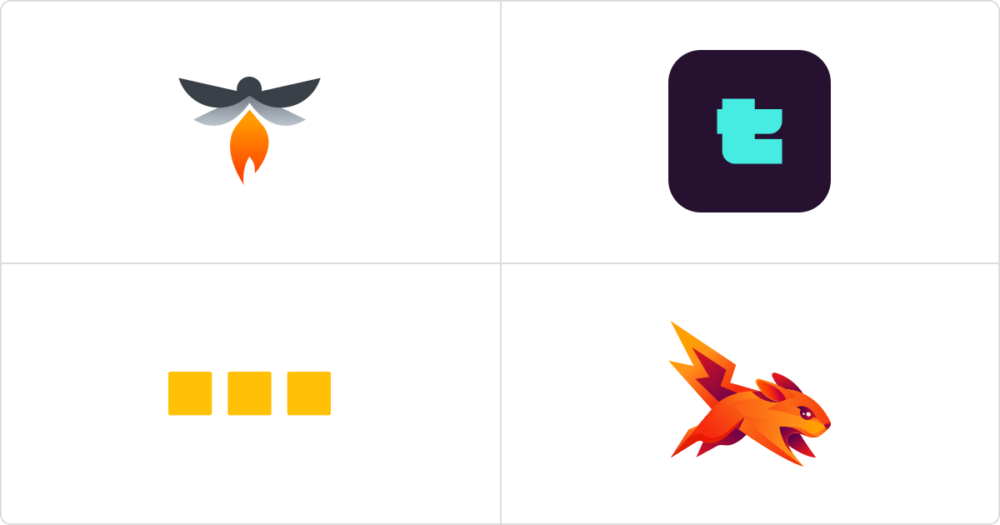
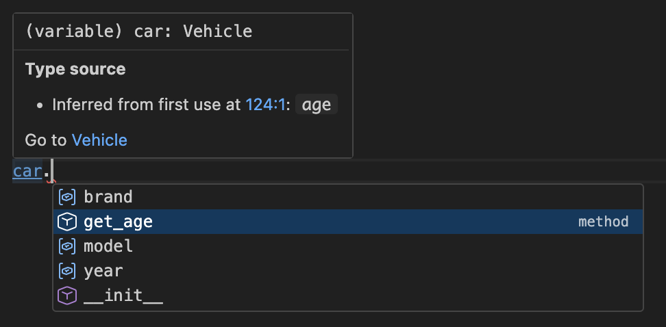
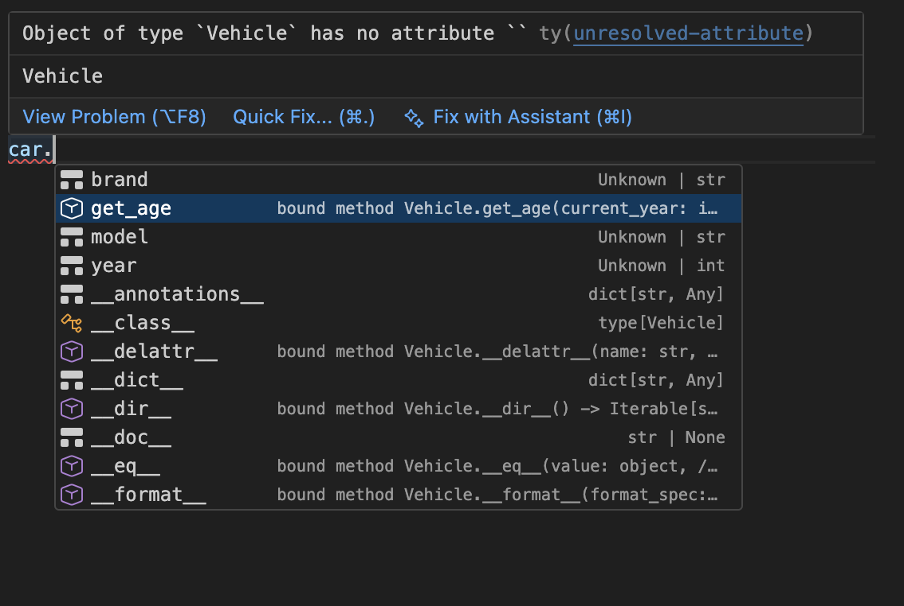
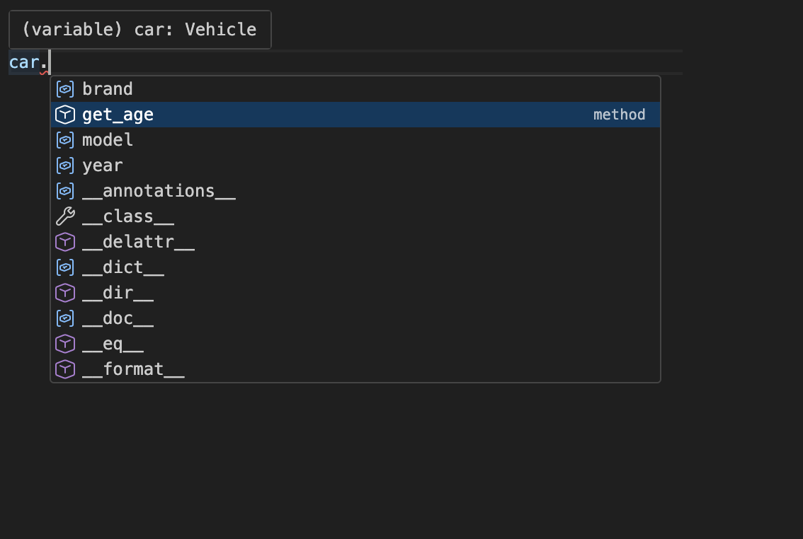
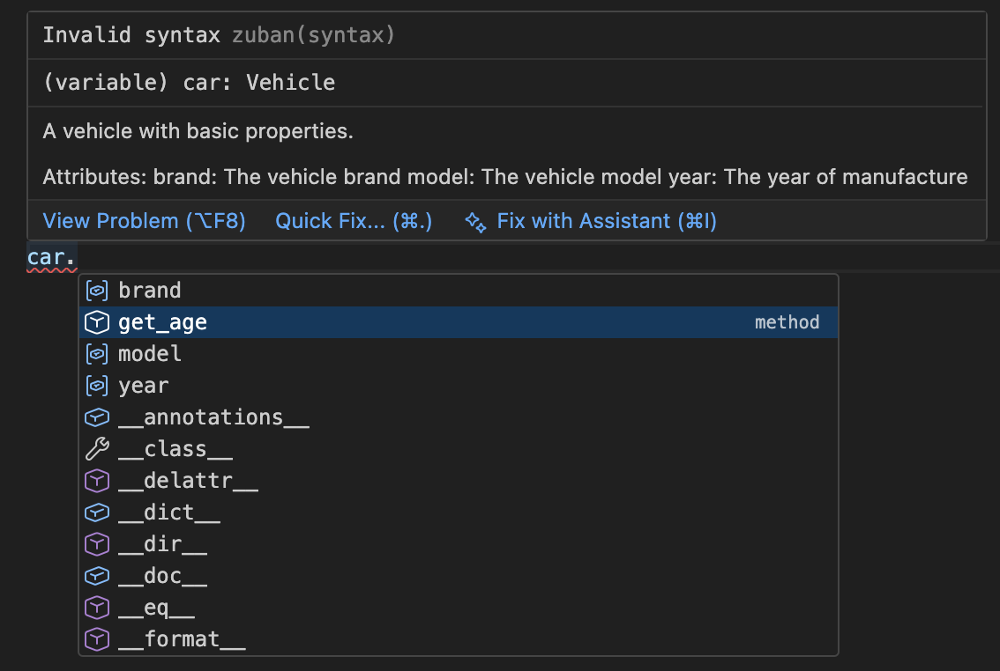

The open-source Python type checker and language server ecosystem has exploded. Over the past year or two, four language server extensions have appeared, each with a different take on what Python type checking should look like. We evaluated each of them to decide which one to bundle with Positron to enhance the Python data science experience.

## Background

The Language Server Protocol (LSP) is a cross-language, cross-IDE specification that allows different IDE extensions to contribute smart features like tab completions, hover info, and more. The four^[Another LSP extension is Pylance, which may be familiar to VS Code users, but due to licensing restrictions, Code-OSS forks like Positron cannot use it.] Python extensions in this post are powered by type checkers, which are Python-specific tools that catch bugs in your code before runtime by guessing and checking the types of your variables. They do this by *statically analyzing* your code before you run it.

::: {.callout-tip}
Positron's built-in language server uses your running Python session to provide runtime-aware completions and hover previews too! Beyond what's in code, it knows your DataFrame column names, your dictionary keys, your environment variables, and more. But the tools evaluated in this post handle the _static analysis_ side: type checking, go-to-definition, rename, and code actions. Both run concurrently, and Positron merges their results.
:::

With AI tools writing more of your code, a good language server helps you read and navigate code you didn't write. LLM-generated code also introduces bugs that type checkers catch before you run anything. For data scientists, who rely on code to be the reproducibility layer, and who can't automate away human judgment, what matters is a tool that helps you understand and trust your code.

We did this evaluation in November 2025 but have refreshed the data in this post at the time of publish.

## The contenders

| Tool | Backing | Language | License | Stars |
|------|---------|----------|---------|:-----:|
| [**Pyrefly**](https://github.com/facebook/pyrefly) | Meta | Rust | MIT | 5.5K |
| [**ty**](https://github.com/astral-sh/ty) | Astral (OpenAI) | Rust | MIT | 17.8K |
| [**Basedpyright**](https://github.com/detachhead/basedpyright) | Community | TypeScript | MIT | 3.2K |
| [**Zuban**](https://github.com/zubanls/zuban) | Indie | Rust | AGPL-3.0 | 1K |

**Pyrefly** is Meta's successor to Pyre. It takes a fast, aggressive approach to type inference, being able to catch issues even in code with no type annotations. It reached [beta status](https://github.com/facebook/pyrefly/releases/tag/0.42.0) in November 2025.

**ty** is from Astral, the team behind uv and ruff. [OpenAI announced its acquisition of Astral](https://openai.com/index/openai-to-acquire-astral/) recently; Astral has stated that ty, ruff, and uv will remain open source and MIT-licensed. It's the newest project, with a focus on speed and tight integration with the Astral toolchain. It reached [beta status](https://astral.sh/blog/ty) in December 2025 and follows a "gradual guarantee" philosophy (more on that below).

**Basedpyright** is a community fork of Microsoft's Pyright type checker, with additional type-checking rules and LSP features baked in. It's the most mature of the four and has the largest contributor base.

**Zuban** is from David Halter, the author of Jedi (the longtime Python autocompletion library). It aims for mypy compatibility and ships as a pip-installable tool.

## What we tested

We tested each language server across several dimensions, roughly following the [rubric we outlined publicly](https://github.com/posit-dev/positron/issues/10300):

- **Feature completeness**: Completions, hover, go-to-definition, rename, code actions, diagnostics, inlay hints, call hierarchy
- **Correctness**: How well does the type checker handle real-world Python code?
- **Performance**: Startup time and time to first completion
- **Ecosystem**: License, community health, development velocity, production readiness

We tested inside Positron with a mix of data science and general Python code.

## Feature completeness

Here are some screenshots of hovers, tab-completions, and diagnostics from each extension:

::: {.panel-tabset}

### Pyrefly



### ty



### Basedpyright



### Zuban



:::

All four provide the core features you'd expect: completions, hover documentation, go-to-definition, semantic highlighting, and diagnostics. The differences show up in the details.

### Pyrefly

Strong feature set. The hover documentation is the best of the four; **Pyrefly** renders it cleanly and sometimes includes hyperlinks to class definitions.

### ty

Fast and clean, now in beta. The completion details can sometimes feel a little overwhelming, but can help when expanded.

### Basedpyright

Handles type checking comprehensively well. The main friction point: it surfaces a lot of warnings out of the box. If you're doing exploratory data science, a wall of type errors on your first `pandas` import can feel hostile. You can tune this down, but the defaults are oriented toward stricter use cases like package development.

### Zuban

The least mature of the four so far. Installation requires a two-step process (`pip install zuban`, then configure the interpreter), and the analysis is tied to that specific Python installation on saved files only. Third-party library completions only work when stubs are available, not from installed packages. Symbol renaming once broke standard library code in our testing.

## Type checking philosophy

The bigger difference between these tools isn't features but how they think about type checking.

### Gradual guarantee vs. aggressive inference

**ty** follows what's called the _gradual guarantee_: removing a type annotation from correct code should never introduce a type error. The idea is that type checking should be additive. You opt in by adding types, and the checker only flags things it's sure about.

The other extensions take the opposite approach. They always infer types from your code, even when you haven't written any annotations. This means they can catch bugs in completely untyped code, but it also means they may flag code that runs perfectly fine.

For example:

```python
my_list = [1, 2, 3]
my_list.append("foo")

# Pyrefly: bad-argument-type
# ty: <no error>
# Basedpyright: reportArgumentType
# Zuban: arg-type
```

**Pyrefly** infers `my_list` as `list[int]` and flags the `append("foo")` call as a type error. **ty** sees no annotations and stays silent. The code is dynamically typed and that's fine.

If you're doing exploratory data analysis and don't want to annotate everything, **ty**'s restraint might be more comfortable. But if you're writing a library and want to catch bugs early, **Pyrefly**'s aggressiveness is helpful. For example:

```python
def process(data):
    return str(data)

process(42) + 1  # Raises a runtime AttributeError

# Pyrefly: unsupported-operation
# ty: <no error>
# Basedpyright: reportOperatorIssue
# Zuban: operator
```

**Basedpyright** and **Zuban** land somewhere in between, with **Basedpyright** leaning toward stricter checking and **Zuban** aiming for mypy compatibility. Each of these extensions has the ability to suppress certain diagnostics you actually see when typing if you wish.

For a deeper dive on this topic, Edward Li's [comparison of **Pyrefly** and **ty**](https://blog.edward-li.com/tech/comparing-pyrefly-vs-ty/) and Rob Hand's [overview of future Python type checkers](https://sinon.github.io/future-python-type-checkers/) are both worth reading, though some bugs have been fixed since they were published.

## Performance

We measured startup time (how long until the language server responds to an `initialize` request) and time to first completion (how long a `textDocument/completion` request takes after initialization) in a relatively small repository. We ran each measurement five times and averaged. As always, these results only represent our computer's experimental setup.

| LSP | Avg. startup (s) | Avg. first completion (ms) |
|-----|:-:|:-:|
| **Pyrefly** | 5.8 | 190 |
| **ty** | 2.2 | 88 |
| **Basedpyright** | 3.1 | 112 |
| **Zuban** | N/A^[**Zuban** requires a multi-step manual startup, so we couldn't measure this automatically.] | 97 |

**ty** was the fastest across the board. But the practical differences are small: a 3-second difference in startup happens once per session, and a 100ms difference in completions is imperceptible. All four are fast enough that differences are negligible for daily use.

## Ecosystem health

We also looked at each project's development velocity and community health metrics. A language server you rely on daily needs to keep up with Python's evolution.

| | **Pyrefly** | **ty** | **Basedpyright** | **Zuban** |
|--|:-:|:-:|:-:|:-:|
| GitHub stars | 5.5K | 17.8K | 3.2K | 1K |
| Contributors | 162 | 186^[Edit (2026-04-01): A previous version of this post undercounted the number of contributors to **ty**. The updated script to fetch stats lives [here](https://github.com/posit-dev/positron-website/blob/main/blog/posts/2026-03-31-python-type-checkers/fetch_stats.py).] | 82 | 17 |
| License | MIT | MIT | MIT | AGPL-3.0 |
| Releases (since Nov 2025) | 17 | 29 | 10 | 9 |
| Release cadence | ~weekly | ~twice weekly | ~biweekly | ~biweekly |
| Issues opened (90 days) | 540 | 789 | 40 | 125 |
| Issues closed (90 days) | 531 | 712 | 20 | 111 |

**ty** and **Pyrefly** are shipping fast. Both are on a weekly release cadence or higher with high issue throughput. **ty**'s issue volume is notable: 789 issues opened in 90 days reflects both heavy adoption and active bug reporting. **Pyrefly** is closing more issues than it's opening, a good sign for a beta project.

Response times are quick. In a spot-check of recent issues, **ty** and **Pyrefly** both had first responses from core maintainers within minutes to hours. **Basedpyright**'s maintainer responds quickly too, though at a lower volume. **Zuban**'s maintainer often replies within an hour.

## What we chose

We bundled **Pyrefly** as Positron's default Python language server.

The deciding factors:

- **Pyrefly**'s clean design decisions felt like the best fit for Positron. The hover docs are rendered and hyperlinked, with sources for type inference. The type inference catches real bugs without requiring you to annotate everything. While it has the strictest type checking, this is configured to a moderate level by default.
- It has active development with strong backing. Meta has committed to making **Pyrefly** genuinely open-source and community-driven, with biweekly office hours and a public Discord. Development velocity is high.
- It is MIT licensed, which allows us to bundle it into Positron.

It wasn't a runaway winner. **Basedpyright** is more mature and feature-complete. **ty** has a lot of long-term potential, especially for ruff users and fans of the gradual guarantee, and is closing feature gaps fast. But for the specific use case of "Python data science in an IDE," **Pyrefly** had the best balance of features, UX, and readiness.

## How to switch

This space is competitive and moving fast, and you shouldn't feel locked in. Positron makes it straightforward to switch language servers:

1. Open the **Extensions** view ().
2. Search for and install the language server you want to try (e.g., `basedpyright`, `ty`, or `zuban`).
3. Disable **Pyrefly**: search for `pyrefly` in Extensions, click **Disable**.
4. Reload the window with the command _Developer: Reload Window_.

Or, if you want to keep **Pyrefly** installed but prevent it from auto-activating, you can use the [`extensions.allowed`](positron://settings/extensions.allowed) setting:

```json
{
    "extensions.allowed": {
        "meta.pyrefly": false,
        "*": true
    }
}
```

## What's next

We started bundling **Pyrefly** in November and have been quite pleased with the results. It solved some longstanding user-requested issues (like better semantic highlighting) and feels snappier to users than our previous internal solution.

**ty** is adding features at an aggressive pace and will likely close its remaining gaps. OpenAI's acquisition of Astral adds resources but also uncertainty; it's unclear how it will affect **ty**'s priorities. **Pyrefly** continues to improve its type checking and performance (a recent release noted [20% faster PyTorch benchmarks](https://github.com/facebook/pyrefly/releases/tag/0.57.0)). **Basedpyright** tracks upstream Pyright closely and keeps shipping.

Both **ty** and **Pyrefly** have been receptive to PRs that improve the experience for Positron users, which suggests they care about working well across editors, not just VS Code. For example, both contribute hover, completions, and semantic highlighting in the Positron Console.

We'll keep evaluating as these tools mature! Want to try Positron? [Download it here](/download.qmd).
