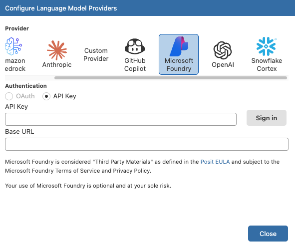
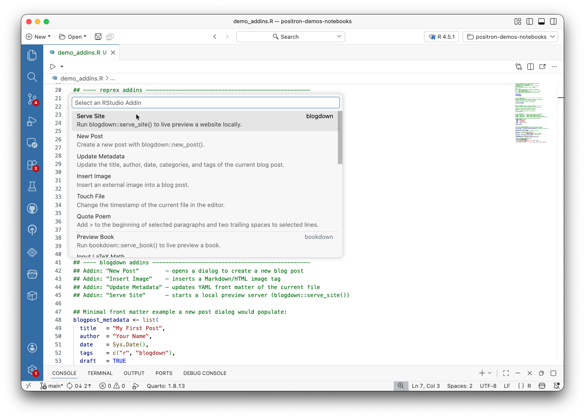
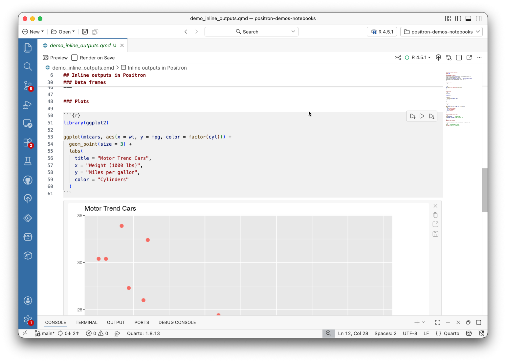

::: {.callout-tip}
[Subscribe](https://posit.co/positron-updates-signup/) to get this newsletter directly in your email inbox.
:::

Welcome to the first edition of our Positron newsletter! Here, we will share highlights from our latest release, tips on how to be more productive with Positron, and useful resources.

We just returned from an in-person onsite in beautiful Monterey, California. During the trip, we got a chance to meet (some of us for the first time), touch grass and sand, and brainstorm ways we can improve to build better products for you.

Let's get into the updates.

## Key Product Updates

The April 2026 release of Positron brings significant improvements across:

- [Positron Server for Academic Use](#positron-server-for-academic-use-via-jupyterhub) via JupyterHub
- [AI enhancements](#ai-next-steps-in-the-native-jupyter-notebook-editor): Next Steps in Jupyter Notebooks, Agent Skills, and Azure AI Foundry Support
- [Telemetry updates](#telemetry-update-anonymous-session-identifiers)
- [R improvements](#rstudio-addins-support): Addins, Debugging, and more
- [Data Explorer Performance Improvement](#data-explorer-faster-with-multiple-dataframes)
- [Windows ARM in GA](#windows-arm-is-generally-available)
- [What's Coming Next](#whats-coming-next): Inline Outputs, Packages Pane, and Posit Assistant

Here's a look at the key features that shipped with the April 2026 release.

### Positron Server for Academic Use via JupyterHub

**What we built:** Academic institutions can now offer Positron Server to their students at no cost through JupyterHub ([blog post](../2026-04-03-positron-server-jupyterhub/)). If your institution already runs JupyterHub, you can add Positron as a launcher option alongside JupyterLab, with no additional infrastructure required. Students simply log in and select Positron from the launcher, getting the full Positron experience including rich Python and R support, the extension marketplace, and (optionally) Positron Assistant.

**Why this matters:** This removes the barrier for students and educators who want to use Positron in a classroom setting. No local installs, no configuration headaches — just a familiar JupyterHub login with Positron ready to go.

**Get started:** Review the eligibility criteria and send an email to [academic-licenses@posit.co](mailto:academic-licenses@posit.co) to request a free teaching license.

### AI Next Steps in the Native Jupyter Notebook Editor



**What we built:** AI Next Steps uses the Positron Assistant to analyze your current cell output and suggest a logical next step in a "ghost cell" at the bottom of your notebook. If you just loaded a CSV, it might suggest data cleaning steps or a visualization, without you needing to open a chat pane or write a prompt. Suggestions stay aligned with the notebook's live kernel state, updating as your code and outputs change.

**Why this matters**: The design came out of interviews with data scientists who kept telling us the same thing: switching to a chat pane mid-analysis breaks their concentration. AI Next Steps sits at the bottom of your notebook and updates as your outputs change. You just run a cell, and if there's a logical next step, it surfaces, with no prompt required.

**Get started:** Enable the feature by setting [`positron.assistant.notebook.ghostCellSuggestions.enabled`](positron://settings/positron.assistant.notebook.ghostCellSuggestions.enabled) to `true` in your settings. When you run a cell, look for the ghost cell suggestion at the bottom of the notebook, accept, reject, or hide it.

### Agent Skills in Positron Assistant

**What we built:** Agent skills — reusable, structured capabilities that extend what agents can do in agent.md files — are now integrated into Positron ([#11753](https://github.com/posit-dev/positron/issues/11753)). Skills let agents execute multi-step workflows like "profile this dataset and suggest cleaning steps" or "run this test suite and summarize failures," so you define a task once and reuse it across sessions and projects.

**Why this matters:** Skills make agents composable building blocks rather than one-off chat interactions. Instead of re-explaining a complex workflow every time, you codify it as a skill that any team member can use.

**Get started:** Open the chat gear icon and select **Skills**, or run _Chat: Configure Skills_ from the Command Palette.

### Positron Assistant Now Supports Microsoft Foundry as a Provider

**What we built:** Positron Assistant now supports Microsoft Foundry as a model provider ([#8583](https://github.com/posit-dev/positron/issues/8583)) with API key-based access via a custom base URL.

**Why this matters:** If your team runs on Azure and uses LLMs through Foundry, you can now use Positron Assistant with them.

**Get Started:** In Positron Assistant's provider settings, set [`positron.assistant.provider.msFoundry.enable`](positron://settings/positron.assistant.provider.msFoundry.enable) to `true` to select Microsoft Foundry as a provider. You can authenticate with an API key and your Foundry endpoint URL.

### Telemetry Update: Anonymous Session Identifiers

**What we changed:** Positron now generates an anonymous, random session identifier to help us understand usage patterns like session frequency and retention across releases. This identifier contains no personal information, account data, or workspace content; it's a cryptographically random UUID that cannot be linked to any other identifiers, including the identifier that VS Code uses for telemetry.

**Why we're doing this:** As a free, source available project, we don't have traditional product analytics. Understanding whether people come back, how often they use Positron, and whether releases improve or regress the experience helps us prioritize the right work to build a better experience for you.

You can opt out by updating your settings outlined [here](/privacy.qmd), or you can reset the anonymous identifier with the command _Preferences: Reset Anonymous Telemetry ID_. If you've opted out of product updates, no session identifier is generated or sent.

### RStudio Addins Support

**What we built:** Positron now supports running RStudio addins from R packages. If a package registers an addin (like styler, reprex, clipr, or shinyuieditor), you can run it directly from Positron ([#1313](https://github.com/posit-dev/positron/issues/1313)).

**Why this matters:** This was one of our most upvoted issues this release (25 👍). Many R users rely on addins as part of their daily workflow for code formatting, generating reproducible examples, or launching Shiny tools.

**Get started:** Open the Command Palette () and search for _Run RStudio Addin_. You'll see a quick pick with all available addins from your installed packages.

 

### R Debugger & Workflow Improvements

**What we built:** The R debugger received a suite of improvements this release. In addition to conditional breakpoints, hit count breakpoints, and log breakpoints ([#12360](https://github.com/posit-dev/positron/issues/12360)), the debugger now supports error and warning breakpoints ([#11797](https://github.com/posit-dev/positron/issues/11797)), the ability to pause R at any time ([#11799](https://github.com/posit-dev/positron/issues/11799)), Watch Pane support ([#1765](https://github.com/posit-dev/positron/issues/1765)), and synchronization between the Console and Variables pane with the selected call stack frame ([#3078](https://github.com/posit-dev/positron/issues/3078) and [#12131](https://github.com/posit-dev/positron/issues/12131)).

**Why this matters:** Advanced debugging in R has traditionally meant scattering `if (...) browser()` calls through your code or setting `options(error = recover)` by hand. These new features put Positron's R debugger on par with what you'd expect from any modern language:

- **Conditional, hit count, and log breakpoints** let you control exactly when breakpoints fire and print diagnostic info, all without touching your source code.
- **Error and warning breakpoints** drop you into the debugger the moment an error or warning is emitted, so you can inspect the state that caused it.
- **Pause R at any time.** If R is stuck in a long computation or an infinite loop, you can drop into the debugger mid-execution, look around, and resume by clicking **Continue**.
- **Watch Pane** lets you track expressions across debug steps. Prefix an expression with `/print` to see R's printed output (hover to get full output) instead of a structured variable.
- **Synchronization with the call stack.** Click any frame in the **Call Stack** view and the Console, completions, and Variables pane all switch to that frame's environment. The Console synchronization is like `recover()`, but built into the IDE.

**Get started:** Set a breakpoint in any R file, then right-click it and choose **Edit Breakpoint**. Select "Expression" to add a condition (e.g., `i > 100`), "Hit Count" to break after N hits, or "Log Message" to print a message without pausing. For error and warning breakpoints, open the **Breakpoints** pane and enable them there. To pause R while code is running, use the command _Debug: Pause_ or check the **Interrupt** breakpoint option in the **Breakpoints** pane. While debugging, add expressions in the **Watch** section of the debug sidebar and click on frames in the **Call Stack** to navigate environments.



### Data Explorer: Faster with Multiple DataFrames

**What we built:** We fixed two long-standing performance issues in the Data Explorer. Background Data Explorer tabs no longer trigger backend recomputation, and the summary panel no longer recalculates summary statistics for large DataFrames on every cell execution ([#4279](https://github.com/posit-dev/positron/issues/4279) and [#2795](https://github.com/posit-dev/positron/issues/2795)).

**Why this matters:** If you work with multiple DataFrames open, you may have noticed lag as Positron recomputed statistics for tabs you weren't even looking at. That's gone now.

**Get started:** Nothing to configure. When you open multiple DataFrames in the Data Explorer and switch between them, you should notice snappier performance, especially with large datasets.

### Windows ARM Is Generally Available

**What we built:** We started creating experimental builds for Windows ARM several months ago, and our early users have had good experiences with them. This release, we promoted the Windows ARM builds from experimental to stable and they are now available through all standard installation channels ([#12207](https://github.com/posit-dev/positron/issues/12207)).

**Why this matters:** ARM-based devices are increasingly common for Windows users, whether you're a student or a professional. GA support means these users get the same Positron experience, including Quarto with R and Python support, without needing workarounds or experimental builds. Do be aware that the Windows ARM build bundles the non-ARM version of Quarto, which runs under emulation.

**Get started:** Install Positron on your ARM-based Windows device through [standard installation channels](/download.qmd).

View all issues in the [2026.04.0 Release milestone](https://github.com/posit-dev/positron/milestone/36).

## What's Coming Next

We are currently building the following features and we'd love your feedback. Please share on [GitHub](https://github.com/posit-dev/positron/discussions). These early alpha features with some rough edges are available for testing by enabling their respective settings.

### Inline Outputs for Quarto and R Markdown Files

This was the second most upvoted issue we have ever, ever had! We just completed an initial run to allow displaying inline outputs within Quarto and R Markdown files ([#5640](https://github.com/posit-dev/positron/issues/5640)), and it is available for early testing. Note that this experimental version, while it does get the basics into Positron, does not have support for many popular RStudio features. You can opt in to the experimental feature using the [`positron.quarto.inlineOutput.enabled`](positron://settings/positron.quarto.inlineOutput.enabled) setting.

### Packages Pane for Managing Environments

We are currently building out a new Packages pane that will allow you to install, update, and uninstall packages without leaving your workspace or needing to use the terminal ([#11214](https://github.com/posit-dev/positron/issues/11214)). We'd love to hear your feedback on this [discussion thread](https://github.com/posit-dev/positron/discussions/12863).

## Events and Resources

### Explore Positron's Video Walkthroughs on YouTube

We hosted a walkthrough of exploring GitHub data in a Jupyter Notebook and converting this into an interactive Shiny app with AI. [Catch up on the recording](https://www.youtube.com/watch?v=qrVkG89ndi8) or [explore more Positron videos](https://www.youtube.com/@PositPBC).

### Registration for posit::conf(2026) Is Now Open!

Registration is officially open for posit::conf(2026)! Join the global data community in Houston or tune in online from September 14–16. [Register today!](https://posit.co/conference/)

### How We Chose a Python Type Checker

Ever wondered about the decision making process behind how we chose which Python type checker to bundle in Positron? Check out Austin Dickey's [blog post](../2026-03-31-python-type-checkers/) walking through his research and decision making process.

## Community Affirmations

Thank you all for your support, ideas and engagement. We're building Positron in the open because the best ideas come from the people using it. If there's a feature you'd love to see, [open an issue](https://github.com/posit-dev/positron/issues) or upvote an existing one, it genuinely shapes what we work on next.

Have a great April!

Positron Team
