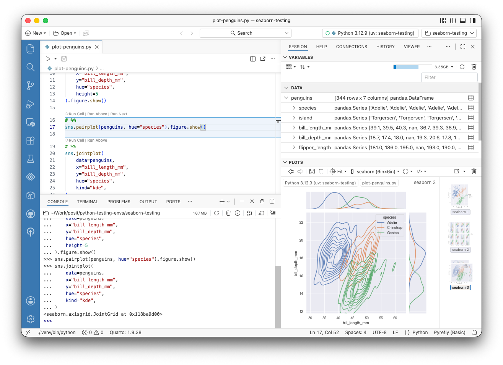

Code cells let you divide a plain `.py` or `.R` script into sections that you can run one at a time, using special comments like `# %%` as cell boundaries. You get a notebook-like, interactive workflow while your code stays in a regular file that is easy to version, diff, and reuse.

Positron supports code cells in both Python and R files:

-   Cells run in your current [interpreter session](managing-interpreters.qmd), with output shown in the Console, just like running any other code from the editor.
-   The cell containing your cursor is highlighted, and cells display **Run Cell**, **Run Above**, and **Run Next** links above their delimiters.
-   Keyboard shortcuts let you run cells, insert new ones, and move between them without leaving the keyboard.

{fig-alt="Positron IDE showing a Python script with several code cells separated by cell delimiter comments. The cell containing the cursor is highlighted, Run Cell links appear above each cell, and the Console pane shows the output of the last cell."}


::: {.callout-note}
Code cells are a feature for plain script files. Positron also has first class support for [Quarto `.qmd` files](quarto.qmd) and [Jupyter Notebooks](jupyter-notebooks.qmd).
:::

## Creating code cells

Start a new cell by adding a comment line that begins with the cell delimiter. A cell extends until the next delimiter or the end of the file. You can also use the _Positron: Insert Code Cell_ command or  to insert a new cell below the current one.

::: {.panel-tabset}

### Python

In Python files, a comment starting with `# %%` begins a new cell:

```python
# %%
import pandas as pd

penguins = pd.read_csv("penguins.csv")
penguins.head()

# %%
penguins.groupby("species")["body_mass_g"].mean()
```

This is the same ["percent" format](https://jupytext.org/formats/scripts/#the-percent-format) used by Jupytext, Spyder, and VS Code, so scripts with code cells move between editing tools fluently. Markdown cells in this format, starting with `# %% [markdown]`, are also supported; running one renders its contents as formatted output in the Console.

### R

In R files, a comment starting with `# %%` or `# +` begins a new cell:

```r
# %%
penguins <- read.csv("penguins.csv")
head(penguins)

# %%
aggregate(body_mass_g ~ species, data = penguins, FUN = mean)
```

A [section header comment](https://docs.posit.co/ide/user/ide/guide/code/code-sections.html) such as `# Load data ----` ends the current cell, so you can combine code sections and code cells in the same script.

:::

### Custom cell delimiters

To use an additional cell delimiter, set [`codeCells.additionalCellDelimiter`](positron://settings/codeCells.additionalCellDelimiter). By default, this setting adds support for the `# COMMAND ----------` delimiter used by Databricks notebooks exported as source files.

## Running code cells

Click the **Run Cell** link above a cell to run it in your current Console session. The **Run Above** link runs all cells before the current cell, which is useful for restoring your session state from the top of the script, and **Run Next** runs the cell that follows.

You can also run cells with keyboard shortcuts:

| Shortcut | Description |
| -------- | ----------- |
|  | Run the current cell |
|  | Run the current cell and advance to the next cell |
|  | Run all cells |
|  | Run all cells above the current cell |
|  | Run all cells below the current cell |
|  | Run the previous cell |
|  | Run the next cell |

All of these commands are also available from the [Command Palette](command-palette.qmd), such as _Positron: Run All Cells_.

## Navigating between cells

Move between cells without running them using  to go to the next cell and  to go to the previous cell, or the corresponding _Positron: Go to Next Cell_ and _Positron: Go to Previous Cell_ commands.

## Customizing cell appearance

The cell containing your cursor is highlighted with a background color by default. Use [`codeCells.cellStyle`](positron://settings/codeCells.cellStyle) to choose a `background`, `border`, or `both` style for the active cell. The colors come from your theme. You can customize them via the `notebook.selectedCellBackground` and `interactive.activeCodeBorder` [theme colors](https://code.visualstudio.com/api/references/theme-color).
