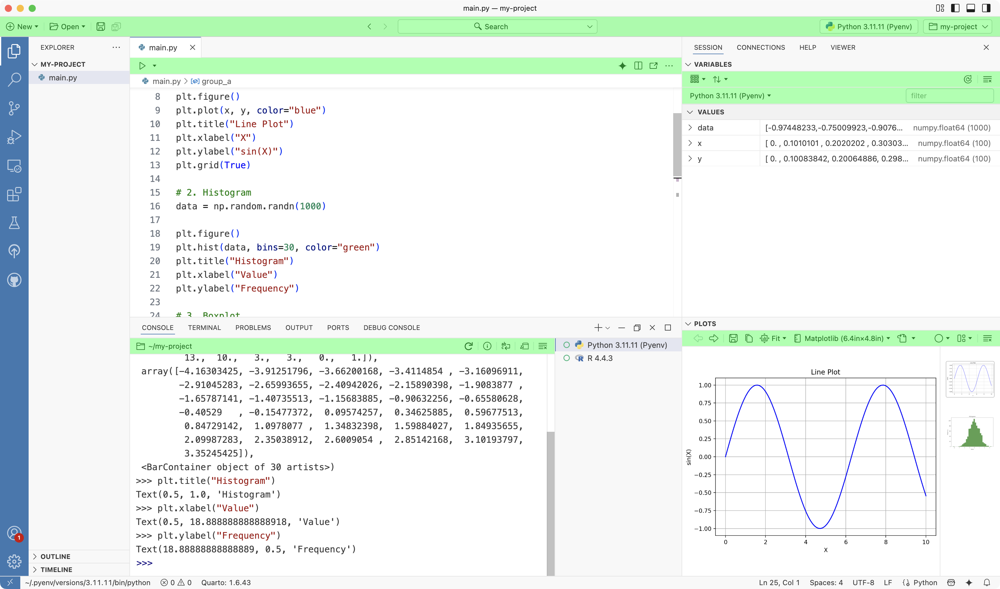
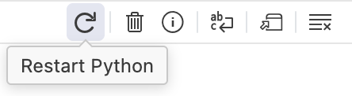
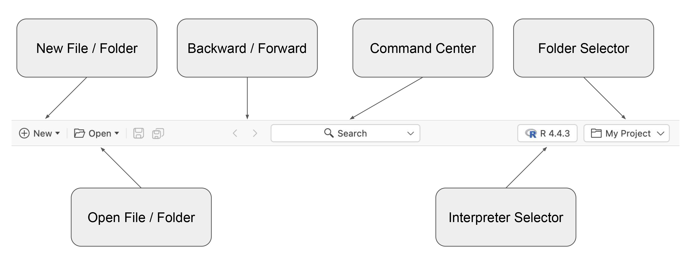

# Action Bars

Discover how Positron’s Action Bars put essential functionality at your fingertips with context-aware buttons, menus, and controls throughout the interface.

Positron uses Action Bars throughout the application to put essential functionality at your fingertips.

Action Bars

## Anatomy of an Action Bar

### Regions

An Action Bar is divided into three regions: left, center, and right. Every Action Bar includes the left and right regions, while the center region appears only when needed. The most important actions are typically placed on the left.

Action Bar Regions

### Elements

Action Bars are made up of Action Bar Elements.

[TABLE]

### Tooltips

Hold the pointer over an Action Bar Element to reveal its tooltip and quickly understand what it does.

Action Bar Tooltip

## Top Action Bar

The Top Action Bar helps you manage your work. On the left, you will find actions to create or open files and folders. In the center, you can navigate backward and forward through recent cursor positions and use the command center to quickly access Positron commands or locate files in your project. On the right, the [interpreter selector](managing-interpreters.llms.md) lets you start new interpreters or switch between running ones, while the folder selector allows you to open recently used folders, either in the current window or a new one.

Top Action Bar

## Wrapping up

Action Bars surface the most important and frequently used actions in each area of the product, so you do not have to rely on the Command Palette to find everything. Because they are contextual, Action Bars present the tools you need right where you need them, helping you stay focused and work more efficiently in Positron.
