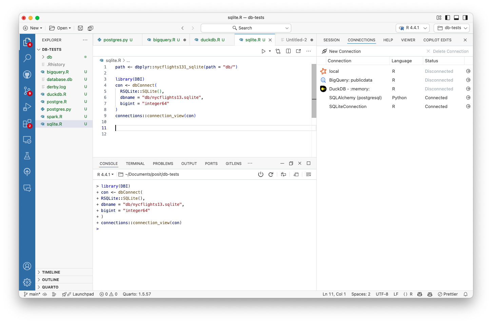
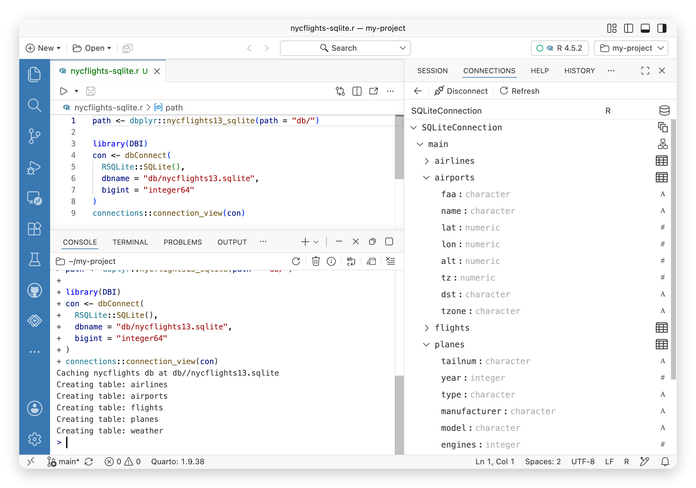
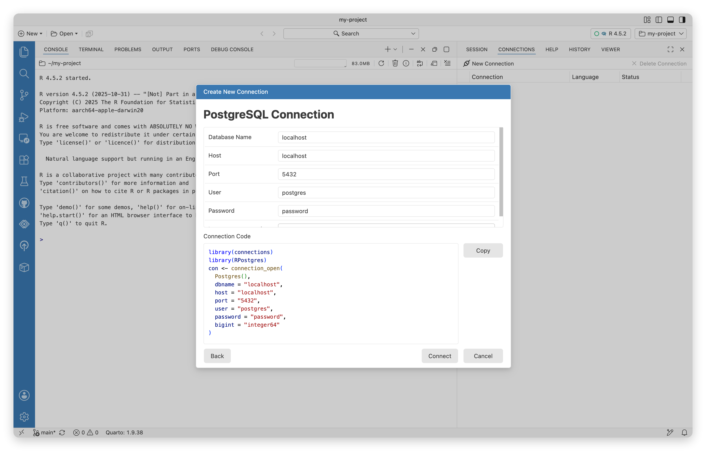
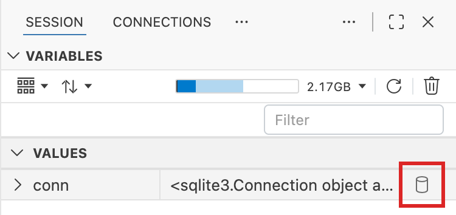

# Connections Pane

Manage database connections and explore schemas in Python and R. Browse tables, columns, and preview data directly in Positron’s Data Explorer.

The **Connections** pane allows you to manage and explore database connections for use within your Python and R sessions. You can create connections to databases, explore their schemas, and interactively preview database tables.

[](images/connections-pane.png "Connections pane")

Connections pane

## Explore your database schema

Once you [create a new connection](#create-a-new-connection), you can use the **Connections** pane to explore the database schema.

[](images/connections-pane-schema-explorer.png "Connections pane showing database schema, tables, and columns")

Connections pane showing database schema, tables, and columns

You can navigate through the database schema, viewing tables, columns, and their data types. You can also select the table icon to explore a preview of the database contents in the [Data Explorer](data-explorer.llms.md).

## Create a new connection

You can create a new connection to a database either from the UI, or using Python or R code.

### Create a new connection from the UI

To open a new connection, select the **New connection** button in the **Connections** pane. This will open a modal that allows you to select the connection type and fill in the connection details. This modal generates the code required to open the connection in your Python or R session.

[](images/connections-pane-new-connection.png "New connections modal")

New connections modal

When you create a new connection, Positron stores and manages connection strings for future usage.

### Create a connection using R

To create a connection in the Positron **Connections** pane, you need to connect to a database using any package that supports the connections contract, such as [odbc](https://github.com/r-dbi/odbc), [sparklyr](https://github.com/rstudio/sparklyr), [bigrquery](https://github.com/r-dbi/bigrquery), and others.

The Positron **Connections** pane implements [RStudio’s connections contract](https://rstudio.github.io/rstudio-extensions/connections-contract.llms.md); this means that any package that works within RStudio’s **Connections** pane should work within the Positron **Connections** pane.

Here is an example of how to open a connection using the [connections](https://github.com/rstudio/connections) package to open a SQLite connection:

``` r
con <- connections::connection_open(RSQLite::SQLite(), "nycflights13.sqlite")
```

Select the connection object [from the **Variables** pane](#explore-a-connection-from-the-variables-pane) or use `connections::connect_view(con)` to open the **Connections** pane.

You can find more information about connecting to a specific database [from Posit Solutions Engineering](https://solutions.posit.co/connections/db/databases/).

### Create a connection using Python

Connections can be created using:

- [sqlite3](https://docs.python.org/3/library/sqlite3.llms.md)
- [SQLAlchemy](https://www.sqlalchemy.org)
- [duckdb](https://duckdb.org/docs/clients/python/overview)
- SQL Server via [pymssql](https://pymssql.readthedocs.io/) or [pyodbc](https://github.com/mkleehammer/pyodbc)
- [Databricks SQL Connector](https://docs.databricks.com/en/dev-tools/python-sql-connector.llms.md)
- [Snowflake Connector](https://docs.snowflake.com/en/developer-guide/python-connector/python-connector)
- [Google BigQuery](https://cloud.google.com/python/docs/reference/bigquery/)
- [AWS Redshift](https://docs.aws.amazon.com/redshift/latest/mgmt/python-redshift-driver.llms.md)

To open a connection in the **Connections** pane, create a top level object that represents the connection/engine.

``` python
import sqlite3
conn = sqlite3.connect("nycflights13.sqlite")
```

You can then either use `%connection_show conn` to open the connection in the **Connections** pane or [open it from the **Variables** pane](#explore-a-connection-from-the-variables-pane).

## Explore a connection from the Variables pane

You can open an existing connection that you created from Python or R from the [**Variables** pane](variables-pane.llms.md):

[](images/connections-pane-variables-pane.png "Variables pane showing a connection object")

Variables pane showing a connection object

Select the database icon to bring up the **Connections** pane, allowing you to navigate the database.
