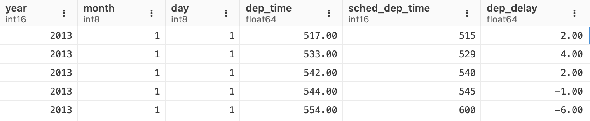
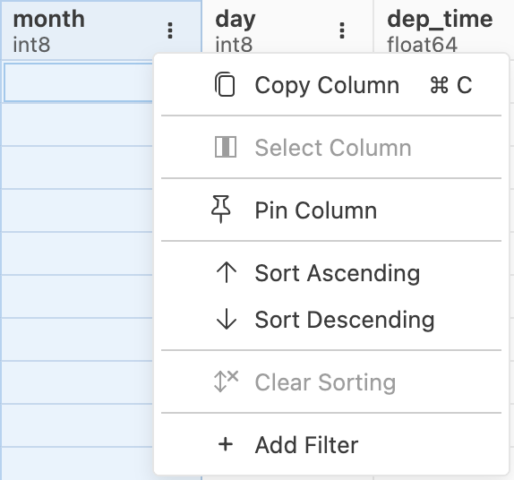
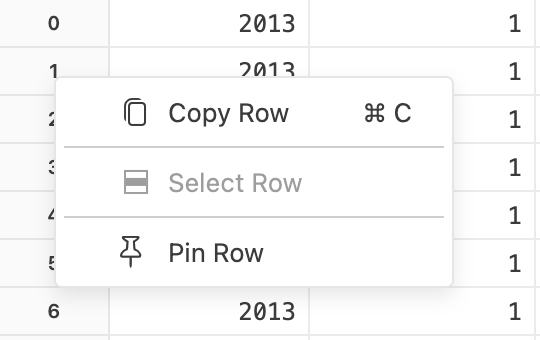
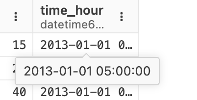
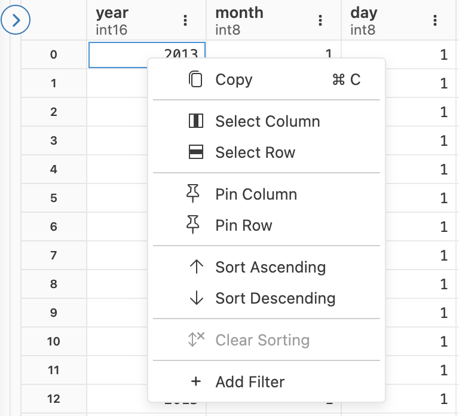
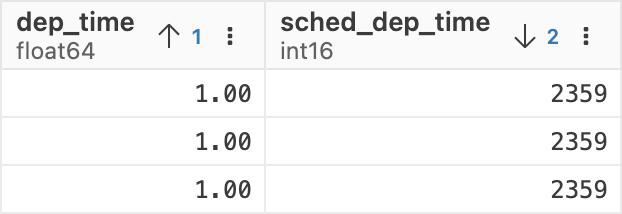
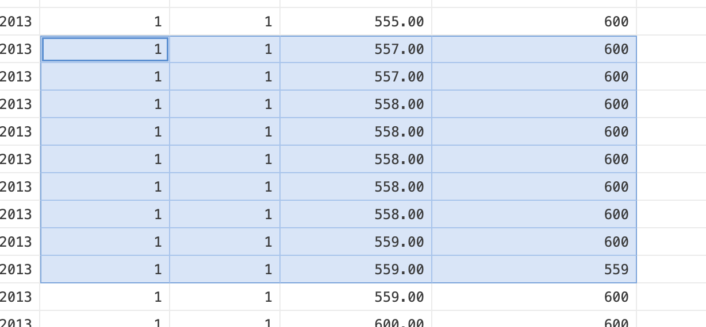
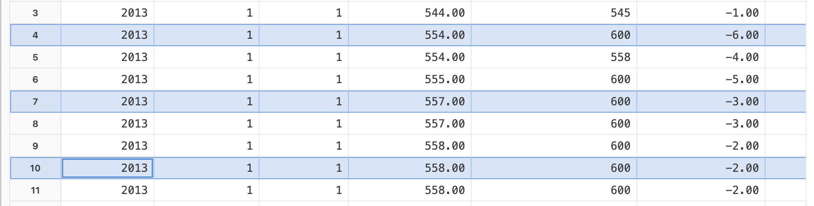
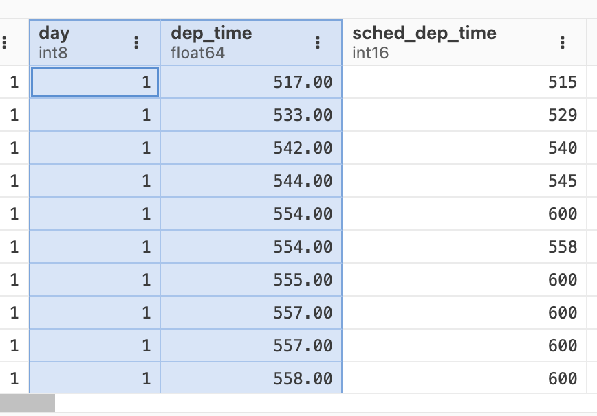

# Data Grid

View millions of rows and columns in Positron’s efficient Data Explorer, with real-time updates and support for Pandas, Polars, tibbles, and database connections.

The data grid is the primary display, with a spreadsheet-like cell-by-cell view. It’s intended to scale efficiently to relatively large in-memory datasets, up to millions of rows or columns.

Data Explorer Grid Example

Each Data Explorer instance watches the underlying data for changes, so if you edit a data file or modify an in-memory dataframe, the changes will be reflected in the Data Explorer.

### Supported data frame libraries

Pandas and Polars dataframe objects are supported in Python, and `data.frame`, `tibble`, and `data.table` are supported in R. Previews of database connections managed by the [**Connections** pane](connections-pane.llms.md) are also supported, for both Python and R.

Based on [user feedback](feedback.llms.md#feedback-and-issues), we may add support for other libraries that expose a tabular data interface.

### Column overview

Each column header has the column name above the data type, which is dependent on the backend type (language runtime or DuckDB).

At the top right of each column, there is a context menu for column specific actions.

Data Explorer Column Menu

Columns can be resized by selecting and dragging the border on either side of a column.

### Row overview

Row labels default to the observed row index, with a zero-based index in Python and a one-based index in R. Alternatively, `pandas` and R users may also have rows with modified indices or string-based labels.

Right-clicking on a row header will bring up a context menu for row specific actions.

Data Explorer Row Menu

### Cell overview

For long strings or other data values that do not fully fit in a grid cell, you can see a tooltip containing the complete value by hovering over the cell:

Data Explorer Cell Value Tooltip

Right-clicking or pressing on a cell will bring up a context menu for cell specific actions.

Data Explorer Cell Menu

When focused on a cell you can bring up the row header menu by pressing . You can bring up the column header menu by pressing

## Sorting

To sort the values in a column, open a column context menu from the top of the grid and select either **Sort Ascending** or **Sort Descending**.

Data Explorer Column Menu

To clear an individual column sort, select the column header and choose **Clear Sorting** from the context menu.

When a column is sorted, the column header displays an arrow pointing up or down to indicate the sort direction. You can sort by multiple columns by opening the context menu for a second column and sorting it as well. The number next to the sort direction indicates the sort order of the column.

Sorting Data by Multiple Columns

To clear all sorting, select the **Clear Column Sorting** button in the top action bar.

## Pinning columns and rows

You can pin columns and rows to keep them visible while scrolling through large datasets. Pinned columns appear on the left side of the grid, and pinned rows appear at the top.

### Pin columns

To pin a column, right-click the column header and select **Pin Column** from the context menu. The column moves to the left side of the grid and remains visible when you scroll horizontally.

To unpin a column, right-click the pinned column header and select **Unpin Column** from the context menu.

### Pin rows

To pin a row, right-click the row header and select **Pin Row** from the context menu. The row moves to the top of the grid and remains visible when you scroll vertically.

To unpin a row, right-click the pinned row header and select **Unpin Row** from the context menu.

### Pin multiple items

You can pin multiple columns and rows. Pinned columns appear in the order you pin them, starting from the leftmost position. Pinned rows appear in the order you pin them, starting from the top.

## Selection, copy, and paste

The data grid provides copy-and-paste capabilities similar to a spreadsheet. You can select:

- A single cell
- A rectangular range of cells
- One or more rows
- One or more columns

To copy a single value, select a cell and press . You can also copy the value using the right-click context menu.

To copy a rectangular range of cells, select a cell, then hold ShiftShift and select another cell to define the range. Press or use the context menu to copy the values.

Copying a Rectangular Range of Cells

When you copy a rectangular range of cells, the system copies the values with column names in tab-separated format. This format makes pasting into Excel or Google Sheets easier.

To copy entire rows or columns, select the first row label or column label. Then either hold ShiftShift and select another row or column label to define a range, or hold and select additional labels to choose individual rows or columns.

Copying Multiple Data Rows

Copying Multiple Data Columns

When you copy entire rows or columns, the system includes column names in the tab-separated output, similar to copying a rectangular range of cells.
