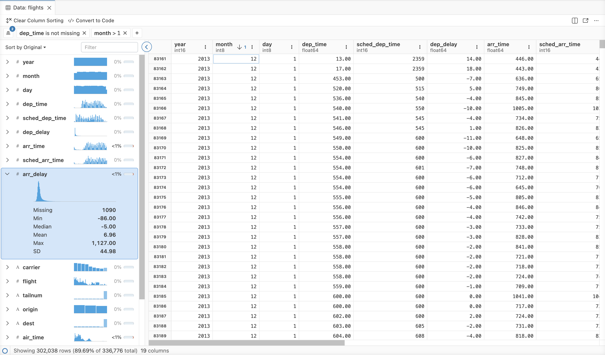

# Data Explorer

Explore dataframes and data files in a spreadsheet-like grid with filtering, sorting, and summary statistics. View CSV, Parquet, and in-memory data interactively.

The Data Explorer complements code-first exploration of data. It displays data in a spreadsheet-like grid, temporarily filters and sorts data, and provides useful summary statistics directly inside Positron. The goal is not to replace code-based workflows. Instead, the Data Explorer supplements them with ephemeral views of the data or summary statistics as you explore or modify the data via code.

The Data Explorer can be used to view raw data files (CSV, Parquet, etc.) in your Positron workspace as well as dataframes in your active Python or R sessions.

The Data Explorer has three primary components:

- **[Data grid](data-explorer-data-grid.llms.md):** Spreadsheet-like display of the individual cells and columns
- **[Summary panel](data-explorer-summary-panel.llms.md):** Summary statistics for each column in the dataset
- **[Filter bar](data-explorer-filter-bar.llms.md):** Ephemeral filters for specific columns

[](images/data-explorer.png "Data Explorer")

Data Explorer

## Opening the Data Explorer

There are a few ways to open the Data Explorer. If you want to look at data you have loaded into memory already, you can navigate to the [**Variables** pane](variables-pane.llms.md) and select the icon for a specific dataframe object.

You can also open the Data Explorer from your editor (`.py`, `.R`, `.ipynb`, or `.qmd` files). Use the *View Data Frame at Cursor* command from the [Command Palette](command-palette.llms.md) or the right-click context menu. This functionality is also available as a code action via the icon in the editor gutter or via the menu.

Using code or the console, you can also run one of the following commands:

- In Python: `%view dataframe label`
- In R: `View(dataframe, "label")`

In Python, you can also use the `%view` magic with expressions, for example `%view df[df['column'] > 10]`. In R, you can compose the `View` function with expressions using pipe syntax:

``` r
df |> mutate(doubled_column = column * 2) |> View()
```

You can directly open `.csv`, `.tsv`, `.parquet`, and `.xlsx` files (using DuckDB) by selecting a file in the File Explorer or using the Command Palette.[^1] You can also open compressed CSV, TSV, and Parquet files.

### Opening CSV files as plain text

After opening a CSV file in the Data Explorer, you can view it in the text editor. Select the **Open as Plain Text File** option in the top action bar.

## Footnotes

[^1]: Use **File Options** in the action bar to configure how DuckDB parses a `.csv` or `.tsv` file.
