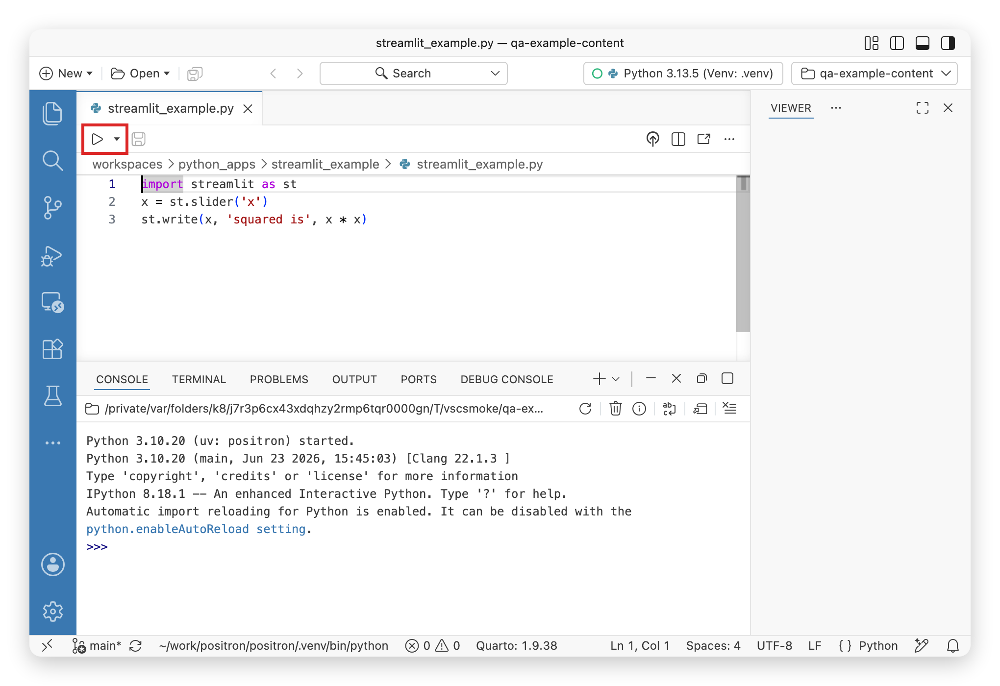
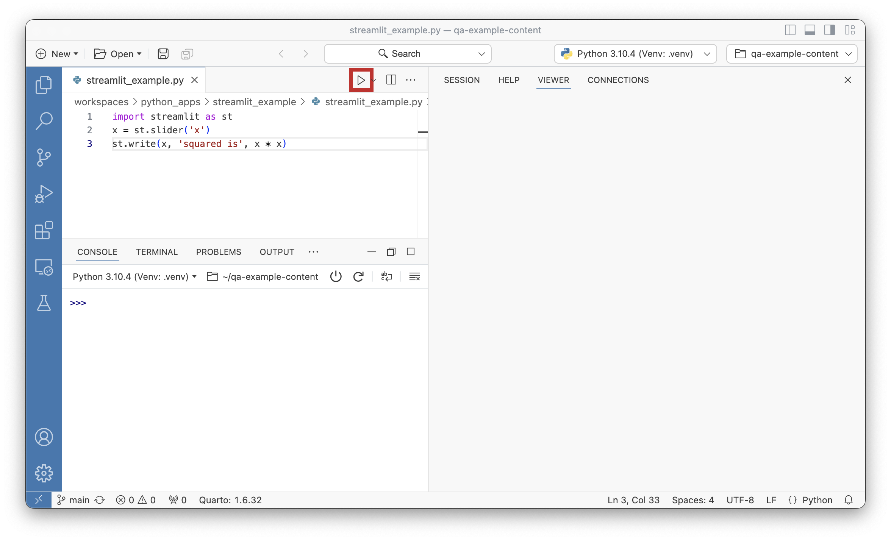
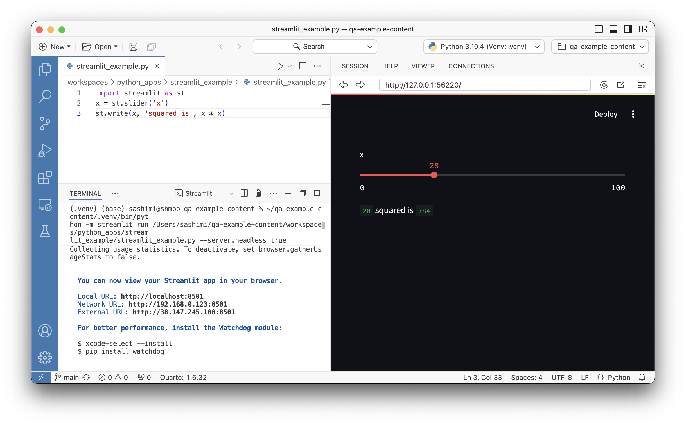
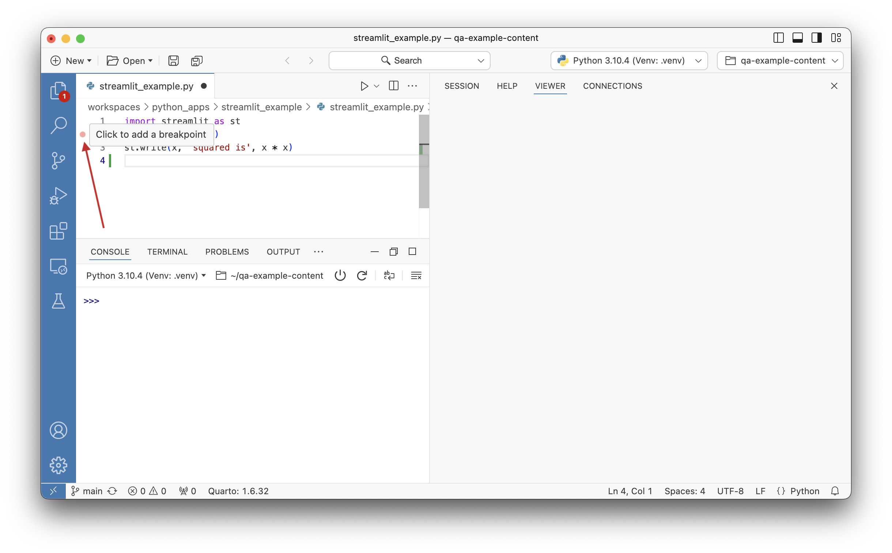
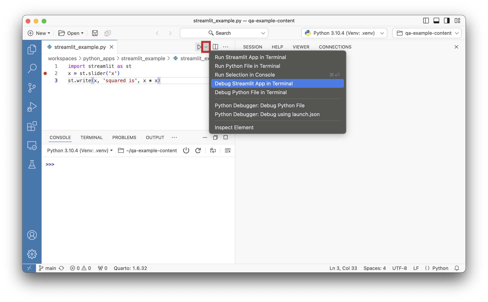
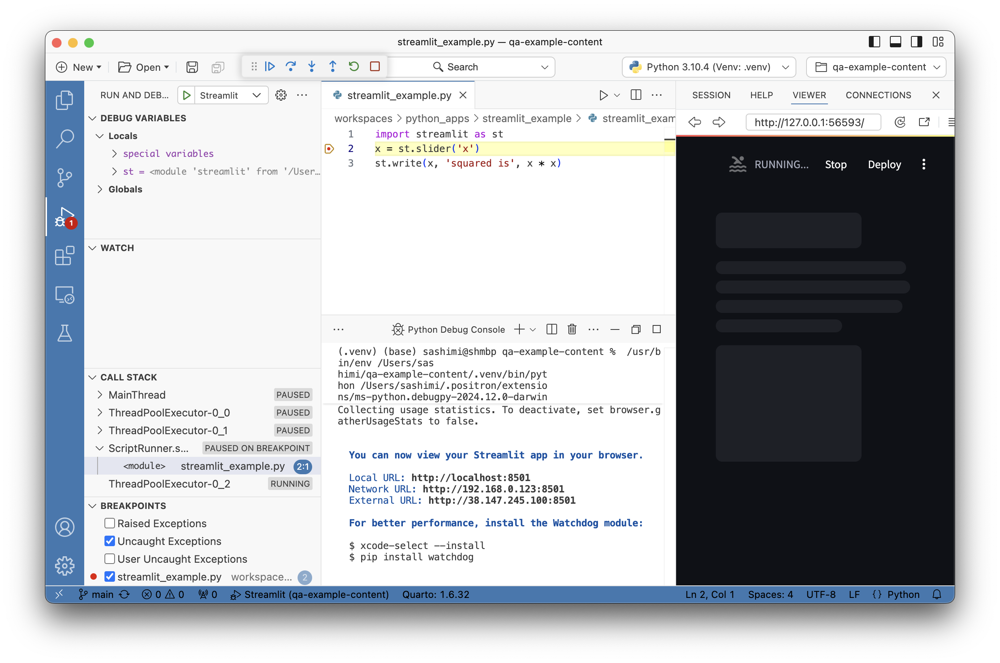

# Develop Data Apps

Build and preview Shiny, Streamlit, Dash, FastAPI, and Flask apps in Positron. Launch with one click of the Play button, or use our debugging support.

Positron provides a simplified method for running interactive data apps via the **Play** button. Instead of running an app from a **Terminal**, you can run supported apps by selecting the **Play** button in Editor Actions. Additionally, you can start a supported app in debug mode through the **Play** button context menu.

Positron App Launcher button in Editor Actions

## Supported app frameworks

Currently, Positron supports the following Python app frameworks:

- [Dash](https://dash.plotly.com/)
- [FastAPI](https://fastapi.tiangolo.com/)
- [Flask](https://flask.palletsprojects.com/en/stable/)
- [Gradio](https://www.gradio.app/)
- [Streamlit](https://streamlit.io/)
- [Shiny](https://shiny.posit.co/py/) via the [Shiny extension](https://open-vsx.org/extension/posit/shiny) which is included as a [bootstrapped extension](extensions.llms.md#bootstrapped-extensions)

## Running a data app

1.  Open the `.py` file of a supported app framework.

2.  In Editor Actions, select **Play**.

    

    Positron App Launcher Play button

Then, Positron runs the app in a dedicated **Terminal** tab and opens the app URL in the **Viewer** pane. If your application does not automatically open in the Viewer, check that the settings [`python.terminal.shellIntegration.enabled`](positron://settings/python.terminal.shellIntegration.enabled) and [`terminal.integrated.shellIntegration.enabled`](positron://settings/terminal.integrated.shellIntegration.enabled) are enabled.

A Streamlit app in the Positron Viewer

To stop the app, you can either:

- Select the interrupt button in the **Viewer** pane toolbar.
- Select the **Terminal** tab running the application and use the trash can icon to delete the **Terminal** or press Ctrl-CCtrl-C to stop the process.

## Choosing where apps open

By default, apps open in the **Viewer** pane. The [`positron.runApp.previewMode`](positron://settings/positron.runApp.previewMode) setting controls where the app opens:

| Value      | Behavior                               |
|------------|----------------------------------------|
| `viewer`   | Opens in the **Viewer** pane (default) |
| `editor`   | Opens in an editor tab                 |
| `external` | Opens in the default external browser  |
| `none`     | Does not open the app automatically    |

Python Shiny apps use the [Shiny extension](https://open-vsx.org/extension/posit/shiny)’s [`shiny.previewType`](positron://settings/shiny.previewType) setting instead.

## Debugging a data app

1.  Open the `.py` file of a supported app framework.

2.  Set breakpoints in the `.py` file by selecting the editor margin.

    

    Editor margin area for adding breakpoints

3.  Select the **Play** button dropdown context menu and choose **Debug \[*{SUPPORTED_APP_TYPE}*\] App in Terminal**.

    - For this example, we select **Debug Steamlit App in Terminal**.

    

    Play button dropdown context menu

Then, Positron runs the app in a dedicated **Terminal** tab, opens the app URL in the **Viewer** pane, and starts the app in debug mode.

A Streamlit app running in debug mode; paused at a breakpoint
