# Features

Discover the complete data science toolkit designed to keep you in the flow. Quickly move from data to insight to application in one code editor.

> **NOTE:**
>
> Interested in Positron for your team? [Learn about enterprise solutions.](https://posit.co/products/ide/positron/?utm_source=positron-docs&utm_medium=features-page)

## Bridge the exploration and production divide

### Build data applications

Instantly develop and preview data applications directly from Positron.

[Develop Data Apps](develop-data-apps.llms.md)

### Create dynamic reports with Quarto

Develop compelling, reproducible reports and presentations with Quarto to effectively communicate insights to any stakeholder.

[Quarto](quarto.llms.md)

### Work with Jupyter Notebooks

Get started instantly with our batteries-included Positron Notebook Editor that bridges Jupyter's functionality with IDE capabilities built for data science.

[Positron Notebook Editor](positron-notebook-editor.llms.md)

### Accelerate insights with AI-powered assistance

Enhance code quality and accelerate insights with integrated AI assistance contextualized for data science.

[AI features](ai-features.llms.md)

## Explore and analyze with speed

### Python and R

Code efficiently with full support for both Python and R in a single, integrated editor.

[Python and R](language-guides.llms.md)

### Interact with data at scale

Explore and manipulate large datasets with intuitive, fast, and interactive data frames.

[Data Explorer](data-explorer.llms.md)

### Inspect your environment

Thoroughly examine variables, objects, and environments for robust debugging and understanding.

[Variables Pane](variables-pane.llms.md)

### Generate rapid visualizations

Create high-quality visualizations quickly to uncover patterns and communicate findings effectively.

[Plots Pane](plots-pane.llms.md)

## Develop with confidence

### Scale beyond your local workstation

Collaborate securely with your team via Posit Workbench or use remote SSH to access your own servers.

[Remote SSH](remote-ssh.llms.md)

### Automatically setup projects

Avoid manual setup by using templatized ready-to-use environments.

[Folder Templates](folder-templates.llms.md)

### Multi-session console

Work across one or multiple consoles for concurrent analysis and development.

[Managing Interpreters](managing-interpreters.llms.md)

### Publish reports quickly

With a click of a button, seamlessly deploy and share your project with Posit Publisher to Posit Connect and Posit Connect Cloud

[Publish reports quickly](publish-to-connect.llms.md)

## Enterprise-ready with Positron Pro

For teams that need enterprise-grade capabilities, [Positron Pro](https://posit.co/products/ide/positron/?utm_source=positron-docs&utm_medium=features-page) on [Posit Workbench](https://posit.co/products/enterprise/workbench/?utm_source=positron-docs&utm_medium=features-page) provides the scalability, data access, admin configuration, and security your organization requires.

### Enhanced Security

Move development off unmanaged laptops into a secure, server-based environment that integrates with your existing SSO identity providers or data governance tools like AWS, Databricks, and Snowflake.

### Scalable Compute

Give data scientists access to powerful servers with more CPU, RAM, and GPUs than their laptops could ever provide.

### Centralized Management

Administer all your IDEs (Positron, RStudio, VS Code, JupyterLab) in one place, reducing IT overhead and ensuring consistent environments.

### Dedicated Support

Get help from Posit experts about how to deploy, maintain, and troubleshoot your Posit Workbench environment.

## Get started

Join thousands of data scientists who have already made the switch to Positron.

[Get Started](welcome.llms.md) [Stay Updated](https://posit.co/positron-updates-signup/)
