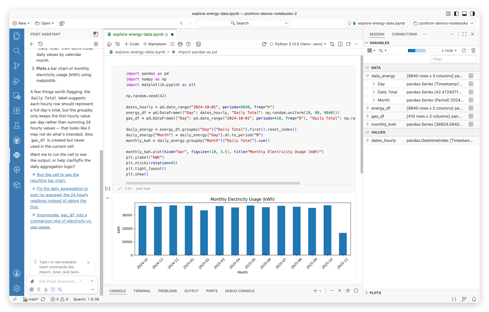

# Jupyter Notebooks

Work with Jupyter Notebooks in Positron with built-in support for Python and R. No extra dependencies needed as notebooks integrate seamlessly with the IDE.

[Jupyter Notebooks](https://jupyter-notebook.readthedocs.io/en/latest/notebook.llms.md) offer a flexible, interactive UI for combining code, prose, and visualizations.

Positron enhances Jupyter Notebooks in several key ways:

- Notebooks work out of the box. You do not need to install any additional dependencies into your Python or R environments.
- Notebooks are integrated into the IDE. You can manage data sources in the [Connections pane](connections-pane.llms.md), view data at a glance in the [Variables pane](variables-pane.llms.md), explore data in depth with the [Data Explorer](data-explorer.llms.md), and browse documentation in the [Help pane](help-pane.llms.md).
- Language features such as autocompletion and go-to-definition work seamlessly across notebooks and plaintext files.

A Jupyter Notebook in Positron with a Python code cell, a monthly electricity usage chart as output, the Assistant panel open to the left, and the Variables pane open to the right.

## Notebook editors

Positron offers two editors for working with Jupyter Notebooks: the [Positron Notebook Editor](positron-notebook-editor.llms.md), which is the default, and the [Legacy Notebook Editor](legacy-notebook-editor.llms.md), the VS Code based notebook editor.

### Positron Notebook Editor

> **NOTE:**
>
> The Positron Notebook Editor is the default editor for Jupyter Notebooks. We are actively working on improving the notebook experience in Positron and want to hear from you! Share your thoughts on [this Github discussion](https://github.com/posit-dev/positron/discussions/10047) or [schedule a call](https://scheduler.zoom.us/cindy-tong/improving-the-positron-notebook-experience) with our product and engineering team.

The [Positron Notebook Editor](positron-notebook-editor.llms.md) is a native notebook experience built specifically for Positron. It provides notebook-aware AI assistance, integrated data exploration, and an improved user experience for data science workflows. Check out the [launch article](https://posit.co/blog/announcing-the-positron-notebook-editor-for-jupyter-notebooks/) for more details.

Read the [launch blog post](https://posit.co/blog/announcing-the-positron-notebook-editor-for-jupyter-notebooks/) to learn more about why we built the Positron Notebook Editor.

Your `.ipynb` files open in the Positron Notebook Editor by default. To learn more, see the [setup instructions](positron-notebook-editor.llms.md#use-the-positron-notebook-editor).

### Legacy notebook editor

The [Legacy Notebook Editor](legacy-notebook-editor.llms.md) is the Code OSS based notebook editor. If you are familiar with Jupyter Notebooks in VS Code, this editor will feel familiar. To use it, disable the [`positron.notebook.enabled`](positron://settings/positron.notebook.enabled) setting.

## Related features

- If you prefer to work in a notebook-like plain text file that mixes narrative and code, Positron has first class support for [Quarto `.qmd` documents](quarto.llms.md).
- If you prefer to work in a plain `.py` or `.R` script with runnable cells, Positron has first class support for [code cells](code-cells.llms.md).
