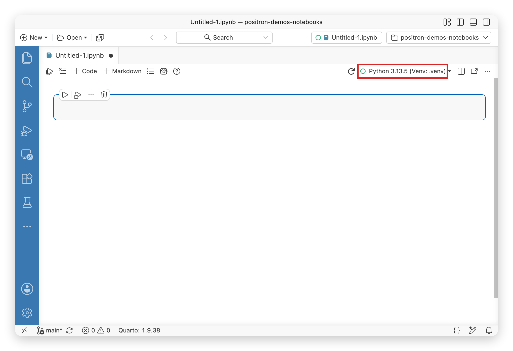

# Legacy Notebook Editor

Use the Code OSS based notebook editor for a notebook experience that seamlessly integrates with the Positron IDE.

You can create and edit `.ipynb` files in Positron just as you would in other editors.

For a general introduction to working with Jupyter Notebooks, see the [VS Code Jupyter Notebooks documentation](https://code.visualstudio.com/docs/datascience/jupyter-notebooks).

> **NOTE:**
>
> Looking for integrated AI assistance, data exploration, and improved data science workflows? Try the [Positron Notebook Editor](positron-notebook-editor.llms.md), the default editor for Jupyter Notebooks. Give it a try and share your feedback to help us build the best experience together!

### Setting up your environment

Positron comes bundled with Jupyter kernel support for R and Python. Once you have [configured a Python or R environment](managing-interpreters.llms.md) for Positron, you do not need to install any additional dependencies into your environment before using a notebook.

If an environment installed on your computer is not available in Positron, you may want to read more about how Positron discovers [Python installations](python-installations.llms.md) and [R installations](r-installations.llms.md).

### Selecting a notebook kernel

When you first open a Jupyter Notebook, Positron starts a notebook session and automatically selects an interpreter based on the notebook’s language, the current workspace, and your configuration. The interpreter used by the notebook is visible in the **Kernel Selector** in the notebook editor action bar.

Each notebook session belongs to one notebook editor. Closing the notebook editor shuts down the session.

When a notebook session is active, the [Interpreter picker](managing-interpreters.llms.md#change-the-active-interpreter-session) shows the notebook filename. This signals that a notebook, not a console, is currently active. To see the runtime backing the notebook, check the **Kernel Selector** in the notebook editor action bar.

The Legacy Notebook Editor action bar with the kernel selector highlighted, showing a Python virtual environment as the selected interpreter.

You can select a different interpreter for the notebook by selecting the **Kernel Selector** button in the notebook editor action bar or by running the *Notebook: Select Notebook Kernel* command from the Command Palette.

### Customization

- To set the default working directory for a notebook, use the [`notebook.workingDirectory`](positron://settings/notebook.workingDirectory) setting.
