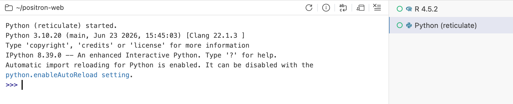
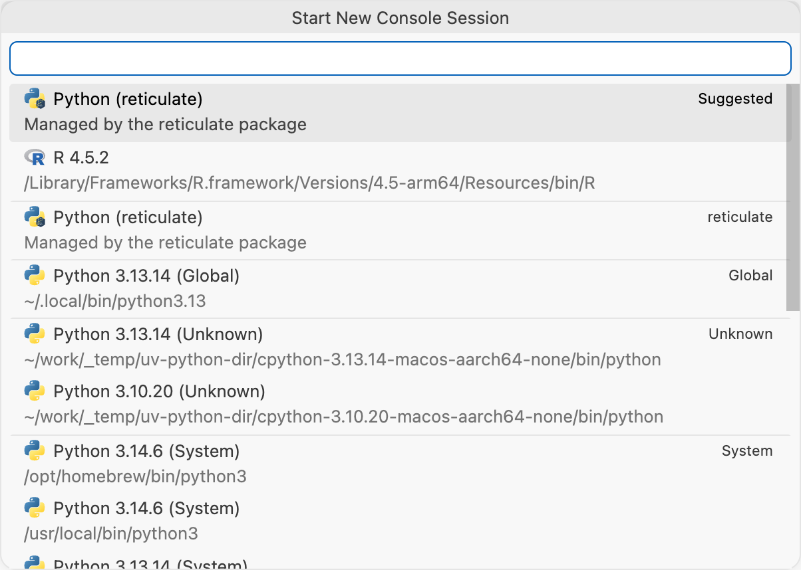
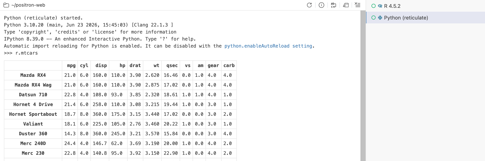

# Reticulate

Use Python from R with reticulate in Positron. Run Python code interactively within your R session with built-in reticulate integration.

Positron has built-in support for Python interpreters managed by the [reticulate](https://rstudio.github.io/reticulate/) R package. When the reticulate package is installed, you can use the `repl_python()` function to start a Python interpreter session directly within Positron. This allows you to run Python code interactively, exactly the same way as you would in a standard Python interpreter.

The feature is controlled by the [`positron.reticulate.enabled`](positron://settings/positron.reticulate.enabled) setting which is set to `'auto'` by default. When `'auto'` is selected, Positron’s reticulate integration will be enabled in workspaces where the reticulate R package has been loaded at least once. You can also explicitly enable or disable the reticulate integration by setting the value to `'always'` or `'never'`, respectively.

To start a reticulate Python interpreter session, execute the following in an active R interpreter session:

``` r
reticulate::repl_python()
```

[](images/reticulate-interpreter.png "Reticulate Python interpreter session")

Reticulate Python interpreter session

The Reticulate Python interpreter can also be started by selecting “Python (reticulate)” when creating a new interpreter session.

[](images/reticulate-interpreter-list.png "New interpreter session list")

New interpreter session list

Python interpreters managed by the reticulate package have some important differences compared to standard Python interpreters:

- They use the **Python version selected by reticulate**. See Reticulate’s [Python version configuration](https://rstudio.github.io/reticulate/articles/versions.llms.md) for additional information.

- They run within the **same process as the R session** that started it.

The latter has a few important implications:

- You can access R objects directly from Python code using the `r` prefix. For example, if you have an R object named `my_data`, you can access it in Python as `r.my_data`.

[](images/reticulate-python-objs.png "Accessing R objects in Python")

Accessing R objects in Python

- You can access Python objects from R using the `py` prefix. For example, if you have a Python function named `my_function`, you can call it in R as `py$my_function()`.

Note that for the above, the conversion between R and Python objects is managed by reticulate using the `py_to_r()` and `r_to_py()` generics. See the [type conversions table](https://rstudio.github.io/reticulate/index.llms.md#type-conversions) for more information.

The reticulate Python interpreter session is tied to the lifecycle of its parent R session. If you close the parent R session or restart it, the Python interpreter session will also be terminated. It’s possible to restart the Python interpreter session independently, but note that this **will not** restart the associated R session.
