# Collaborate with AI on an R analysis

Use Posit Assistant to explore Excel data, build an R analysis in a Quarto document, and turn it into a dashboard.

> **NOTE:**
>
> Is this the right tutorial to start with? It picks up where [First data analysis with R in a Quarto document](tutorial-get-started-quarto.llms.md) and [Migrate to Positron from RStudio](tutorial-migrate-from-rstudio.llms.md) leave off. If you have not worked through those, start there. This tutorial assumes you already know how to:
>
> 1.  Install Positron
> 2.  Use the Command Palette
> 3.  Run a Quarto code cell

Positron is a free, source-available IDE for data science, built on the same open source core as VS Code. In the earlier tutorials, you built a Quarto document by hand. In this one, you will bring an AI assistant alongside you to write, extend, and improve an analysis, while you stay in control of the result.

You will work through a small analysis from raw data to a published dashboard, using the AI features you might rely on every day:

- Posit Assistant, the AI assistant built into Positron
- The `/report` command, which turns a conversation with Posit Assistant into a Quarto document
- **Fix** and **Explain** buttons that troubleshoot code errors
- Code completions, which suggest the next line of code as you type

You will practice these by analyzing a new dataset: a spreadsheet of retail orders that you will aggregate into quarterly sales, visualize, and ship as an interactive dashboard.

## Open the workshop project

The dataset you will use lives in a GitHub repository, alongside an `renv.lock` file that records the exact package versions the analysis needs.

You can clone a repository without leaving Positron. The **New Folder from Git** option, available on the Welcome screen or from the Command Palette, clones a remote repository and opens it as your project.

[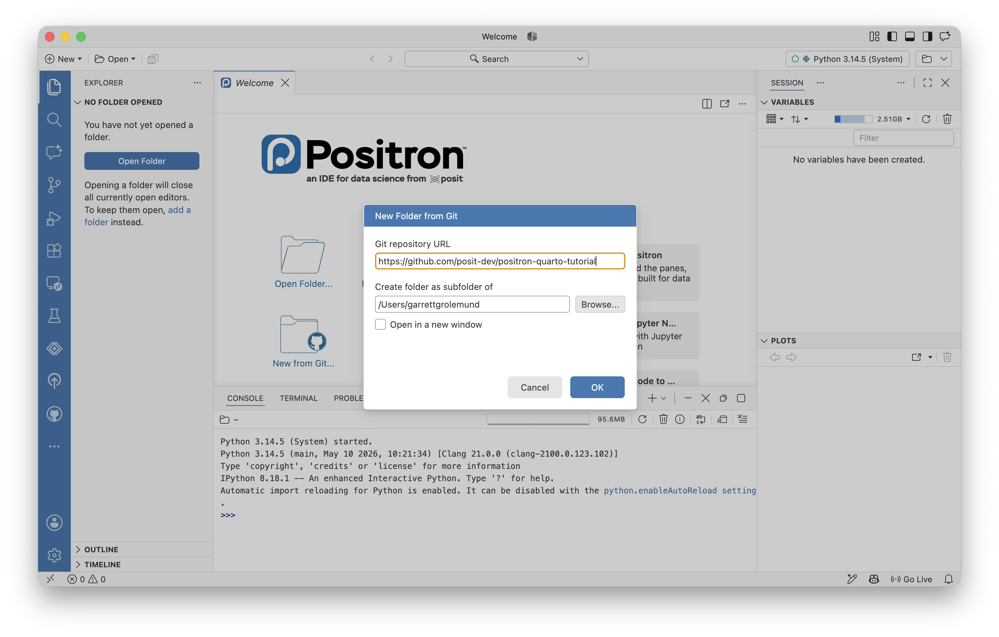](images/tutorial-r-ai-git.png "The New Folder from Git helper in Positron")

The New Folder from Git helper in Positron

> **TIP:**
>
> Open the Command Palette with , run *Workspaces: New Folder from Git*, and paste the repository URL when prompted:
>
> ``` default
> https://github.com/posit-dev/positron-quarto-tutorial
> ```
>
> Choose a location, then open the cloned folder when Positron offers to.
>
> **You will know it worked when** the **Explorer** in the left sidebar shows the project files, including a `data` folder and an `renv.lock` file.

## Explore the data in the Data Explorer

Take a look at the data before setting a goal. The dataset is an Excel file, `data/retail_sales.xlsx`. You can open Excel files directly in the Positron Data Explorer and inspect them without writing any code. Just double-click the file name.

The Data Explorer is a sortable, filterable table with per-column summary statistics. It gives you four ways to get your bearings in an unfamiliar table:

- Scroll through the rows or columns to see cell values. Pin a row or column so it stays in view while you scroll.
- Sort on a column by clicking its header.
- Filter to a subset of the data with the filter controls in the table header.
- View summary statistics for each column in the expandable sidebar.

> **TIP:**
>
> In the **Explorer**, double-click `data/retail_sales.xlsx`. It opens in the Data Explorer as a table of retail orders.
>
> 1.  Scroll down to get a feel for the roughly 9,800 rows.
> 2.  Pin the `order_id` column so it stays visible.
> 3.  Sort by `sales` to find the largest single order. On which date did it occur?
>
> **You will know it worked when** you can name the two columns this analysis will need: `order_date` and `sales`.

[](images/tutorial-python-ai-explorer.png "retail_sales.xlsx open in the Data Explorer with columns pinned and sorted")

`retail_sales.xlsx` open in the Data Explorer with columns pinned and sorted

## Set a goal

Now that you know the data, here is the goal: aggregate the orders into total sales per quarter, then visualize the trend.

To keep a reproducible record, you will save the work as R code. That means the next step is to set up Positron to run R for this project.

## Set up a reproducible R environment

[renv](https://rstudio.github.io/renv/) is an R package that records the exact package versions a project uses in an `renv.lock` file and restores them into a project-local library. Its packages stay separate from everything else on your computer, so this analysis keeps working even as you update packages elsewhere. The `renv.lock` in the workshop repository pins the versions the analysis needs, including the tidyverse, readxl, and gt packages.

The `renv::restore()` function reads `renv.lock` and installs each pinned package into the project library. To use it, first run `renv::activate()` and restart your session to activate renv. To learn more about renv, see the [renv documentation](https://rstudio.github.io/renv/articles/renv.html) for how it snapshots and restores project dependencies.

> **TIP:**
>
> 1.  Open the Console (**View \> Console**). If Positron has not yet started an R session, run *Interpreter: Start New Console Session*, and select an R interpreter.
> 2.  Run `renv::activate()` in the Console to activate renv.
> 3.  Run *Interpreter: Restart Active Interpreter Session* to restart the console.
> 4.  Run `renv::restore()` in the Console.
> 5.  When renv lists the packages it will install, confirm to proceed.
>
> **You will know it worked when** the packages from `renv.lock` install without errors and an `renv` folder appears in the **Explorer**.

[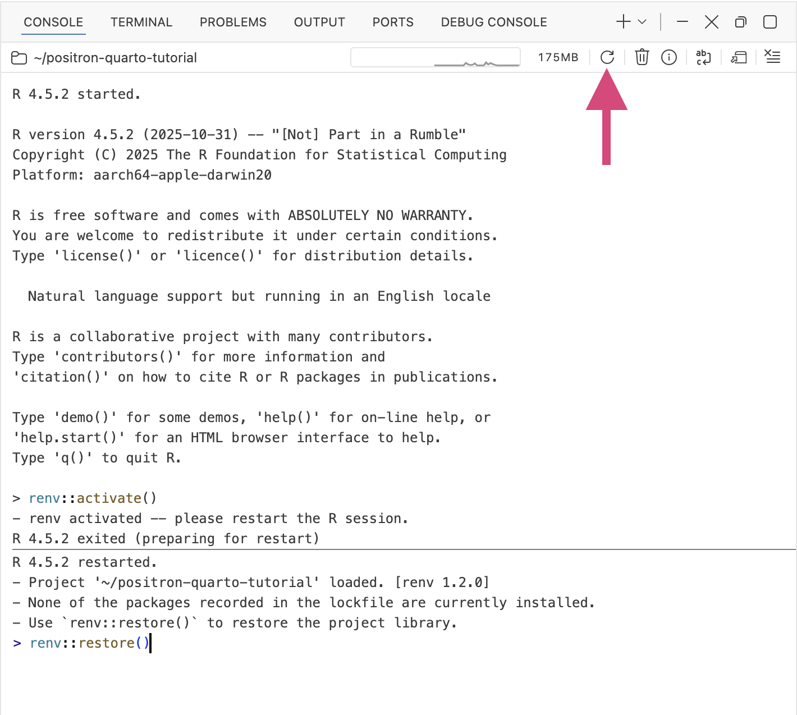](images/tutorial-r-ai-renv.png "The Restart R button in the Console pane, for after renv::activate()")

The Restart R button in the Console pane, for after `renv::activate()`

> **NOTE:**
>
> You can also follow along by running `install.packages(c("tidyverse", "gt", "rmarkdown"))`. This installs the packages you are likely to need, avoiding renv.

## Configure a language model provider

You can use AI in Positron via Posit Assistant, the AI assistant built into Positron. Posit Assistant does not include a language model of its own. Instead, it sends your prompt, along with context such as your open files and your session’s data, to a language model provider that you choose and sign in to. The provider runs the model and returns the response, which Posit Assistant shows in the chat. You can open Posit Assistant by clicking its icon in the activity bar or by running *View: Show Posit Assistant*.

[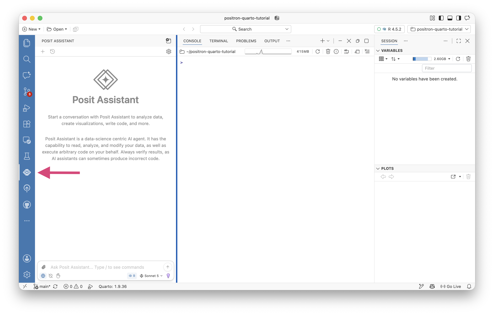](images/tutorial-r-ai-assistant.png "Posit Assistant open in the left sidebar")

Posit Assistant open in the left sidebar

To use Posit Assistant, you must first log in to a model provider with *Authentication: Configure Language Model Providers*. Posit Assistant lists every provider by default, but none is active until you authenticate with it.

[](images/tutorial-python-ai-configure-model.png "The Configure Language Model Providers window")

The Configure Language Model Providers window

Because providers differ in what account and credentials they need, the steps below are deliberately general. Use whichever provider you already have access to. If you do not have one, [Posit AI](assistant-providers.llms.md#posit-ai) is the most direct way to get started. You can start a free trial at [posit.ai](https://posit.ai/) and sign in through your browser, with no API keys to manage.

> **TIP:**
>
> 1.  Run *Authentication: Configure Language Model Providers* from the Command Palette.
> 2.  Select your provider from the list.
> 3.  Complete the sign-in or credential step the provider asks for. The [Language Model Providers](assistant-providers.llms.md) reference lists what each one needs.
>
> **You will know it worked when** the provider shows as connected and you can open a chat with *View: Show Posit Assistant*.

> **NOTE:**
>
> Later in this tutorial you will also use code completions, which require [Posit AI](assistant-providers.llms.md#posit-ai) or [GitHub Copilot](assistant-providers.llms.md#github-copilot). Connecting one of those providers now lets you try that step when you reach it.

## Ask Posit Assistant to write the analysis

With a provider connected, describe the analysis in plain language and let Posit Assistant draft the code. A good request names three things, so the assistant knows what to do and how to do it:

- the files to work with
- the packages to use
- the outputs you want

Before you send the request, predict what a correct answer looks like. You want sales grouped by quarter, one row per quarter, and a chart with a bar and a line over the same quarterly totals. Holding that picture in mind makes it easy to judge whether the generated code did the right thing.

[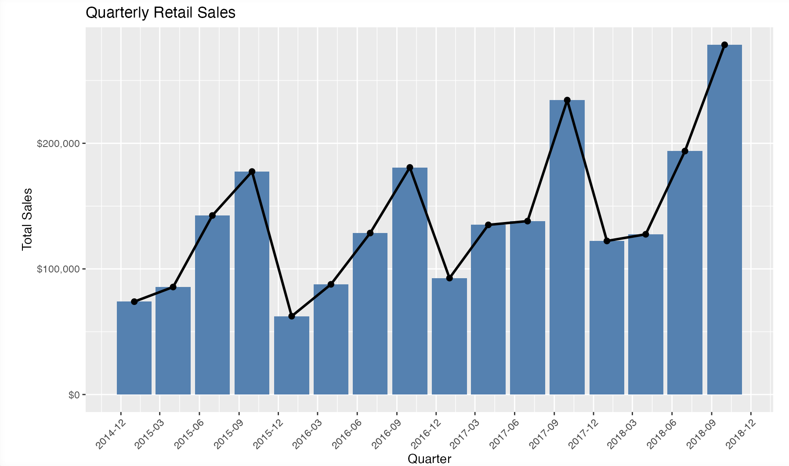](images/tutorial-r-ai-chart.png "The quarterly sales chart you will ask Posit Assistant to build")

The quarterly sales chart you will ask Posit Assistant to build

> **TIP:**
>
> Open Posit Assistant with *View: Show Posit Assistant* and send this request:
>
> ``` default
> Read data/retail_sales.xlsx into a tibble with readxl.
> Parse order_date as a date and aggregate total sales by calendar quarter with dplyr.
> Then:
> 1. Show the quarterly totals as a formatted table with gt.
> 2. Plot quarterly sales as a ggplot2 bar chart with a line overlaying the same values.
> Run the code and show me the results.
> ```
>
> Posit Assistant proposes code and, with your permission, runs it in your R session. Review each step before you approve it.
>
> **You will know it worked when** you see a formatted table of quarterly totals and a bar-and-line chart of sales over time.

Before it runs anything, Posit Assistant asks for permission. You can **Accept**, **Decline**, or reply with written instructions to adjust what it does.

[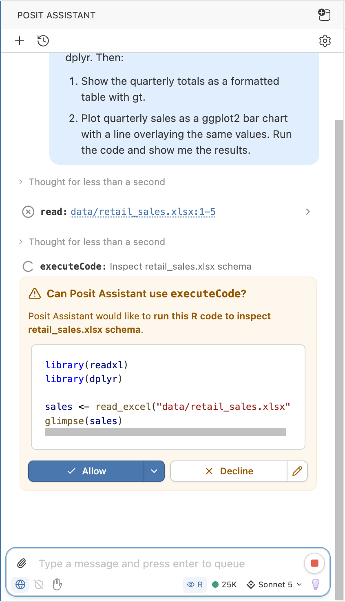](images/tutorial-r-ai-permission.png "Posit Assistant asking permission to run code")

Posit Assistant asking permission to run code

Your generated code will vary, but it will resemble this:

``` r
library(tidyverse)
library(readxl)
library(gt)

orders <- read_excel("data/retail_sales.xlsx")

quarterly <- orders |>
  mutate(quarter = paste0(year(order_date), " Q", quarter(order_date))) |>
  group_by(quarter) |>
  summarize(sales = sum(sales), .groups = "drop")

quarterly |>
  gt() |>
  fmt_currency(sales)

ggplot(quarterly, aes(x = quarter, y = sales, group = 1)) +
  geom_col(fill = "steelblue") +
  geom_line(color = "black") +
  labs(title = "Quarterly retail sales", x = "Quarter", y = "Sales")
```

[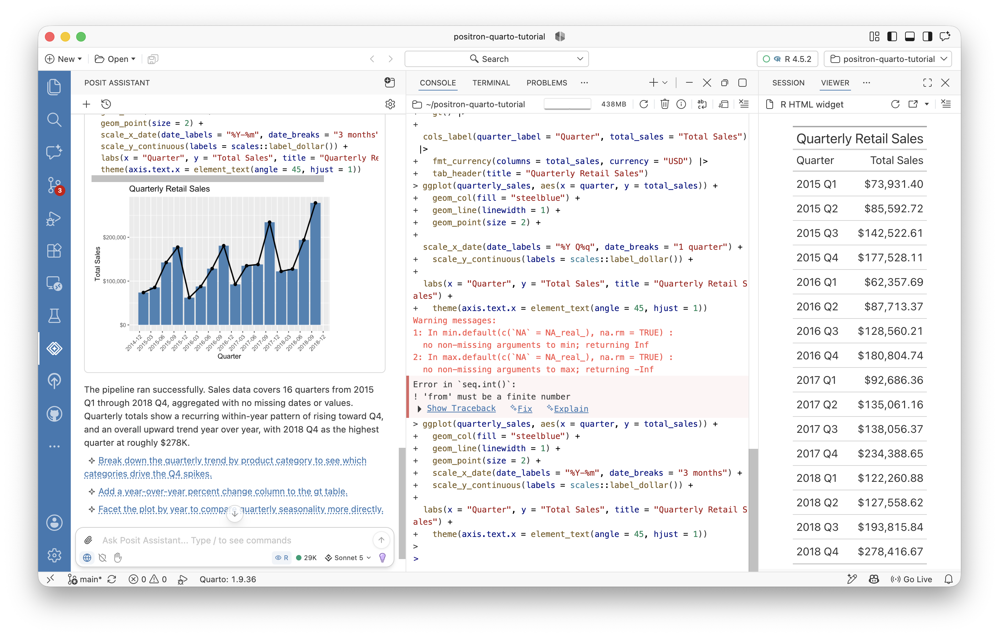](images/tutorial-r-ai-results.png "The table and chart Posit Assistant generated")

The table and chart Posit Assistant generated

If a result looks off, say so in the same conversation. Posit Assistant keeps the context as it makes revisions, so you can steer it toward the picture you predicted rather than starting over.

## Export the conversation as a Quarto document

The analysis works, but right now it lives in a chat. To save it as a reproducible artifact, type `/report` into the chat to export the conversation as a Quarto document. `/report` is a command packaged with Posit Assistant that tells the assistant to collect the code and prose from your conversation into a `.qmd` file that you can rerun, edit, and commit.

A Quarto document is a plain text file that mixes Markdown prose with code cells. It renders to HTML, PDF, Word, and more, so one source can become whatever format your audience needs.

> **TIP:**
>
> In the same Posit Assistant conversation, type `/report` and send it. Posit Assistant exports the conversation as a Quarto document and opens the `.qmd` file in the editor.
>
> **You will know it worked when** a new `.qmd` file opens with your analysis laid out as code cells and prose. Save the report. Then click **Preview** at the top of the file to render an HTML version of the report.

[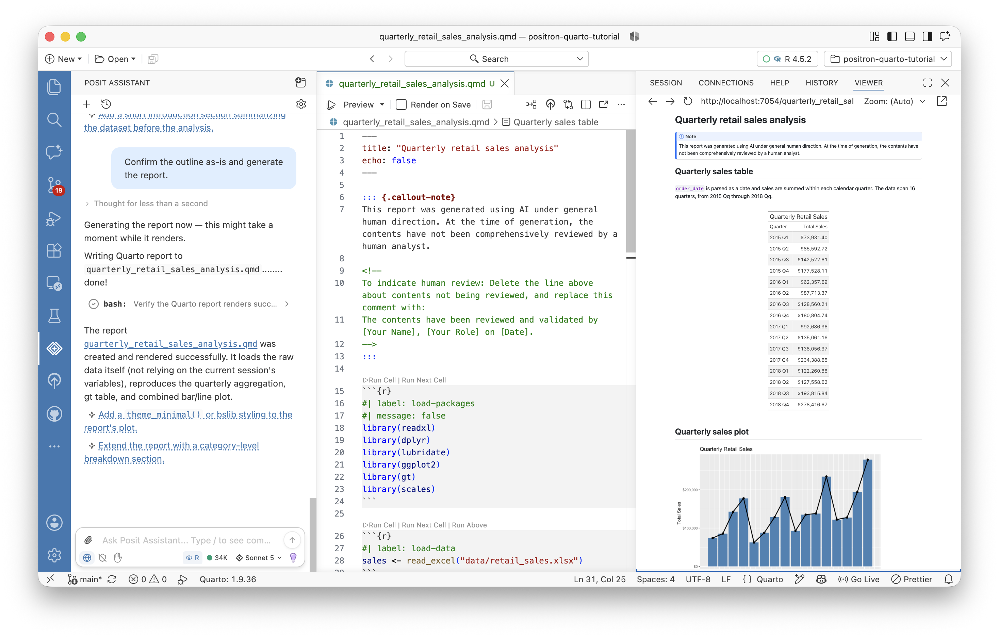](images/tutorial-r-ai-report.png "The exported Quarto document open in the editor beside its rendered preview")

The exported Quarto document open in the editor beside its rendered preview

The document runs on the R environment you restored with renv, so it uses the same pinned packages as the rest of the project. That is what makes the exported report reproducible rather than tied to whatever R packages happened to be loaded in your session.

> **NOTE:**
>
> New to the format? See [Quarto](quarto.llms.md) for how Positron renders and previews `.qmd` files.

## Work with AI inside the Quarto document

You do not have to leave the Quarto document to keep working with Posit Assistant. The same AI you chatted with is available as you edit, through three entry points:

- **Fix** and **Explain** buttons appear on any code error message, sending the failure straight to Posit Assistant.
- Code completions suggest the next line as inline ghost text while you type.
- Posit Assistant can edit the document when you ask it to from the chat.

The next three sections put each of these to work.

## Fix a cell error with one click

Errors are a normal part of an analysis, and the fastest AI win is fixing one without copying the traceback anywhere. When a cell fails, Positron shows **Fix** and **Explain** buttons right on the error output. **Fix** sends the code and the error to Posit Assistant and proposes a corrected cell. **Explain** describes the cause without editing anything.

> **TIP:**
>
> Introduce a small, deliberate error so you can practice the recovery. In any cell, misspell a column name, for example change `sales` to `sale`, and run it. When the cell fails:
>
> 1.  Click **Fix** on the error output.
> 2.  Read the correction Posit Assistant proposes.
> 3.  Accept it and rerun the cell.
>
> **You will know it worked when** Posit Assistant identifies the wrong column name, restores `sales`, and the cell runs cleanly.

[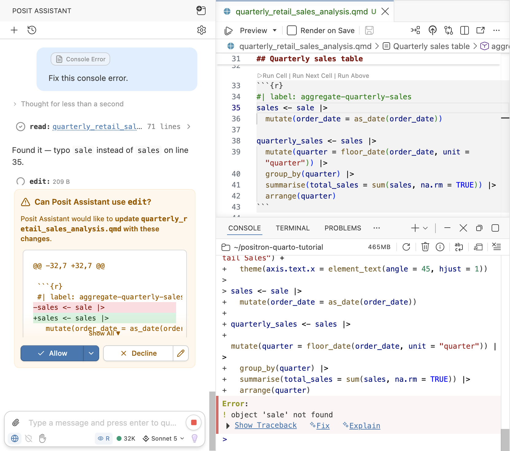](images/tutorial-r-ai-explain-error.png "Posit Assistant explaining a cell error in a Quarto document")

Posit Assistant explaining a cell error in a Quarto document

## Complete a line of code as you type

Code completions suggest the next line as you type, drawn from the context of the surrounding code. The suggestion appears in faded ghost text that you accept with a keypress, so you fill in familiar code without typing every character. Posit AI or GitHub Copilot powers completions, so connect one of those providers if you have not already.

> **TIP:**
>
> Add a new R code cell at the end of the document with . Start typing a line that reports the quarter with the highest sales, such as:
>
> ``` r
> quarterly |> filter(sales ==
> ```
>
> Pause and wait for the ghost text to appear.
>
> 1.  Read the suggested completion.
> 2.  Press TabTab to accept it, or keep typing to dismiss it.
> 3.  Run the cell to confirm it returns the top quarter.
>
> **You will know it worked when** a greyed-out suggestion appears as you type and becomes real code once you press TabTab.

[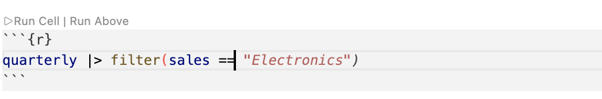](images/tutorial-r-ai-completion.png "A code completion shown as ghost text in a Quarto cell")

A code completion shown as ghost text in a Quarto cell

## Extend the analysis with Posit Assistant

Posit Assistant can edit the open Quarto document directly, not just answer in the chat. That lets you grow the analysis by describing the next piece and letting the assistant add it in place, where you can review the change before you keep it.

> **TIP:**
>
> With the `.qmd` open, ask Posit Assistant:
>
> ``` default
> Add a short section to this document that reports the quarter with the highest
> sales and its total, with a sentence of prose introducing it. Include a donut 
> chart that compares sales from this quarter by Shipping Method (ship_mode).
> ```
>
> Review the cell and prose Posit Assistant adds, then accept the change and click **Preview** to see it in the rendered report.
>
> **You will know it worked when** a new section appears in the document naming the top quarter, and it renders in the preview.

[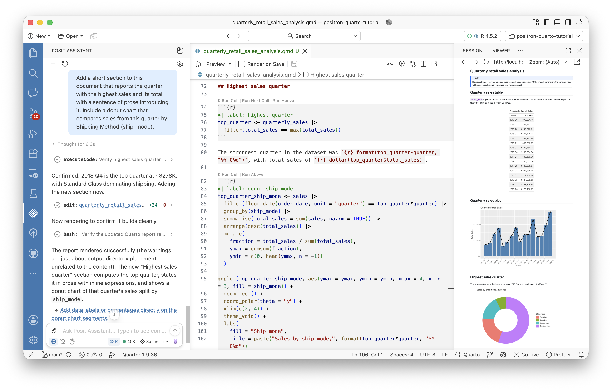](images/tutorial-r-ai-donut.png "A donut chart added by Posit Assistant")

A donut chart added by Posit Assistant

## Convert the report into a dashboard

Quarto can render that same document as a dashboard, a layout of cards arranged in rows and columns, built for at-a-glance reading. Because the analysis is already Quarto, turning it into a dashboard changes how the content is laid out, not what it computes. Ask Posit Assistant to make that change.

> **TIP:**
>
> With the `.qmd` open, ask Posit Assistant:
>
> ``` default
> Convert this Quarto document into a dashboard with format: dashboard.
> Remove all of the text and code, retaining just the cell outputs.
> Use a two-column layout, and add a toggle to switch between light and dark mode.
> ```
>
> When Posit Assistant has finished, press **Preview** to render the dashboard and preview it.
>
> **You will know it worked when** the report renders as a two-column dashboard with a control to switch between light and dark themes. The dashboard appears as an HTML file saved in your project folder.

[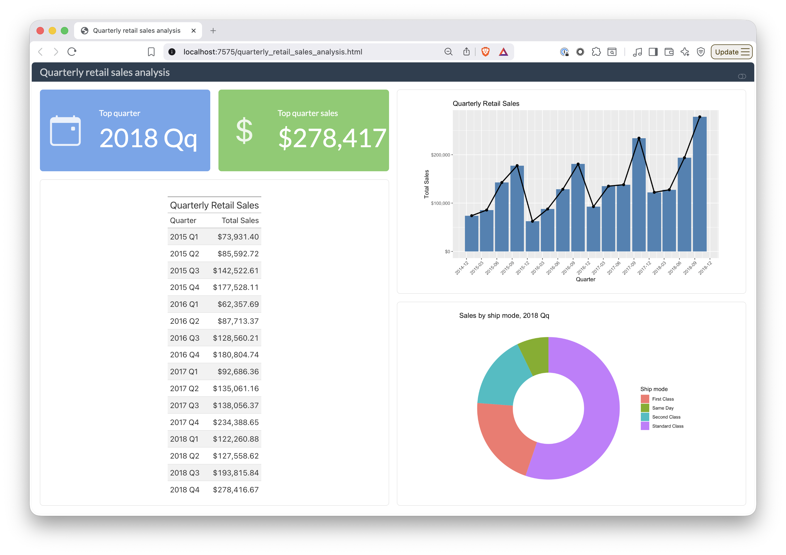](images/tutorial-r-ai-dashboard.png "The finished dashboard")

The finished dashboard

## Publish your dashboard

Your dashboard is a single file you can share several ways, all from inside Positron:

- Commit and push it with the Git client to store it in a repository like the one you cloned. See [Using Git in Positron](git.llms.md).
- Publish it to [Posit Connect](publish-to-connect.llms.md) or to Posit Connect Cloud with the Publisher extension, which deploys the rendered dashboard to a server your colleagues can open in a browser.

## Wrap up

You took a spreadsheet from raw data to a published dashboard, with AI as a collaborator. Along the way, you:

- Explored `retail_sales.xlsx` in the Data Explorer
- Restored a project library from `renv.lock`
- Configured a language model provider for Posit Assistant
- Had Posit Assistant write the quarterly aggregation, a gt table, and a ggplot2 chart
- Exported the conversation with `/report`, then fixed a cell, accepted a completion, and extended the analysis in the document
- Reshaped the report into a publishable dashboard

Throughout, you made the choices and the LLM wrote the code: you reviewed each step, accepted or edited it, and kept a reproducible record you can rerun and share.

From here, dig deeper into the tools you used:

- [Posit Assistant](assistant.llms.md)
- [Quarto](quarto.llms.md)
- [Completions](assistant-completions.llms.md)

> **NOTE:**
>
> To keep going, explore the [Guides](welcome.llms.md) for in-depth documentation on everything Positron can do.
