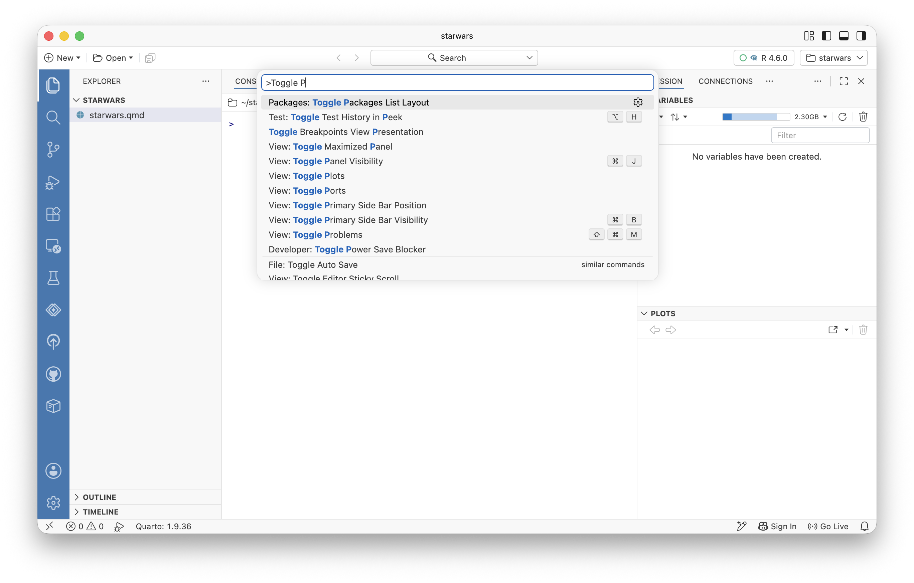
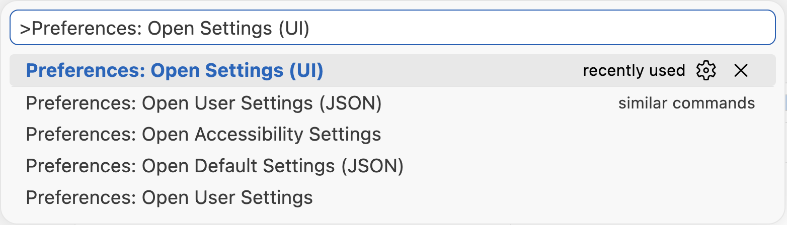
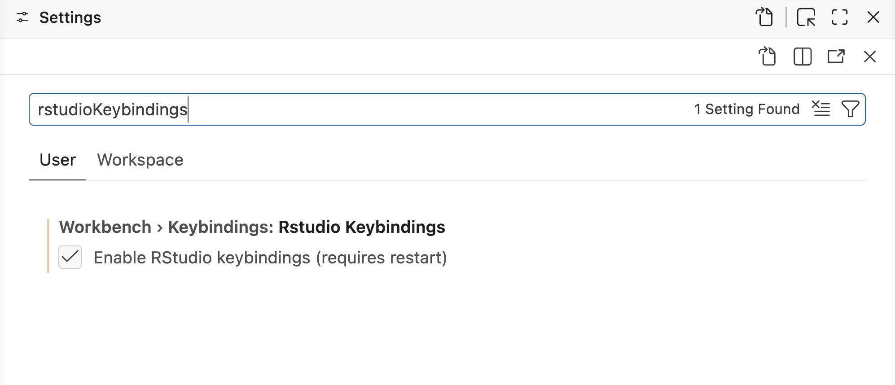
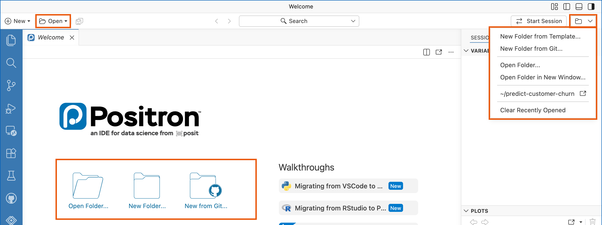
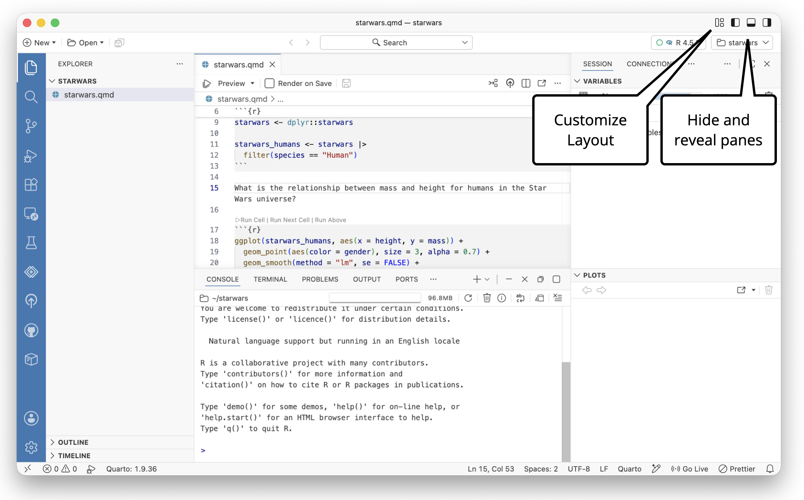
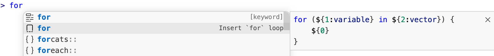
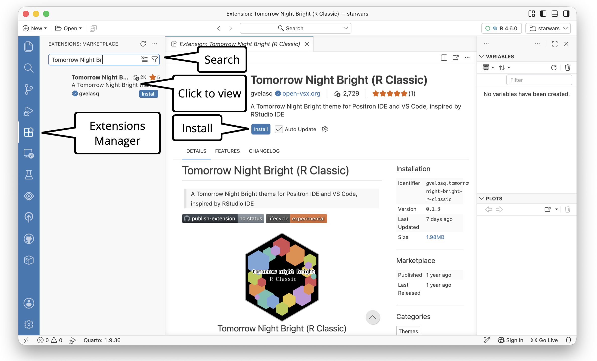

# Migrate from RStudio to Positron

Set up Positron so it looks, feels, and responds like the RStudio you already know. A hands-on tutorial for RStudio users.

> **IMPORTANT:**
>
> Should you take this tutorial first? This tutorial assumes Positron is installed and you have a project open. If that is not the case, start with [First data analysis with R in a Quarto document](tutorial-get-started-quarto.llms.md). It takes about 15 minutes and leaves you with a project you can configure here.

You just finished your first analysis in Positron. If some of it felt unfamiliar compared to RStudio, that is completely normal, and it is exactly what this tutorial fixes.

You are fast in RStudio because of muscle memory, not because of RStudio itself. In RStudio, you know where everything is. Over the next 20 minutes you will rebuild that familiarity by configuring Positron to be similar to RStudio. Along the way you will meet a few things Positron can do that RStudio cannot.

We will suggest specific settings that work well for most RStudio users, but you can change these settings however you like. Think of this as your chance to make Positron your personalized IDE.

> **IMPORTANT:**
>
> RStudio is not going away. It is actively maintained with no deprecation timeline. Moving to Positron is not all-or-nothing. It is fine to use both IDEs side by side, and this tutorial will point out the few tasks where you might still prefer RStudio.

# Start with a new habit: the Command Palette

In RStudio, when you want to do something, you reach for a button, a menu, or a keyboard shortcut you have memorized. Positron has hundreds of commands too, but instead of memorizing where each one lives, you learn one place to find them all: the Command Palette.

The Command Palette is a searchable list of every IDE command you can run in Positron. Open it with the keyboard shortcut .

Start typing a keyword and the fuzzy finder shows matching commands. Use the arrow keys to move through them, then press EnterEnter to run one.

[](images/tutorial-migrate-command-palette.png "Open the Command Palette with  and then search by name or keyword.")

Open the Command Palette with and then search by name or keyword.

This is the single most valuable habit to build for Positron. For the rest of this tutorial, almost every step starts the same way: open the Command Palette and type what you want. That one reflex replaces most of the buttons you used to hunt for in RStudio. By the end of this tutorial, you will be opening it without thinking.

> **TIP:**
>
> Open the Command Palette, type *Toggle Primary Side Bar*, and press EnterEnter.
>
> **You will know it worked when** the side bar on the left disappears. Run the same command again to bring it back. You just did something without touching a single button.

> **NOTE:**
>
> Positron also ships with an interactive **Migrating from RStudio to Positron** walkthrough. Open it anytime from the Command Palette by searching for *Welcome: Open Walkthrough* and selecting it. Treat it as a quick-reference companion to this tutorial, and notice that you just used the Command Palette to find it.

# Bring your keyboard shortcuts with you

Your fingers already know to run a line and to insert a pipe. Losing that muscle memory is the productivity fear most RStudio users have, so let us settle it first.

Many RStudio shortcuts already work in Positron unchanged. You can turn on the full RStudio shortcut set with a single setting. We recommend turning it on if you are mainly familiar with RStudio as your IDE of choice. Enable [`workbench.keybindings.rstudioKeybindings`](positron://settings/workbench.keybindings.rstudioKeybindings), then restart Positron for it to take effect.

> **TIP:**
>
> Open the Command Palette, search for *Preferences: Open Settings (UI)*, and search the settings for `rstudioKeybindings`. Turn it on, then restart Positron by running *Developer: Reload Window* from the Command Palette.
>
> **You will know it worked when** Ctrl-1Ctrl-1 moves your cursor to the editor and Ctrl-2Ctrl-2 jumps to the Console after the restart.

[](images/tutorial-migrate-open-settings.png "Open the settings with Preferences: Open Settings (UI).")

Open the settings with *Preferences: Open Settings (UI)*.

[](images/tutorial-migrate-open-keybindings.png "Search the settings for rstudioKeybindings and click the box to enable RStudio keyboard shortcuts.")

Search the settings for `rstudioKeybindings` and click the box to enable RStudio keyboard shortcuts.

Once enabled, these RStudio shortcuts are available in Positron:

| Shortcut     | Description                    |
|--------------|--------------------------------|
| Ctrl-1Ctrl-1 | Focus Source                   |
| Ctrl-2Ctrl-2 | Focus Console                  |
|              | Go to Function/Symbol          |
|              | Comment/Uncomment a line       |
|              | Create a new R file            |
| F2F2         | Go to definition               |
|              | Reindent selection             |
|              | Reformat selection             |
|              | Source the current R script    |
|              | Rename symbol                  |
|              | Insert code cell (Quarto)      |
|              | Run current statement (Quarto) |
|              | Run current cell (Quarto)      |
|              | Open version control pane      |
|              | Go to previous tab             |
|              | Go to next tab                 |
|              | Delete the current line        |
|              | Set working directory          |
|              | Insert section                 |
|              | Open global keybindings list   |

Prefer to learn the native Positron shortcuts? Leave this setting off. See [Positron keyboard shortcuts](keyboard-shortcuts.llms.md) and [R-specific shortcuts](guide-r.llms.md#keyboard-shortcuts) for the full reference.

> **NOTE:**
>
> If a command has a keyboard shortcut, the shortcut will be displayed next to the command in the Command Palette. You can edit a command’s keyboard shortcut by clicking the gear icon that appears when you hover over the command in the Command Palette.

# Make Positron feel familiar

With the Command Palette and your shortcuts in place, let us make Positron look like home.

## Open your existing RStudio projects

In RStudio, you open a project by double-clicking its `.Rproj` file. In Positron, a **workspace** is simply a folder opened in its own window: the same idea, without the special file.

To open one of your existing projects, use *File: Open Folder* in the Command Palette (or **File \> Open Folder**) and choose the project folder. You can also run `positron .` from a terminal inside the folder.

Your existing `.Rproj` file is safe to leave in place. Positron ignores it. If you use Git, your `.git/` folder continues to mark the project root for tools like the [here](https://here.r-lib.org/) package, so paths keep working exactly as before.

[](images/open-folder.png "Various ways to open a folder in Positron, highlighted in orange.")

Various ways to open a folder in Positron, highlighted in orange.

> **TIP:**
>
> Open the Command Palette and search for *File: Open Recent*. Reopen a project you already work in.
>
> **You will know it worked when** the project opens in its own window with your files in the Explorer, no `.Rproj` required. Rerun *File: Open Recent* to return to your previous project.

> **NOTE:**
>
> Positron stores project-specific settings in `.vscode/settings.json`, but only creates that file once you configure something project-specific. There is no Positron equivalent of the `.Rproj` file, and you do not need one.

## Match your layout

RStudio arranges everything into four fixed panes. Positron uses the same building blocks, an Editor, a Console, and panes for Variables, Plots, and more, but gives you two controls for arranging them:

- The **Activity Bar** (the icon strip on the far left) chooses what the Primary Side Bar shows.
- The **Primary Side Bar** displays context-specific content (files, search, Git, extensions) depending on the active Activity Bar icon.

Here is how the Activity Bar maps to tools you know from RStudio:

| Activity Bar icon | RStudio equivalent                                  |
|-------------------|-----------------------------------------------------|
| Explorer          | Files pane and document Outline                     |
| Search            | **Edit \> Find in Files** or                        |
| Source Control    | Git pane (see [using Git in Positron](git.llms.md)) |
| Debugger          | Debugging pane when in debugger mode                |
| Test Explorer     | No RStudio equivalent                               |
| Posit Assistant   | Posit Assistant Chat window                         |
| Publisher         | Publishing Wizard                                   |
| Packages          | Packages pane                                       |

[](images/user-interface-for-rstudio-migration.jpeg "Interface of the Positron IDE")

Interface of the Positron IDE

The Positron layout is more flexible than the RStudio layout. We recommend starting from a built-in preset and adjusting from there.

> **TIP:**
>
> Open the Command Palette and type `layout`. Try the **Stacked**, **Side-by-Side**, and **Notebook** presets.
>
> **You will know it worked when** the panes rearrange instantly. Keep the one that feels most like your RStudio setup. You can also drag any pane to a new spot.

You can also adjust the layout with the icons at the top right of Positron, drag tabs from one pane to another, or resize panes by dragging their borders.

[](images/tutorial-layout-buttons.png "Layout buttons")

Layout buttons

> **NOTE:**
>
> See [Customize the Layout](layout.llms.md) for the full set of options.

## Bring over your theme

A familiar color scheme goes a long way. If you like the default RStudio editor colors, install the [Tomorrow Night Bright (R Classic)](https://open-vsx.org/extension/gvelasq/tomorrow-night-bright-r-classic) theme (see [Add features with extensions](#add-features-with-extensions) below). Otherwise, Positron ships with dozens of built-in themes.

> **TIP:**
>
> Open the Command Palette and search for *Preferences: Color Theme*. Use the arrow keys to move through the list.
>
> **You will know it worked when** the whole editor recolors live as you move, a small taste of how much Positron previews before you commit. Press EnterEnter on the one you want.

The video below shows how to preview color themes with *Preferences: Color Theme*.

# Make Positron tailored to your workflow

Now that Positron feels familiar, let us set up a few things that go beyond what RStudio offers.

## Format your code automatically with Air

In RStudio you might reformat code by hand or run [styler](https://styler.r-lib.org/). Positron bundles [Air](https://posit-dev.github.io/air/), an R formatter, for `.R`, `.qmd`, and `.Rmd` files.

- To format a file, open the Command Palette and run *Format Document*.
- To format a selection, run *Format Selection*.

We recommend enabling Format on Save so your code is tidied automatically every time you save, with no shortcut to remember.

> **TIP:**
>
> Open the Command Palette, search for *Preferences: Open Settings (UI)*, and turn on [`editor.formatOnSave`](positron://settings/editor.formatOnSave). Then open an R file, add some messy spacing, and save with .
>
> **You will know it worked when** Air snaps the code into clean formatting the instant you save.

> **NOTE:**
>
> See the [Air documentation](https://posit-dev.github.io/air/) for details on choosing a user vs. workspace setting.

## Reuse code with snippets

Code snippets insert ready-made templates for common code patterns. For example, typing `for` and selecting the snippet inserts this skeleton:

``` r
for (variable in vector) {
    # code to repeat
}
```

Press TabTab to jump between the placeholders for `variable`, `vector`, and `# code to repeat`.

[](images/snippets-for-example.png "Completion list after typing “for”, showing the snippet that can be inserted")

Completion list after typing “for”, showing the snippet that can be inserted

Positron provides snippets for R’s reserved words (`if`, `while`, `for`, `function`) out of the box.

> **TIP:**
>
> In an R file, type `for` and select the snippet from the completion list. Press TabTab to move through each placeholder.
>
> **You will know it worked when** the cursor jumps cleanly from `variable` to `vector` to the body.

To add your own snippets, open the Command Palette and run *Snippets: Configure Snippets*. Positron uses the [TextMate snippet syntax](https://code.visualstudio.com/docs/editing/userdefinedsnippets), which differs from the RStudio format. You can find the default RStudio snippets already translated to the Positron syntax in [`r.code-snippets`](https://github.com/posit-dev/ark/blob/19337a1b41e8c5a3a77ac61db93b7c6bf6cdc8a3/crates/ark/resources/snippets/r.code-snippets) on GitHub.

## Add features with extensions

Extensions let you add features to Positron beyond its defaults. In this way, they are like RStudio addins, but the Extensions marketplace is far larger. Open the Extensions view from the Activity Bar, or run *Extensions: Focus on Extensions View* from the Command Palette. Then search for an extension by name or keyword.

Here are some popular picks for R users:

| Extension | Purpose |
|----|----|
| [Tomorrow Night Bright (R Classic)](https://open-vsx.org/extension/gvelasq/tomorrow-night-bright-r-classic) | RStudio dark theme ported to Positron |
| [Indent-Rainbow](https://open-vsx.org/extension/oderwat/indent-rainbow) | Colorized indentation |
| [Rainbow CSV](https://open-vsx.org/extension/mechatroner/rainbow-csv) | Colorized CSV file editing |
| [GitHub Actions](https://open-vsx.org/extension/GitHub/vscode-github-actions) | Interact with GitHub Actions from the IDE |
| [GitLab Workflow](https://open-vsx.org/extension/GitLab/gitlab-workflow) | GitLab support |
| [Project Manager](https://open-vsx.org/extension/alefragnani/project-manager) | Quickly switch between projects |

> **TIP:**
>
> Open the Command Palette, run *Extensions: Focus on Extensions View*, and search for “Tomorrow Night Bright (R Classic)”. Click **Install**.
>
> **You will know it worked when** you can select it from *Preferences: Color Theme* and your editor takes on the classic RStudio dark mode colors. Scroll to **Light** to return to the default Posit colors.

[](images/tutorial-migrate-extensions.png "How to find and install an extension from the marketplace.")

How to find and install an extension from the marketplace.

You can also [create your own extensions](extension-development.llms.md) with TypeScript and JavaScript, going well beyond what RStudio addins can do.

> **NOTE:**
>
> Many software companies provide free extensions that let you run their software inside Positron, such as SAS, Snowflake, Databricks, and DuckDB. If you use specific software in your workflow, check for it in the Extension Marketplace.

## Run your RStudio addins

Positron supports most [RStudio addins](https://rstudio.github.io/rstudio-extensions/rstudio_addins.llms.md) through shims for the [rstudioapi](https://rstudio.github.io/rstudioapi/) package. To run one, open the Command Palette and run *R: Run RStudio Addin*. For example, with the [reprex](https://reprex.tidyverse.org/) package installed, you can launch its addin to build a reproducible example.

# Know the gaps

Part of migrating confidently is knowing exactly where the edges are, so nothing surprises you later.

## What is not in Positron (and what to do instead)

A few RStudio features are not yet in Positron. If any of these are essential to your workflow, it is perfectly reasonable to keep using RStudio for that task:

- **Saving and reloading workspace state on R restart.** Positron starts each session clean. Rely on your scripts to rebuild state.
- **Dedicated panes and buttons for code profiling and package development.** The underlying tooling still works from the Console and Command Palette.
- **A data import widget.** Follow progress on [GitHub](https://github.com/posit-dev/positron/issues/5515). In the meantime, use `readr` or `readxl` in code.

## What Positron does that RStudio cannot

And here is what you gain by making the move:

- Positron gives you easy access to [multiple R versions](r-installations.llms.md) and [multiple concurrent R sessions](managing-interpreters.llms.md) in one window.
- If a session crashes, you can open a new one without restarting the IDE.
- Python is a first-class citizen, with data science support on par with R and the ability to run R and Python in the same session.
- An integrated [Data Explorer](data-explorer.llms.md) works with data frames and files such as CSV and Parquet.
- A large third-party extension marketplace provides tools from providers like SAS, Snowflake, and Databricks.
- [Remote sessions](remote-ssh.llms.md) in Posit Workbench keep the UI local while compute runs on a remote server.

> **NOTE:**
>
> If you ever miss a button or pane from RStudio, check the Command Palette first. Almost every action in Positron lives there, and your familiar keyboard shortcuts usually work too.

# Your forever Positron is ready

You have rebuilt your home. The Command Palette is your one-stop shortcut, your keyboard muscle memory carries over, and your layout and theme feel familiar. Your code even formats itself on save. You did it all in the project you already work in. This is your setup now.

From here, dig deeper into the tools you might use every day:

- [Working with R in Positron](guide-r.llms.md)
- [Quarto documents](quarto.llms.md)
- [The Data Explorer](data-explorer.llms.md)
- [The Command Palette](command-palette.llms.md)
- [Migrating from RStudio](migrate-rstudio.llms.md)

> **NOTE:**
>
> To keep going, explore the [Guides](welcome.llms.md) for in-depth documentation on everything Positron can do.
