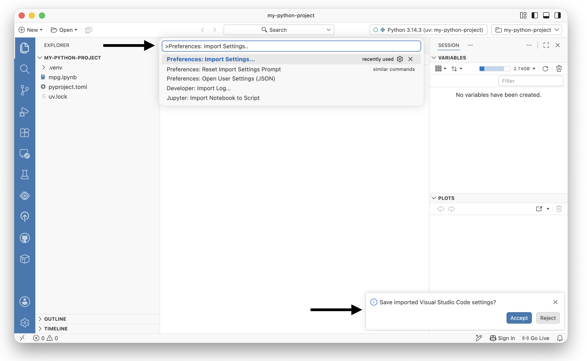
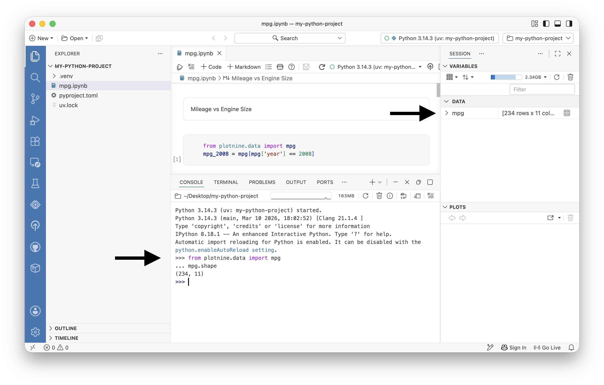
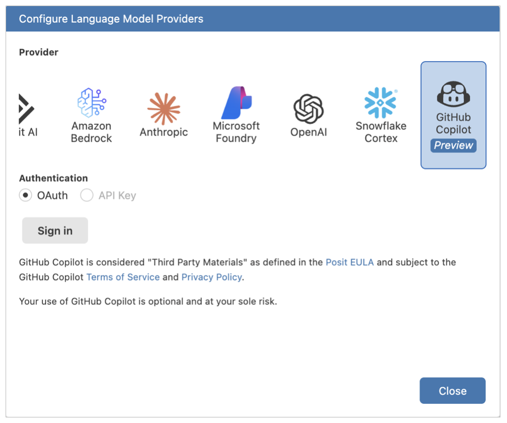
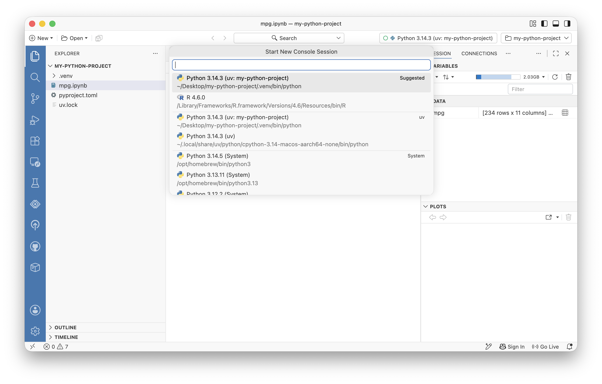

# Migrate from VS Code to Positron

Import your VS Code settings and extensions into Positron and see what makes Positron different.

> **NOTE:**
>
> Is this the right tutorial to start with? This tutorial picks up where [First data analysis with Python in a Jupyter Notebook](tutorial-get-started-ipynb.llms.md) leaves off, using the same project. If you have not done that tutorial yet, start there. It takes about 15 minutes and leaves you with a project you can configure here.

You just finished your first analysis in Positron. If a few things felt slightly unfamiliar compared to VS Code, this tutorial explains them, and shows you why they work the way they do.

The good news is as a VS Code user, you already know most of Positron. Positron builds on [Code OSS](https://github.com/microsoft/vscode), the open source core of VS Code. These parts of Positron all work the way you expect, so you do not need to relearn them:

- Editor
- Command Palette
- Terminal
- Git client
- Extensions system

What is different is everything Positron adds for data science:

- a first-class Console
- a live Variables tracker
- a Plots pane
- a Data Explorer
- native Python and R support with no setup

Over the next 20 minutes you will bring your VS Code setup to Positron, then meet the tools that make Positron more than a general-purpose editor.

> **IMPORTANT:**
>
> You do not have to give up VS Code. Positron keeps the extensions and settings you install separate from your VS Code installation, and they will not interfere with it. You can use both editors side by side.

> **NOTE:**
>
> Positron also ships with an interactive **Migrating from VS Code to Positron** walkthrough. Open it anytime from the Command Palette by searching for *Welcome: Open Walkthrough* and selecting it. Treat it as a quick-reference companion to this tutorial.

# Bring your settings and keybindings across

You have spent time tuning VS Code, including your theme, your font size, your keybindings, your formatter. You do not have to redo any of that.

Positron can import your user settings directly from VS Code. On its first launch, it offers to do this with a notification, and it shows you a preview before saving so you can review and adjust what comes across. Your keybindings come with your settings, so your muscle memory carries over.

We recommend importing your settings so Positron starts out feeling like the editor you already configured.

> **TIP:**
>
> Open the Command Palette with , search for *Preferences: Import Settings*, and run it. Review the preview, then confirm.
>
> **You will know it worked when** your familiar theme and settings appear in Positron.

[](images/tutorial-vscode-import-settings.png "To import VS Code settings to Positron, run Preferences: Import Settings then click Accept.")

To import VS Code settings to Positron, run *Preferences: Import Settings* then click Accept.

# Install your extensions from a different marketplace

Extensions work in Positron much as they do in VS Code: open the Extensions view from the **Activity Bar**, or run *Extensions: Focus on Extensions View* from the Command Palette, then search for Extensions by name or keyword.

The one real difference is where the extensions come from. Positron does not use the Microsoft Visual Studio Marketplace. Microsoft reserves that marketplace for their proprietary VS Code builds. Instead, Positron installs extensions from [Posit Public Package Manager](https://p3m.dev), which serves the same catalog as [Open VSX](https://open-vsx.org/), the vendor-neutral, open source marketplace for VS Code compatible extensions. Here, you will find over 10,000 extensions, including those published by data science software companies such as SAS, Snowflake, and Databricks. The extensions you will not find are the ones built with proprietary Microsoft code and licensed only for use inside the VS Code product from Microsoft.

Some more good news is that you do not need the Microsoft Python and Jupyter extensions you rely on in VS Code. Positron provides their functionality natively, with no setup. Out of the box you already have:

| In Positron | In VS Code |
|----|----|
| Native Python support: code completion, type checking, debugging, and more, built in | Requires Microsoft Python extension (`ms-python.python`) |
| Bundled Jupyter notebook support | Requires Jupyter extension |
| Bundled [Ruff](https://docs.astral.sh/ruff/) for linting and formatting | Requires you to install and configure a formatter and linter, like Black Formatter and Pylint |
| Bundled [Quarto](https://quarto.org/) support | Requires a separate publishing workflow |

> **NOTE:**
>
> Are you an R user? You no longer need the `vscode-r` extension. Positron provides deeper, native R support, the same way it does for Python.

> **TIP:**
>
> Open the Extensions view and search for an extension you like, such as `Rainbow CSV`. Click **Install**.
>
> **You will know it worked when** the extension installs from Posit Public Package Manager, exactly as it does from the marketplace in VS Code.

> **NOTE:**
>
> If an extension you rely on is missing, it might not be published to Open VSX. You can ask its author to [publish it to Open VSX](https://github.com/open-vsx/publish-extensions/blob/master/docs/external_contribution_request.md). See [Extensions](extensions.llms.md) for the full picture.

# Meet the Console

In the last tutorial you did everything inside notebook cells. That works well for the analysis you want to keep. But often you just want to poke at your data, check the shape of a data frame, test whether a line of code runs, or try an idea you will throw away.

In VS Code you can open a Python read-eval-print loop (REPL) in the Terminal or spin up an interactive window for this. Positron gives you the **Console**, a persistent, interactive Python session that is a first-class part of the IDE.

The Console is more than a terminal REPL. Because Positron runs the interpreter as a live session, the Console offers code completion, syntax highlighting, and, most importantly, it drives the Variables and Plots panes you will meet next. It also knows your data at runtime; it can complete your data frame’s column names, not just your variable names.

> **TIP:**
>
> Focus the Console (run *Focus Console* from the Command Palette, or click the Console pane). Type:
>
> ``` python
> from plotnine.data import mpg
> mpg.shape
> ```
>
> **You will know it worked when** the Console prints the shape of the data frame, and `mpg` appears in the Variables pane, without you adding a cell to your notebook.

[](images/tutorial-vscode-console.png "Running commands in the Console.")

Running commands in the Console.

## Check your code against another environment

Positron lets you run several Console sessions at once, each on a different Python version or environment. That makes it simple to answer a common question, such as whether the code in my cell can also run somewhere else?

Say you want to confirm your analysis works on a different Python version, or in a coworker’s environment. Open a second Console session for that additional interpreter and run the same code. Both sessions stay open, and the **Interpreter picker** in the top right shows which one is active.

> **TIP:**
>
> If you have more than one Python interpreter available, open the Interpreter picker in the top right (or run *Interpreter: Start New Console Session*) and start a session on a different interpreter. Run `from plotnine.data import mpg` again there.
>
> **You will know it worked when** you can switch between the two Console sessions from the Interpreter picker, each running independently. If `plotnine` is not installed in the second environment, the import fails, which is exactly the compatibility check you wanted.

> **NOTE:**
>
> Because the interpreter runs separately from the IDE, a crash in Python does not take down your Positron window, and you can switch interpreters without reloading the editor. See [Managing interpreter sessions](managing-interpreters.llms.md) for more.

# Explore data without writing throwaway code

The Console feeds a set of data science panes that VS Code does not provide natively. You met two of them in the last tutorial. Here they are together:

- The **Variables pane** lists every object in your active session, with its type and value. You saw `mpg` appear there a moment ago.
- The **Data Explorer** opens any data frame in a sortable, filterable grid with per-column summary statistics. Its filters are ephemeral, so you can explore without changing your code, then click **Convert to Code** when you want to keep a step.
- The **Plots pane** collects the plots your code creates and keeps a history you can page through. You can export a plot or jump back to the code that produced it. You can drive the Plots pane with the Console, which means you no longer need a notebook just to see a plot.
- The **Help pane** shows documentation for Python objects and packages as you work.

> **TIP:**
>
> In the Console, open your data frame in the Data Explorer by running:
>
> ``` python
> %view mpg
> ```
>
> **You will know it worked when** `mpg` opens in a grid. Sort a column by clicking its header, then open the summary panel to see its distribution.

[](images/tutorial-vscode-data-explorer.png "Run %view to view a table in the Data Explorer.")

Run `%view` to view a table in the Data Explorer.

You can also open the Data Explorer by clicking the next to `mpg` in the Variables pane.

# Your notebook, upgraded

You might have noticed the notebook in the last tutorial looked a little different from the one in VS Code. That is because Positron uses an enhanced notebook editor built for data science. It comes with notebook-aware AI assistance and is synchronized with the Variables, Plots, Help, History, and Data Explorer panes you just used.

If you prefer the editor you know from VS Code, Positron still includes it as the [Legacy Notebook Editor](legacy-notebook-editor.llms.md), and you can switch between the two.

> **TIP:**
>
> If you did not try the Positron Notebook editor in the last tutorial, try it now:
>
> 1.  Run *Create: New Jupyter Notebook*
> 2.  Experiment with adding cells and running code, like `from plotnine.data import mpg`
> 3.  Watch the Variables, Plots, Help, History, and Data Explorer panes interact with the notebook

The video below demonstrates how the Positron IDE responds to your notebook edits, which enhances your authoring experience.

# Set up AI with your Copilot account

If you use GitHub Copilot in VS Code, you do not have to leave it behind. Positron includes Posit Assistant, an AI assistant designed for data science, and it can use your existing GitHub Copilot account as its model provider.

We recommend adopting Posit Assistant and pointing it at the Copilot subscription you already pay for.

> **TIP:**
>
> Run *Authentication: Configure Language Model Providers* from the Command Palette, select **GitHub Copilot**, and sign in through your browser.
>
> **You will know it worked when** Posit Assistant is connected and you can start a chat.

[](images/tutorial-vscode-copilot.png "You can configure Posit Assistant to work with many model providers, including Github Copilot.")

You can configure Posit Assistant to work with many model providers, including Github Copilot.

> **NOTE:**
>
> GitHub Copilot is a preview provider. For account requirements and other providers, see [Posit Assistant](assistant.llms.md) and [Language Model Providers](assistant-providers.llms.md).

# Let Positron manage your Python environments

In VS Code you often install a Python version yourself and then point the editor at it. Positron can do more of this for you.

Positron discovers the interpreters and virtual environments already on your system automatically, including those created with venv, uv, pyenv, conda, and others. Run *Interpreter: Start New Console Session* to see the interpreters available in your session. If you create a new environment that it does not pick up, run *Interpreter: Discover All Interpreters* to refresh the list.

[](images/tutorial-vscode-available-interpreters.png "Interpreter: Start New Console Session")

Interpreter: Start New Console Session

If you do not have Python on your computer, Positron can install Python for you with [uv](https://docs.astral.sh/uv/). When you start a session without a valid Python available, Positron offers to install Python via uv and build an environment for you. You can also do this anytime with the *Python: Install Python via uv* command.

> **NOTE:**
>
> When Positron detects a `pyproject.toml` or `requirements.txt` in a project with no environment yet, it offers to create a `.venv` and install the dependencies with uv. See [Python installations and environments](python-installations.llms.md) for the full set of options and settings, such as [`python.interpreters.include`](positron://settings/python.interpreters.include).

# Know the gaps

Migrating confidently means knowing where the edges are. For VS Code users, the main one is the marketplace. Extensions that contain proprietary Microsoft code are not available, because Microsoft licenses them only for its own VS Code product. Open source extensions, which cover the great majority of data science tooling, work in Positron. If a specific extension matters to your workflow, check whether it is published to [Open VSX](https://open-vsx.org/) before you rely on it.

Beyond that, most of what you know transfers directly, and much of what you set up by hand in VS Code, Positron provides out of the box.

For a fuller reference on any of the topics above, see [Migrating to Positron from VS Code](migrate-vscode.llms.md).

# Your data science editor is ready

You brought your settings and keybindings across, installed extensions from the Positron marketplace, and met the tools that VS Code leaves to extensions or does without. Those tools include a live Console, the Variables, Plots, and Data Explorer panes, a native notebook editor, and Posit Assistant running on your own Copilot account. The familiar editor is still there underneath, built for data science.

From here, dig deeper into the tools you might use every day:

- [Working with Python in Positron](guide-python.llms.md)
- [The Data Explorer](data-explorer.llms.md)
- [Jupyter Notebooks](jupyter-notebooks.llms.md)

> **NOTE:**
>
> To keep going, explore the [Guides](welcome.llms.md) for in-depth documentation on everything Positron can do.
