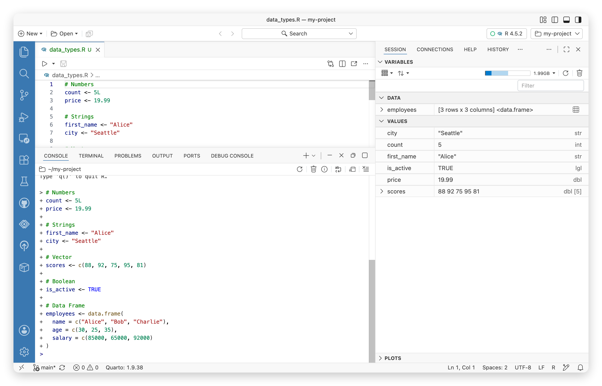

# Variables Pane

View and inspect all variables in your Python or R session. Browse objects, data tables, and connections in a convenient sidebar interface.

The **Variables** pane allows you to view the variables in your Python or R session and by default, is located in the Secondary Side Bar.

In addition to variables, if applicable, it displays data tables and any open [connections](connections-pane.llms.md) for your session.

Variables pane

### Viewing variables

If the **Variables** pane is not already displayed, you can open it by selecting **View** \> **Variables** or by running *Session: Focus on Variables View* from the Command Palette.

### Viewing data tables

If your session includes data tables, they appear in the **DATA** section of the **Variables** pane. For more information about viewing your data tables, see the [Data Explorer](data-explorer.llms.md) section.
