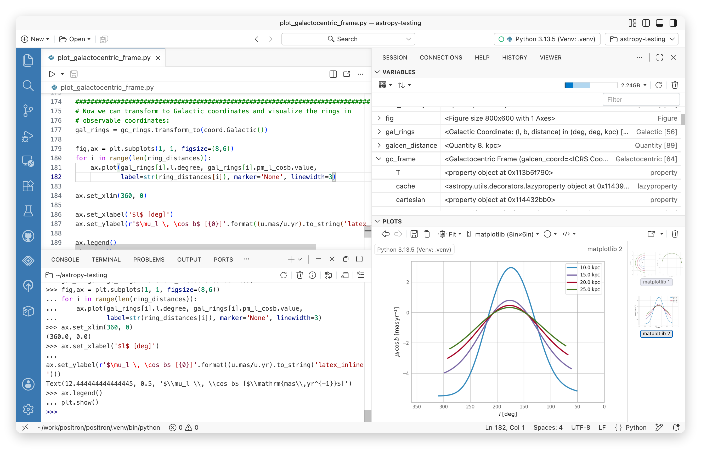

# Welcome

Welcome to Positron, the next-generation data science IDE built for Python and R.

Welcome to Positron, the next-generation data science IDE built for Python and R. It combines the power of a full-featured IDE with interactive data science tools for Python and R

Execute code and explore data in Positron

> **NOTE:**
>
> Interested in Positron for your team? [Learn about enterprise solutions.](https://posit.co/products/ide/positron/?utm_source=positron-docs&utm_medium=features-page)

## Positron might be a good fit for you if you

- use VS Code for data science (Python or R) but wish it included more interactive affordances for data-specific tasks like running exploratory code, examining your variables and datasets, interacting with your plots, and developing data apps such as Shiny, Streamlit, or FastAPI.
- use JupyterLab or hosted notebook tools for data science (Python or R) and are ready for a more powerful, fully-featured IDE that still supports notebooks.
- use RStudio and want more ability to customize or extend your IDE.
- use additional languages beyond only Python or R in your day-to-day data science or package development work, like Rust, C++, JavaScript, or Lua.
- want access to powerful, data-science specific AI integrations in a modern, extensible IDE.

### Get started

Download and install Positron on your system

### Explore Features

Discover key Positron features to streamline your workflow

### Customize your IDE

Install extensions to enhance your data science workflow

### Set up your environment

Configure Python and R interpreters for data science

### Migrate from RStudio

Transition smoothly from RStudio to Positron

### Migrate from VS Code

Move from VS Code to Positron built specifically for data science

> **NOTE:**
>
> Positron is built on [Code OSS](https://github.com/microsoft/vscode), the open-source foundation of Visual Studio Code. For general editor features like commands, settings, and source control, reference the [VS Code documentation](https://code.visualstudio.com/docs).
