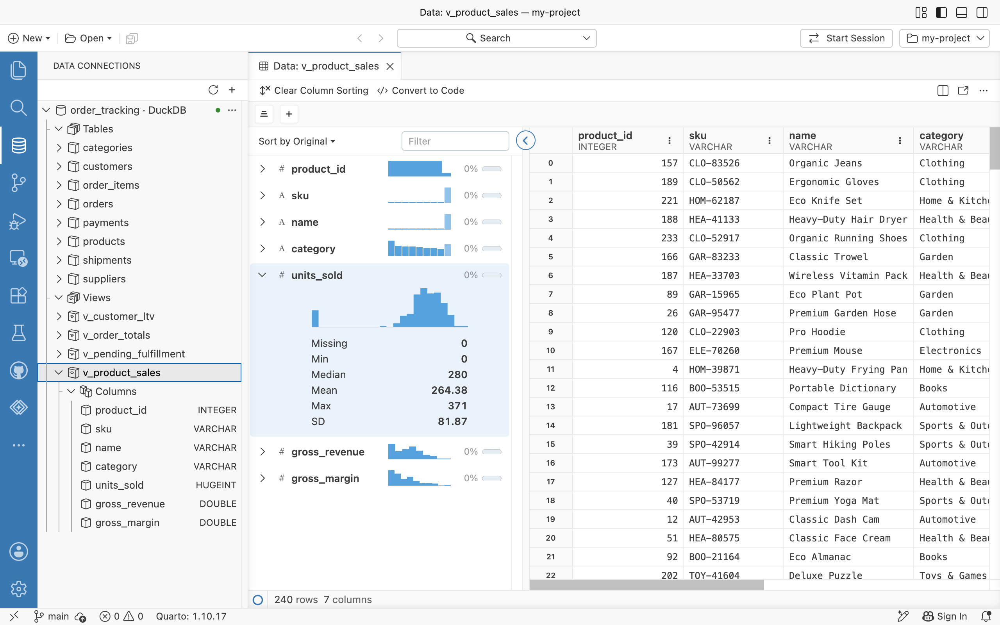

Data Connections is the default experience for working with databases and data warehouses in Positron. The **Data Connections** view appears in the primary sidebar. From there, you can create connections, browse tables and views in a tree, open tables and views in the [Data Explorer](data-explorer.qmd), and generate ready-to-run connection code in Python, R, or [ggsql](https://ggsql.org). Driver extensions connect to databases directly, without a Python or R session.

{.drop-shadow width=700 fig-alt="The Data Connections view in the sidebar shows an order_tracking DuckDB connection expanded to its tables and views, with the v_product_sales view selected and expanded to its columns and their types. The v_product_sales view is open in the Data Explorer, sorted by gross revenue, with the units_sold column profile expanded in the summary panel to show a histogram and summary statistics."}

Data Connections supersedes the Catalog Explorer extension, which is no longer included, and the classic [Connections pane](connections-pane.qmd), which shows connections opened by code in a Python or R session. To use the older Connections pane instead, set [`dataConnections.enabled`](positron://settings/dataConnections.enabled) to `false` and reload Positron.

## Supported databases

Data Connections includes drivers for the following data sources:

| Data source | Notes |
|-------------|------|
| Databricks | Personal access token, OAuth user-to-machine (U2M), or OAuth machine-to-machine (M2M) authentication. On Posit Workbench, connections can use the managed credentials of the session. Browse Unity Catalog catalogs, schemas, tables, views, and volumes. |
| DuckDB | Connect to DuckDB database files, with a read-only option. |
| ODBC | Any database with a locally installed ODBC driver, via a configured data source name (DSN), server and driver details, or a connection string. |
| Posit Connect Pins | Browse and download [pins](https://docs.posit.co/connect/user/pins/) published on [Connect](https://posit.co/products/enterprise/connect), and authenticate with environment variables, browser sign-in, or an API key. |
| PostgreSQL | User and password, local server (no password), client certificate (SSL), or connection string. |
| Redshift | User and password, or AWS Identity and Access Management (IAM) authentication for both Redshift Serverless and provisioned clusters, using the standard AWS credential provider chain. |
| Snowflake | External browser single sign-on (SSO), key pair, OAuth client credentials, programmatic access token, or a named connection from `connections.toml`. On Workbench, connections can use the managed credentials of the session. Browse tables, views, and stages. |
| SQLite | Connect to SQLite database files, with a read-only option. |

: {tbl-colwidths="[25,75]"}

When you install a recognized ODBC driver, dedicated entries for databases such as MySQL, MariaDB, SQL Server, Oracle, Db2, Hive, Impala, Teradata, and BigQuery also appear when creating a connection. Positron automatically detects data sources already configured on your machine (for example, in `odbc.ini` or the Snowflake `connections.toml` file) and shows them in the tree with a **Detected** badge. When you edit `connections.toml`, the list of detected connections updates and open connections stay open.

Let us know which additional databases and warehouses you need in the [Positron GitHub discussions](https://github.com/posit-dev/positron/discussions).

To create connections and work with them, see [Using Data Connections](using-data-connections.qmd).

## Settings

- [`dataConnections.enabled`](positron://settings/dataConnections.enabled): Choose the connections experience. When `true` (the default), Positron shows the **Data Connections** view, whose drivers connect to databases directly, without a Python or R session. When `false`, Positron shows the older [Connections pane](connections-pane.qmd), which shows connections opened by code in a Python or R session. Requires a reload to take effect.
- [`dataConnections.tree.showSingleSchema`](positron://settings/dataConnections.tree.showSingleSchema): Show a connection's schema even when it is the only one, folded together with its group on a single row (for example "Schemas · public"). When disabled (the default), a lone schema is hidden and its tables and views are shown directly under the connection.
