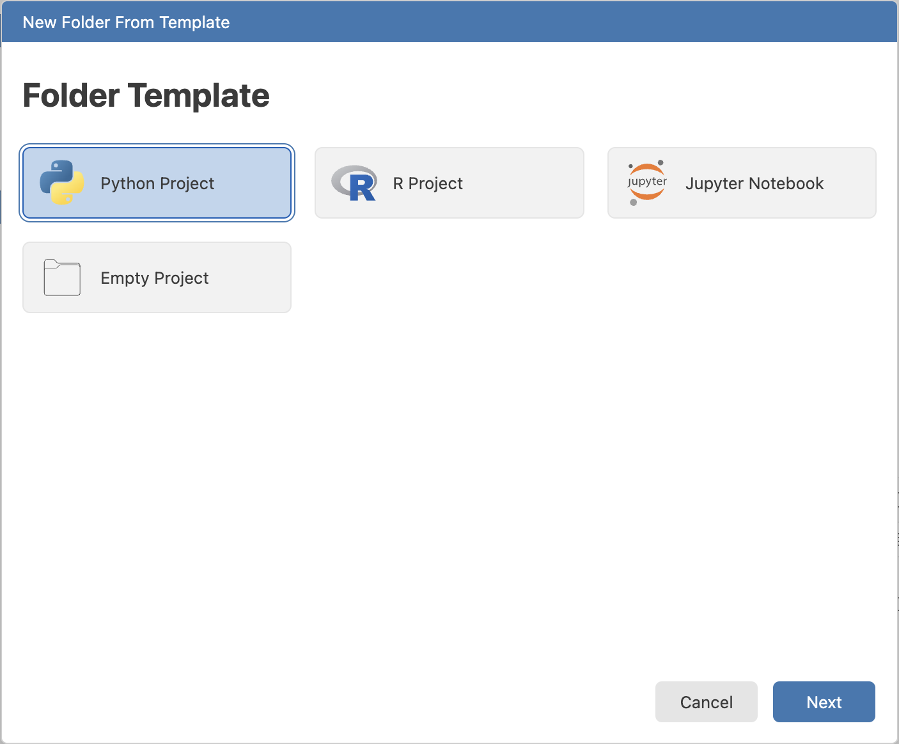
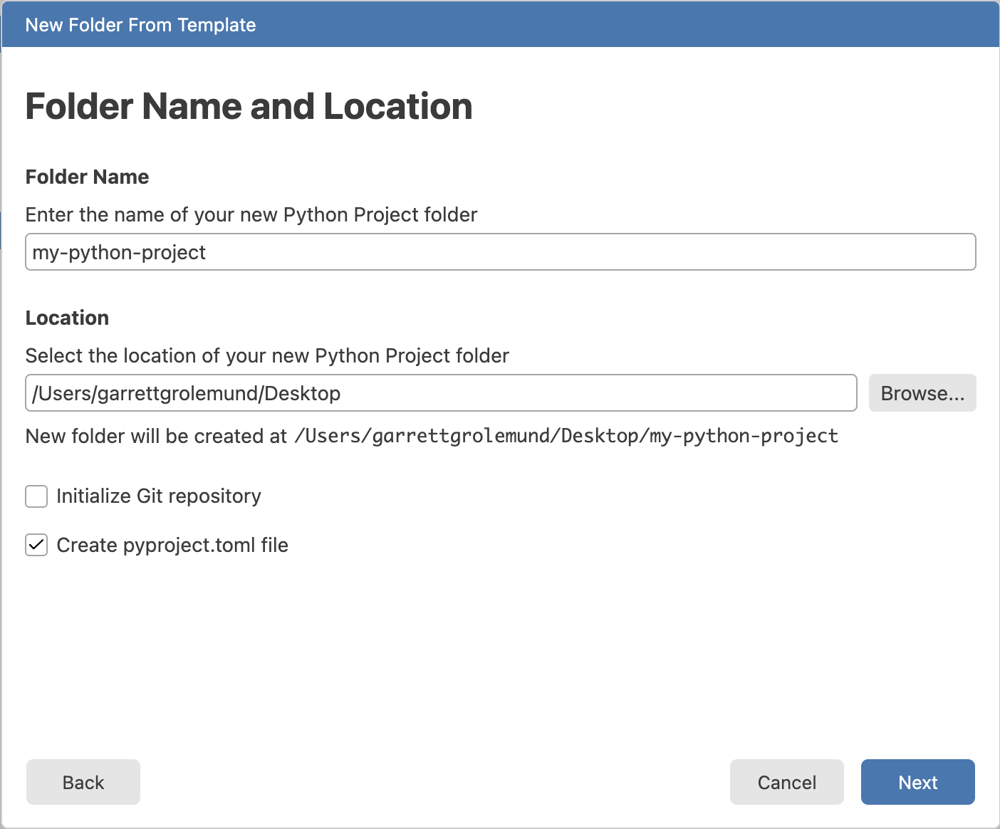
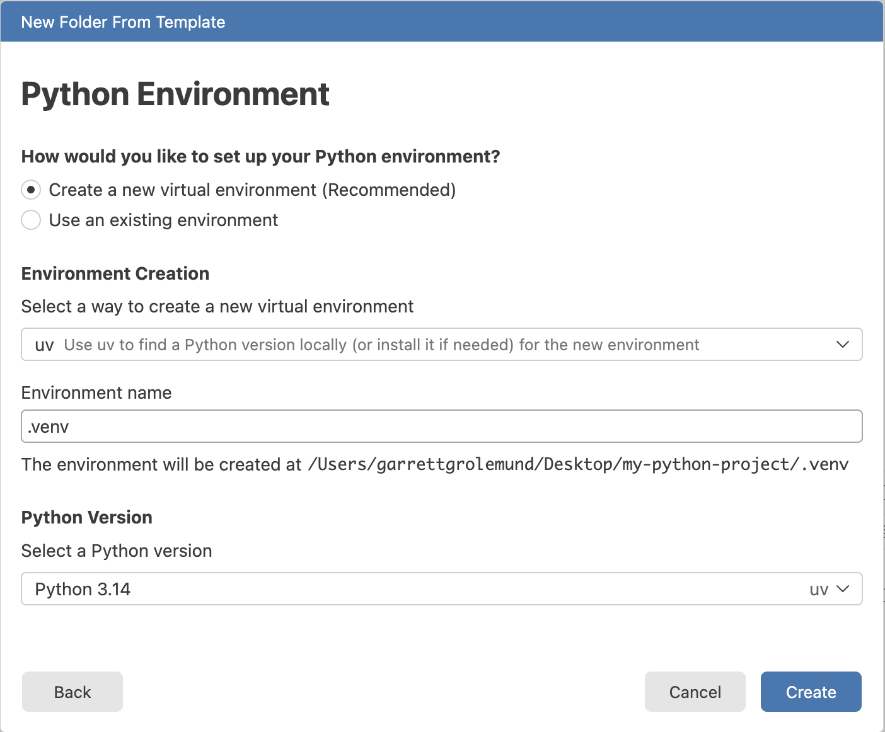
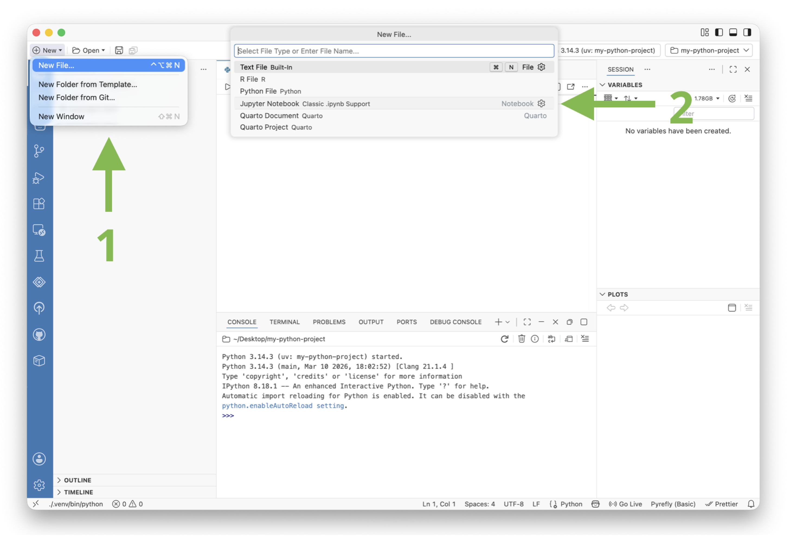
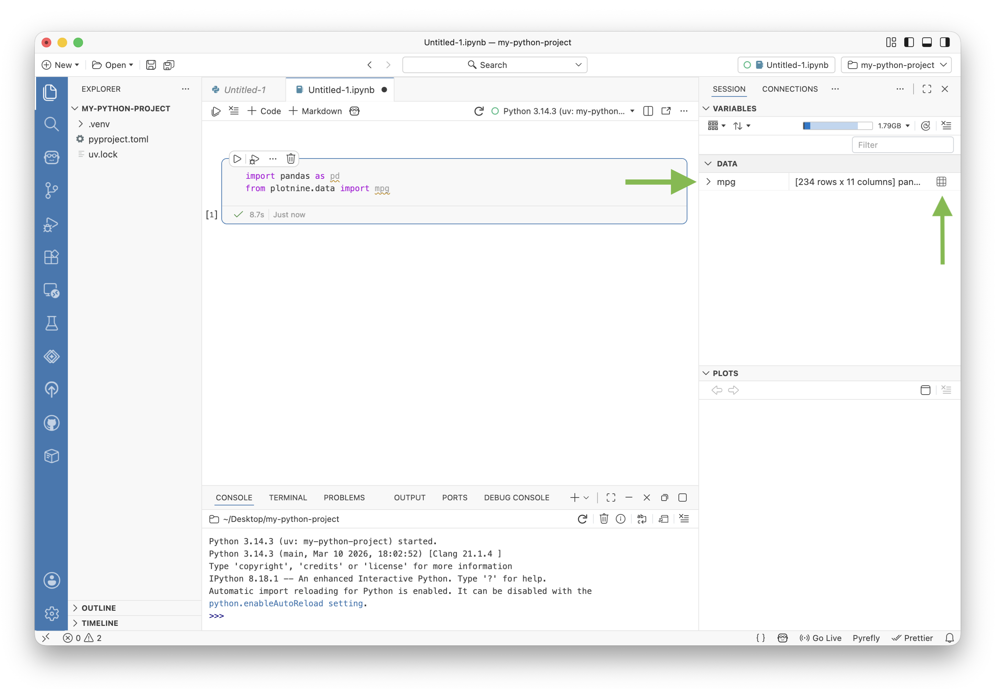
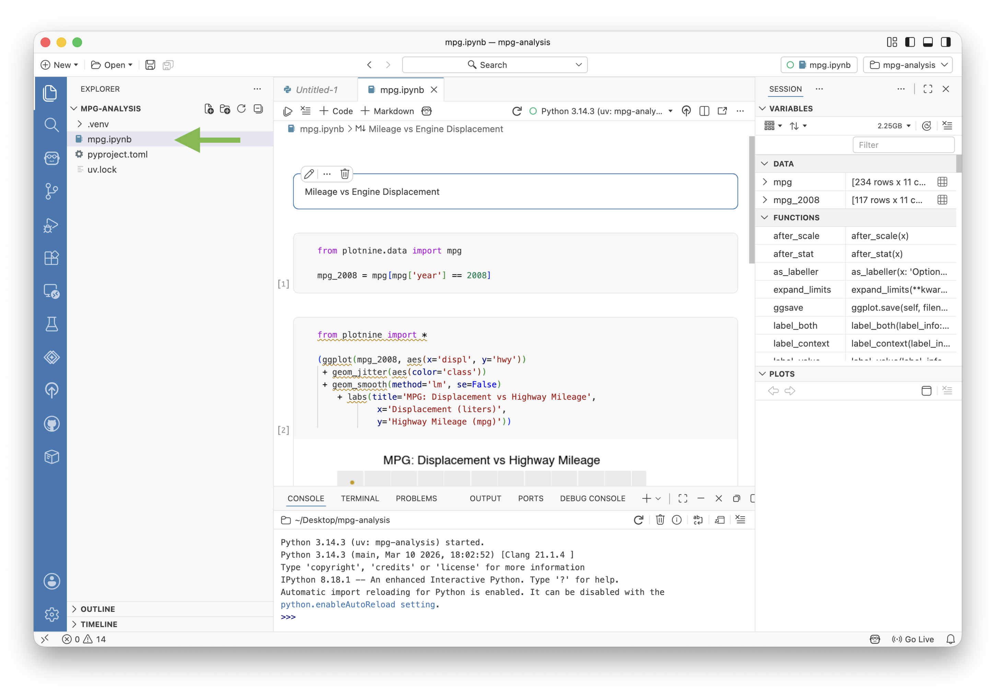

This quick tutorial will show you how to use Jupyter Notebooks within Positron. We will:

- Install Positron
- Create a Python project with its own virtual environment
- Install the packages we need for our analysis
- Open a Jupyter Notebook and
- Explore some data


## Install Positron

Positron is a free and source available code editor for data scientists. To install Positron on your computer, visit [positron.posit.co](http://positron.posit.co) and click the "Download" button. 


Follow the instructions to install Positron.

## Make a Python environment

Python users typically create a project folder for each analysis they do. This keeps all the files for that project organized in one place. Each project also has its own virtual environment, which is a self-contained Python environment that has its own set of packages installed. This allows you to have different versions of packages for different projects without conflicts. 

To create a project folder with its own virtual environment in Positron, follow these steps:

1. Open Positron
2. Select New > New Folder from Template...


3. Choose Python Project from the list of templates

{width="50%"}

4. Select a location for your project folder and give it a name. Then check Create a pyproject.toml file. This file will keep track of the packages you install in your virtual environment. Then click Next.

{width="50%"}

The next screen will help you set up your Python environment. 

1. Choose whether to create a new virtual environment or to use an existing environment. For this tutorial, we will create a new virtual environment.

2. Select a software to use to build your environment. We recommend using uv, but you can also use pip or conda if you prefer.

3. Give your environment a name. Python users typically choose .venv as the name for their virtual environments, but you can choose any name you like.

4. Select a Python version to use for your environment. We recommend using the latest stable version of Python.

{width="50%"}

Once you have made your selections, click Create. Positron will create the project folder and set up the virtual environment for you.

## Install packages

Now that we have an environment set up, we need to install the packages we will use for our analysis. For this tutorial, we will use the `pandas` and `plotnine` packages. 

::: note

`plotnine` is a Python package for creating complex and informative visualizations. It is based on the grammar of graphics, which is a powerful and flexible way to create visualizations.

:::

To install `pandas` and `plotnine`, navigate to the Terminal in Positron (View > Terminal). When Positron opened our project, it navigated the Terminal to our project folder and activated the virtual environment we created.

::: note
You should see the name of your environment in parentheses at the beginning of the terminal prompt. If you don't see it, you can activate the environment manually with the command `source .venv/bin/activate` (replace `.venv` with the name of your environment if you chose a different name).
:::

We recommend running the following command to install the packages:

```bash
uv add pandas plotnine
```

`uv add` will install the package and also add it to your `pyproject.toml` file so that you can easily keep track of the packages you have installed in your environment.

This is what it looks like to set up a new Python project in Positron:

<script src="https://fast.wistia.com/player.js" async></script><script src="https://fast.wistia.com/embed/56anfwwqco.js" async type="module"></script><style>wistia-player[media-id='56anfwwqco']:not(:defined) { background: center / contain no-repeat url('https://fast.wistia.com/embed/medias/56anfwwqco/swatch'); display: block; filter: blur(5px); padding-top:62.71%; }</style> <wistia-player media-id="56anfwwqco" aspect="1.5946843853820598"></wistia-player>

## Open a Jupyter Notebook

Now that we have our environment set up and the packages we need installed, we can open a Jupyter Notebook to start our analysis.

To open a Jupyter Notebook in Positron:

1. Click New > New File in the New menu
2. Choose Jupyter Notebook from the list of file types



This will create a new Jupyter Notebook file in your project folder and open it in the editor. You can now start writing code in the notebook and running it to see the results.

::: tip
You can also open an existing Jupyter Notebook by navigating to it in the File Explorer and clicking on it. Positron will recognize that it is a Jupyter Notebook and open it in the editor.
:::

Above the notebook, Positron adds a toolbar with buttons to run your code, add new cells, select a different kernel and more. You can use these buttons to interact with your notebook.

When you first open your Notebook it will use your active environment as its kernel. The Positron toolbar will also update to show your Jupyter Notebook as the active session. This means that the rest of the IDE will reflect the state of your notebook. For example, the Variables pane will show the variables that are currently in your notebook's kernel.

## Explore some data

Now that we have our Jupyter Notebook open, we can start exploring some data. For this tutorial, we will use the `mpg` dataset, which is a built-in dataset in the `plotnine` package. To load the dataset:

Hover over the area where you would like to insert a new cell and click the "+ Code" button that appears.

Then paste the following code into the cell and click the Run button:

```python
from plotnine.data import mpg  
```

This will load the `mpg` dataset into your notebook's kernel. Notice that the Variables pane to the right of the notebook now shows a new variable called `mpg`. This variable contains the dataset we just loaded.



You can use the Variables pane to explore the columns in the dataset. Or you can click the grid-like icon to open the dataset in the Positron Data Explorer.

The Data Explorer allows you to sort and filter the data, as well as view summary statistics. If you would like to recreate a filter, you can click the "</> Convert to Code" button to copy the code for that filter to your clipboard. You can then paste that code into a cell in your notebook to run it.

We will use the following code to filter `mpg` to only rows where year is 2008:

```python
mpg_2008 = mpg[mpg['year'] == 2008]
```
The video below shows how to use the Data Explorer to filter the data and copy the code for that filter to a notebook cell.

<script src="https://fast.wistia.com/player.js" async></script><script src="https://fast.wistia.com/embed/cavosguj3g.js" async type="module"></script><style>wistia-player[media-id='cavosguj3g']:not(:defined) { background: center / contain no-repeat url('https://fast.wistia.com/embed/medias/cavosguj3g/swatch'); display: block; filter: blur(5px); padding-top:62.71%; }</style> <wistia-player media-id="cavosguj3g" aspect="1.5946843853820598"></wistia-player>

Next we will visualize the relationship between the engine displacement (`displ`) and the miles per gallon (`mpg`) for cars from 2008 using `plotnine`:

```python
from plotnine import *

(ggplot(mpg_2008, aes(x='displ', y='hwy'))
 + geom_jitter(aes(color='class'))
 + geom_smooth(method='lm', se=False)
    + labs(title='MPG: Displacement vs Highway Mileage',
            x='Displacement (liters)',
            y='Highway Mileage (mpg)'))
```

We will also add a code cell that returns a formatted table of the average highway mileage for each class of car:

```python
(mpg_2008.groupby('class')['hwy']
 .mean()
 .reset_index()
 .sort_values(by='hwy', ascending=False))
```

Finally, we will place a Markdown cell with a title at the top of the notebook. To do this, hover over the area where you would like to insert the new cell and click the "+ Markdown" button that appears.

Watch the video below to see these steps in action:

<script src="https://fast.wistia.com/player.js" async></script><script src="https://fast.wistia.com/embed/zkmmmdw026.js" async type="module"></script><style>wistia-player[media-id='zkmmmdw026']:not(:defined) { background: center / contain no-repeat url('https://fast.wistia.com/embed/medias/zkmmmdw026/swatch'); display: block; filter: blur(5px); padding-top:62.71%; }</style> <wistia-player media-id="zkmmmdw026" aspect="1.5946843853820598"></wistia-player>

To test that the notebook works when we run all of the cells in order, click the "Clear Outputs" button in the toolbar to clear all of the outputs from the cells. Next, click the Restart Kernel arrow to create a fresh session in which to run the cells. Then click the "Run All" button to run all of the cells in order. You should see the plot and the table appear as outputs from the cells.

The entire process looks liek this:

<script src="https://fast.wistia.com/player.js" async></script><script src="https://fast.wistia.com/embed/541018pjrj.js" async type="module"></script><style>wistia-player[media-id='541018pjrj']:not(:defined) { background: center / contain no-repeat url('https://fast.wistia.com/embed/medias/541018pjrj/swatch'); display: block; filter: blur(5px); padding-top:62.71%; }</style> <wistia-player media-id="541018pjrj" aspect="1.5946843853820598"></wistia-player>

## Save your notebook

To save your notebook, use the keyboard shortcut Ctrl+S (Cmd+S on Mac). This will save your notebook to your project folder, where it will appear in the File Explorer in the left sidebar.



::: tip
If you have Git set up for your project, you can use the Git pane in Positron to commit and push your notebook to a remote repository like GitHub. This is a great way to share your notebook with others or to keep a backup of your work.

Learn more about using Git in Positron at <https://positron.posit.co/git.html>
:::

## Conclusion

Congratulations! You have successfully set up a Python environment in Positron, installed the packages you need, and explored some data in a Jupyter Notebook. 

We invite you to learn more about Positron in the [Positron Guides](https://positron.posit.co/welcome.html).


