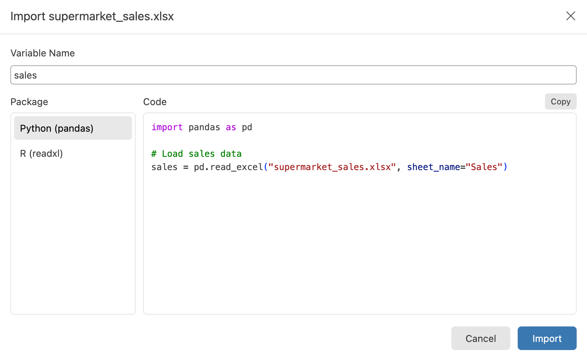
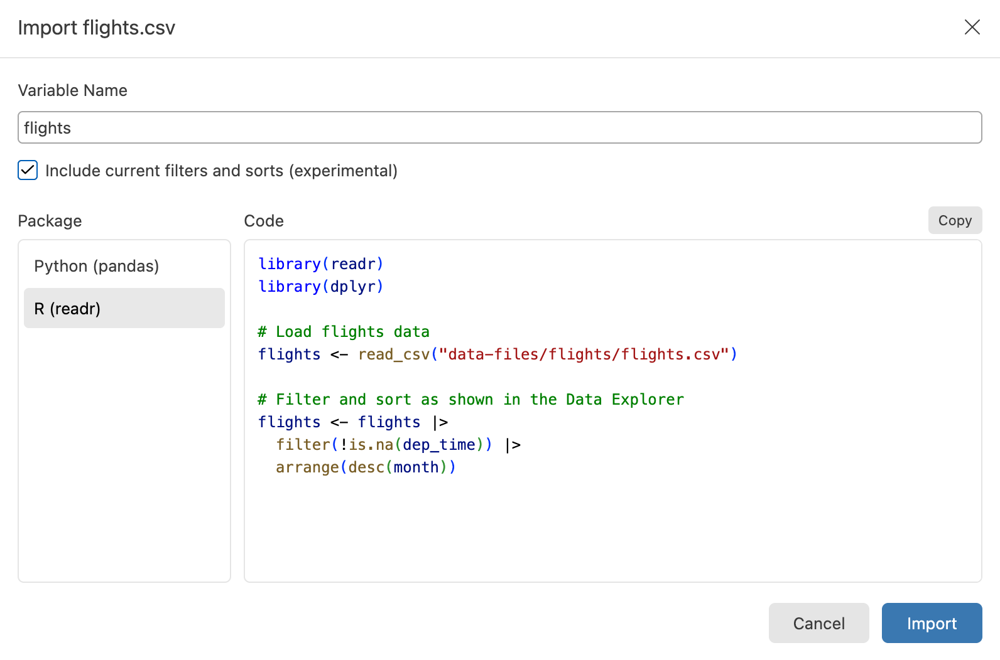

The Import Data dialog generates the code to load a data file into a Python or R session, and can run that code for you. It is the shortest path from looking at a file in the [Data Explorer](data-explorer.qmd) to having a dataframe in your [Variables pane](variables-pane.qmd).

{.drop-shadow width=650 fig-alt="Import Data dialog for an Excel workbook with Python (pandas) selected and a code preview showing pd.read_excel."}

## Open the Import Data dialog

You can open the Import Data dialog from several places:

- Select **Import Data** in the action bar of a Data Explorer that shows a `.csv`, `.tsv`, `.xlsx`, or `.parquet` file
- Select **File > Import Data** from the main menu
- Select the  **Import Data** button in the **Variables** pane toolbar
- Right-click a `.csv`, `.tsv`, `.xlsx`, or `.parquet` file in the File Explorer and select **Import Data**

The main menu and Variables pane entries open a file picker first. From every entry point, Positron opens the file in the Data Explorer and shows the dialog over it. If the Data Explorer already shows that file, Positron reuses it, so the dialog picks up the header row and worksheet options you already chose.

## Choose a package

The dialog offers the packages that can read the file you opened:

| File type | Python | R |
|---|---|---|
| `.csv`, `.tsv` | pandas `read_csv` | readr `read_csv` or `read_tsv` |
| `.xlsx` | pandas `read_excel` | readxl `read_excel` |
| `.parquet`, `.parq` | pandas `read_parquet` | nanoparquet `read_parquet` |

Reading Parquet files with pandas requires the pyarrow or fastparquet package.

If no extension can generate code for the file, the dialog reports that instead. Compressed files such as `.csv.gz` fall into this case: the Data Explorer can open them, but the Import Data dialog does not generate code for them.

## Customize the generated code

The dialog names the new variable after the file, sanitized into a valid identifier for the language you choose. For example, a file named `2020 data.csv` becomes `data`, and a file named `class.csv` becomes `class_` in Python because `class` is a reserved word. You can edit the name, and your edit persists if you switch packages.

Two Data Explorer settings flow into the generated code:

- If you turn off the header row in **File Options**, the code reads the file without column names (`header=None` in pandas, `col_names = FALSE` in readr)
- For an Excel workbook, the code reads the worksheet you are viewing (`sheet_name=` in pandas, `sheet =` in readxl)

The generated code names the file by a workspace-relative path when the file is inside your workspace, and by its absolute path otherwise. In a remote window, the code uses the remote path for files on the remote machine.

You can also edit the code directly in the preview before running it.

## Run or copy the code

Select **Import** to run the code in the console. Positron starts a session for the language if one is not running, and the new dataframe appears in the **Variables** pane. Select **Copy** to copy the code for pasting into a script or document.

## Include filters and sorts

If the Data Explorer has filters or sorts applied, the dialog offers an **Include current filters and sorts (experimental)** checkbox. When you check it, the generated code reproduces the filtered and sorted view you see:

```python
import pandas as pd

# Load flights data
flights = pd.read_csv("flights.csv")

# Filter and sort as shown in the Data Explorer
flights = flights[flights["dep_time"].notna()]
flights = flights.sort_values("month", ascending=False)
```

{.drop-shadow width=650 fig-alt="Import Data dialog with the filters and sorts checkbox checked and R (readr) selected, showing readr and dplyr code."}

In R, the generated code adds dplyr and pipes the data into `filter()` and `arrange()` verbs.

When the dialog cannot express part of your view in code, it shows a warning under the preview describing what it left out. Because this translation is experimental, review the generated code before relying on it.

## Import Data and Convert to Code

Import Data and [Convert to Code](data-explorer-filter-bar.qmd#convert-to-code) are mutually exclusive. A Data Explorer backed by a file shows **Import Data**, and a Data Explorer backed by an object in a session shows **Convert to Code**.
