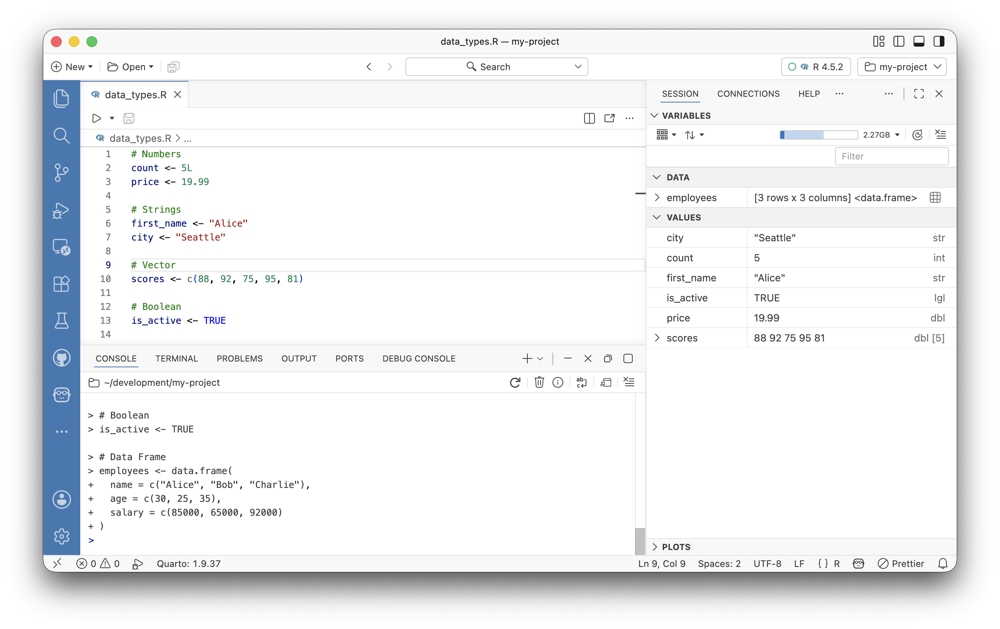
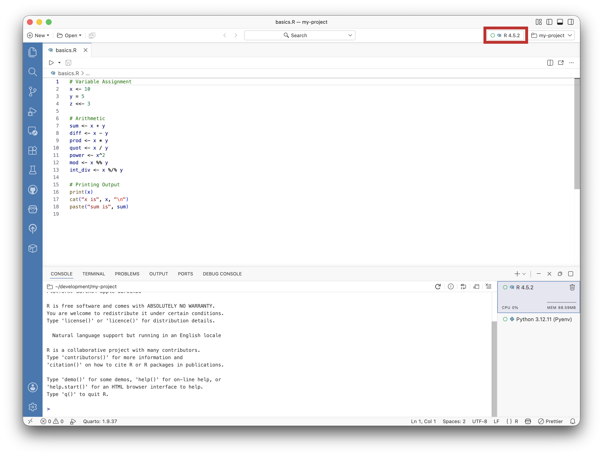
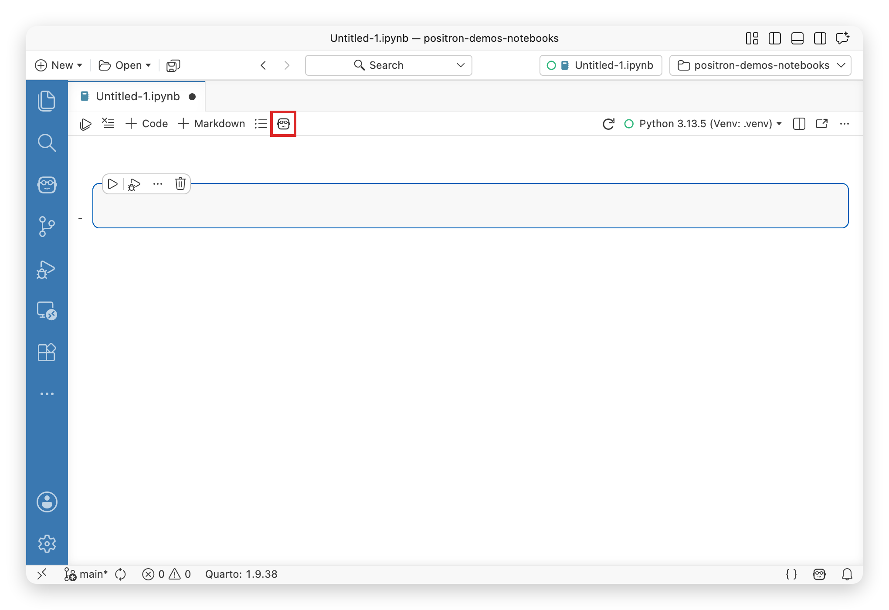

<!-- ============================== HERO ============================== -->
<section class="hero-section">

From <a href="https://posit.co/">Posit PBC</a>, the creators of RStudio

<h1>The Data Science IDE</h1>

A free IDE with built-in AI for the full spectrum of data science in Python and R.

::: {.content-visible unless-profile="workbench"}

<a href="download.qmd" class="btn btn-primary btn-lg">Download for Free</a>
<a href="features.qmd" class="btn btn-outline-primary btn-lg">Explore Features</a>

Available for macOS, Windows, and Linux. No account required.

:::

::: {.content-visible when-profile="workbench"}

<a href="features.qmd" class="btn btn-outline-primary btn-lg">Features</a>
<a href="release-notes.qmd" class="btn btn-outline-primary btn-lg">Release Notes</a>
<a href="welcome.qmd" class="btn btn-outline-primary btn-lg">Guides</a>

:::

<button class="hero-tab active" role="tab" aria-selected="true" aria-controls="panel-data-explorer" id="tab-data-explorer" data-index="0">
<i class="bi bi-table"></i> Data Explorer
</button>
<button class="hero-tab" role="tab" aria-selected="false" aria-controls="panel-notebooks" id="tab-notebooks" data-index="1">
<i class="bi bi-journal-code"></i> Notebooks
</button>
<button class="hero-tab" role="tab" aria-selected="false" aria-controls="panel-ai-assistant" id="tab-ai-assistant" data-index="2">
<i class="bi bi-robot"></i> AI Assistant
</button>
<button class="hero-tab" role="tab" aria-selected="false" aria-controls="panel-plots" id="tab-plots" data-index="3">
<i class="bi bi-graph-up"></i> Plots
</button>

</section>

<!-- ========================= VALUE PROPS ========================== -->
<section class="value-props-section">

<h2>Stop context-switching between tools</h2>

<button class="feature-nav-item active" data-target="workflow-0">

Integrated workflow

Explore data, write code, and ship results, all without leaving your IDE. No more copying between notebooks and scripts or juggling separate tools for analysis and production.

</button>
<button class="feature-nav-item" data-target="workflow-1">

Built-in Data Explorer

</button>
<button class="feature-nav-item" data-target="workflow-2">

Interactive plots

</button>

<h2>One IDE for both Python and R</h2>

<button class="feature-nav-item active" data-target="languages-0">

Dual language support

Stop juggling RStudio and VS Code. Positron gives both languages the same data explorer, variables pane, and plots viewer so you pick the best language for the job, not the one your IDE supports.

</button>
<button class="feature-nav-item" data-target="languages-1">

Shared variables and data explorer

</button>
<button class="feature-nav-item" data-target="languages-2">

Switch interpreters on the fly

</button>

<!-- TODO: Replace with variables pane screenshot showing both languages -->

<!-- TODO: Replace with interpreter switcher screenshot -->

<h2>AI that actually understands your data</h2>

<button class="feature-nav-item active" data-target="ai-0">

Context awareness

Generic AI assistants don't know your variables, your data, or your session. Positron's AI sees your active dataframes, console output, and plots so it has the full context when making suggestions.

</button>
<button class="feature-nav-item" data-target="ai-1">

Notebook assistant

</button>
<button class="feature-nav-item" data-target="ai-2">

Inline code generation

</button>

<!-- TODO: Replace with notebook assistant in action -->

<!-- TODO: Replace with inline AI code generation screenshot -->

</section>

<!-- ======================== TESTIMONIALS ============================ -->
<section class="testimonials-section">

<h2>Hear from the community</h2>

SP

Sam Parmar

Statistical Data Scientist, Pfizer

<blockquote>"Positron feels like the perfect balance between VS Code and RStudio."</blockquote>

MH

Meghan S. Harris

Data Scientist, Memorial Sloan Kettering Cancer Center

<blockquote>"Positron didn't just make Python accessible, it made it fun."</blockquote>

YR

Yanan Ren

Senior Statistician, Medtronic

<blockquote>"The combination of Positron and the AI Assistant makes switching between R &amp; Python incredibly smooth."</blockquote>

</section>

<!-- ========================== SUPADEMO ============================= -->
::: {.content-visible unless-profile="workbench"}
<section class="supademo-section">

<h2>See it in action</h2>

Take an interactive tour of Positron's key features and see how it streamlines your data science workflow.

<i class="bi bi-play-circle-fill"></i>
Launch Interactive Tour

</section>
:::

<!-- ============================== FAQ =============================== -->
<section class="faq-section">

<h2>Frequently Asked Questions</h2>

Is Positron free?

Yes! Positron is free to download and use. It is source-available under the [Elastic License 2.0](https://github.com/posit-dev/positron?tab=License-1-ov-file#readme).

::: {.content-visible unless-profile="workbench"}
Learn more about [what this license means](licensing.qmd) and our decision to use it.
:::

Can I use my VS Code extensions?

Yes! Positron supports VS Code compatible extensions (.vsix files), giving you access to thousands of community extensions out of the box. By building on Code OSS, Positron gets rich text editor capabilities and broad extensibility beyond the core IDE. <a href="extensions.qmd">Read more about using extensions with Positron</a>.

Is RStudio going away?

No. Posit is committed to maintaining and updating RStudio. RStudio is very mature, stable software, and will continue to receive security updates, stability improvements, and priority bug fixes. If you're new to R, we recommend starting with Positron — but if you're happy with RStudio, you can continue using it.

How is Positron different from RStudio or VS Code?

Positron combines the best of both worlds: the data-science-first experience of RStudio — with a built-in data explorer, variables pane, and plots viewer — and the modern editor capabilities of VS Code, including extensions, AI assistance, and multi-language support.

<a href="faqs.qmd">View all frequently asked questions →</a>

</section>

<!-- ========================== CLOSING CTA =========================== -->
<section class="closing-cta-section">

<h2>Ready to get started?</h2>

Download Positron for free and start building with Python and R today.

::: {.content-visible unless-profile="workbench"}

<a href="download.qmd" class="btn btn-primary btn-lg">Download for Free</a>
<a href="features.qmd" class="btn btn-outline-primary btn-lg">Explore Features</a>

:::

::: {.content-visible when-profile="workbench"}

<a href="features.qmd" class="btn btn-outline-primary btn-lg">Features</a>
<a href="release-notes.qmd" class="btn btn-outline-primary btn-lg">Release Notes</a>
<a href="welcome.qmd" class="btn btn-outline-primary btn-lg">Guides</a>

:::

</section>

<!-- ========================= LICENSE NOTE =========================== -->
::: {.content-visible unless-profile="workbench"}

Positron™ is licensed under the <a href="https://github.com/posit-dev/positron?tab=License-1-ov-file#readme">Elastic License 2.0</a>, a source-available license. <a href="licensing.qmd">Read more</a> about what this license means and our decision to use it.

:::

<!-- ========================= TAB SCRIPT ============================ -->

