<!-- ============================== HERO ============================== -->
<section class="hero-section">

From <a href="https://posit.co/">Posit PBC</a>, the team behind RStudio, Shiny, and the tidyverse

<h1>The Data Science IDE</h1>

::: {.content-visible unless-profile="workbench"}

Move from question to insight to application faster in Positron, a free IDE purpose-built for Python and R with transparent, inspectable AI.

:::

::: {.content-visible when-profile="workbench"}

Move from question to insight to application faster in Positron, an IDE purpose-built for Python and R with transparent, inspectable AI.

:::

::: {.content-visible unless-profile="workbench"}

<a href="download.qmd" class="btn btn-primary btn-lg">Download for Free</a>
<a href="features.qmd" class="btn btn-outline-primary btn-lg">Explore Features</a>
<a href="https://posit.co/positron-updates-signup/" class="btn btn-outline-primary btn-lg">Get Updates</a>

Available for macOS, Windows, and Linux. No account required.

:::

::: {.content-visible when-profile="workbench"}

<a href="features.qmd" class="btn btn-outline-primary btn-lg">Features</a>
<a href="release-notes.qmd" class="btn btn-outline-primary btn-lg">Release Notes</a>
<a href="welcome.qmd" class="btn btn-outline-primary btn-lg">Guides</a>

:::

<button class="hero-tab active" role="tab" aria-selected="true" aria-controls="panel-data-explorer" id="tab-data-explorer" data-index="0">
<i class="bi bi-table"></i> Data Explorer
</button>
<button class="hero-tab" role="tab" aria-selected="false" aria-controls="panel-ai-assistant" id="tab-ai-assistant" data-index="1">
<i class="bi bi-robot"></i> Inspectable AI
</button>
<button class="hero-tab" role="tab" aria-selected="false" aria-controls="panel-data-apps" id="tab-data-apps" data-index="2">
<i class="bi bi-window-stack"></i> Data Apps
</button>
<button class="hero-tab" role="tab" aria-selected="false" aria-controls="panel-notebooks" id="tab-notebooks" data-index="3">
<i class="bi bi-journal-code"></i> Notebook Editor
</button>

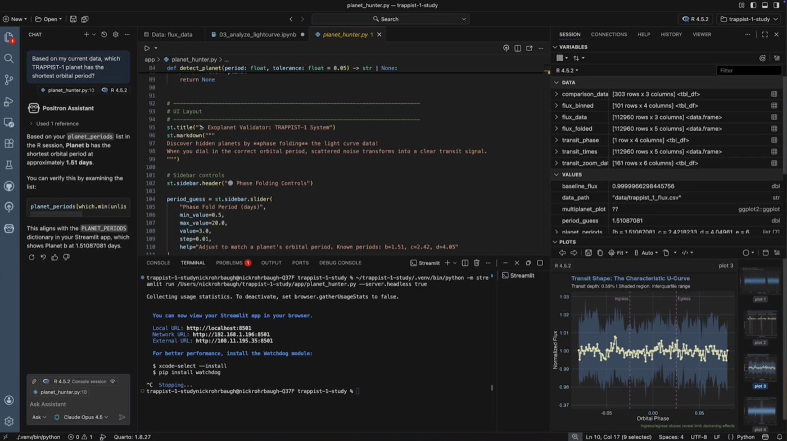

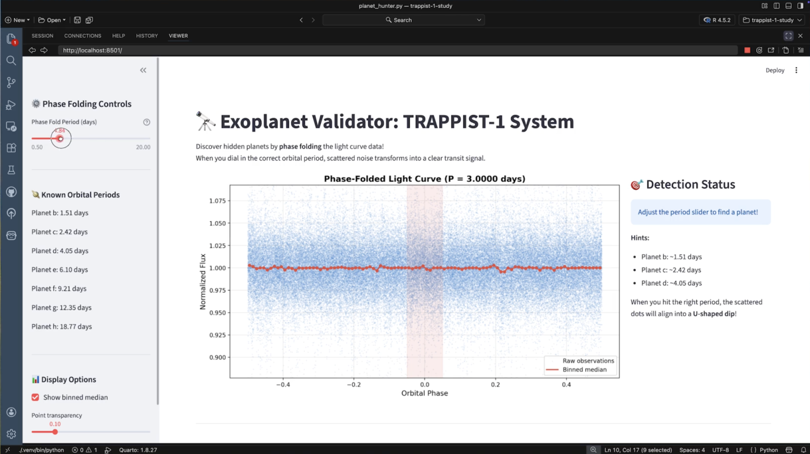

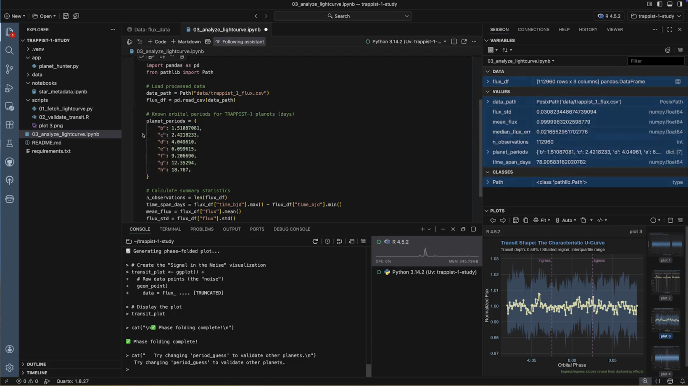

</section>

<!-- ========================== VIDEO ================================ -->
::: {.content-visible unless-profile="workbench"}
<section class="video-demo-section">

<h2>See it in action</h2>

Watch a quick overview of Positron's key features and see how it streamlines your data science workflow.

<video controls preload="none" poster="images/positron-intro-poster.png" aria-label="Introducing Positron, the data science IDE" style="width:100%; border-radius:8px; box-shadow: 0 4px 24px rgba(0,0,0,0.10);">
<source src="videos/positron-intro.mp4" type="video/mp4">
</video>

</section>
:::

<!-- ========================= VALUE PROPS ========================== -->
<section class="value-props-section">

<h2>Stop context-switching between tools</h2>

Positron is built for data science workflows. Execute code interactively in a native console or notebook, explore data, view variables and dataframes, create visualizations, train models, build apps, and access everything else you need to stay in the flow.

<button class="feature-nav-item active" data-target="workflow-0">

Python & R

Code efficiently with first-class support for both R and Python.

</button>
<button class="feature-nav-item" data-target="workflow-1">

Data Explorer

Sort, filter, and profile large datasets with fast, interactive data frames.

</button>
<button class="feature-nav-item" data-target="workflow-2">

Rapid visualizations

Create high-quality visualizations quickly to uncover patterns and communicate findings effectively.

</button>
<button class="feature-nav-item" data-target="workflow-3">

Jupyter & Quarto Notebooks

Iteratively explore data in a batteries-included native editor for Jupyter and Quarto notebooks. Create reproducible reports, presentations, and websites that combine code, results, and narrative.

</button>
<button class="feature-nav-item" data-target="workflow-4">

Production Apps

Easily convert explorations into production scripts, data apps, and reports.

</button>

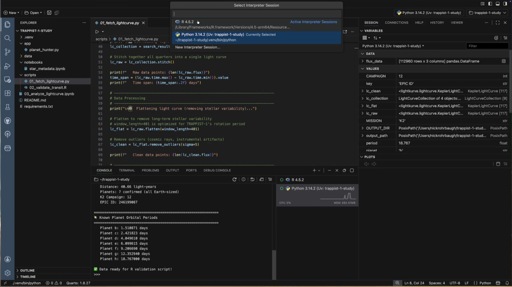

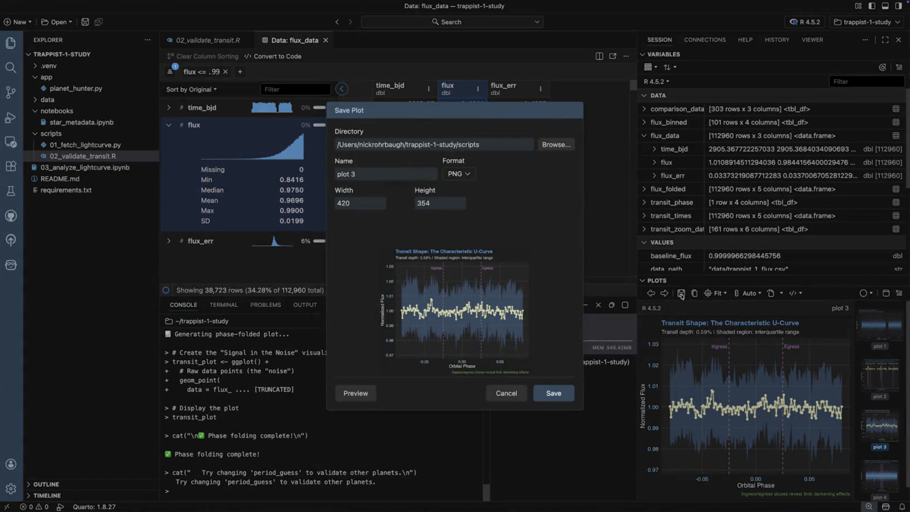

<h2>AI that actually understands your data</h2>

Positron Assistant sees your active dataframes, console output, and plots so every suggestion is grounded in your actual work. Transparent, inspectable, and always under your control.

<button class="feature-nav-item active" data-target="ai-0">

Data-aware AI

Positron Assistant has context about your loaded data, plots, and console history, enabling more relevant guidance for data science tasks.

</button>
<button class="feature-nav-item" data-target="ai-1">

Exploratory Agent

Accelerate exploratory data analysis with Databot, an agent that collaborates with you to provide transparent insights.

</button>
<button class="feature-nav-item" data-target="ai-2">

Bring your own model

Connect your preferred AI provider with just an API key. All AI traffic goes directly from your machine to your chosen provider.

</button>
<button class="feature-nav-item" data-target="ai-3">

Notebook assistant

Assistant understands the full context of your Jupyter notebook from code cells to outputs and execution history. Use AI quick actions to generate code and AI next steps to guide your analysis.

</button>

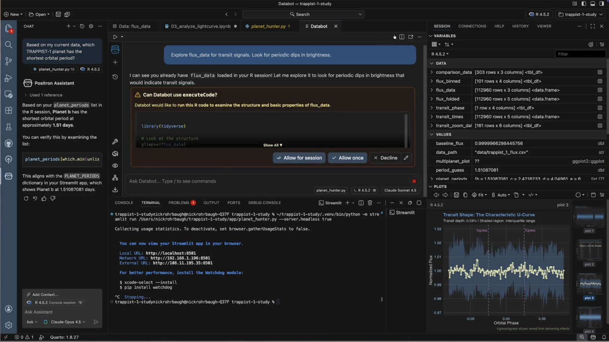

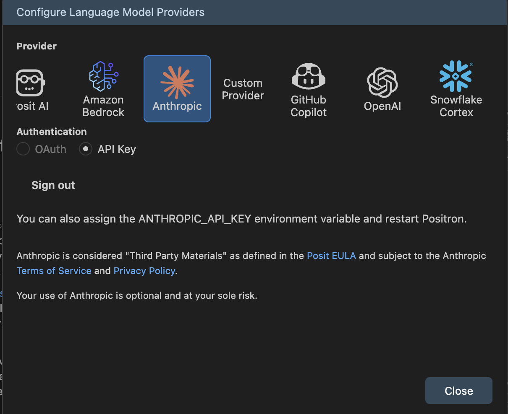

<h2>Built on a platform you can grow with</h2>

::: {.content-visible unless-profile="workbench"}

Start with a free desktop IDE and expand as your needs evolve. Connect to your data, extend with thousands of plugins, and scale to Workbench for enterprise when you're ready.

:::

::: {.content-visible when-profile="workbench"}

Connect to your data, extend with thousands of plugins, and scale with enterprise-grade infrastructure.

:::

<button class="feature-nav-item active" data-target="production-0">

Connect to your data

Create connections to databases like Databricks, Snowflake, and Postgres directly from Positron. Browse schemas, preview tables, and start querying without leaving your editor.

</button>
<button class="feature-nav-item" data-target="production-1">

Leverage extensions

Access the Open VSX marketplace for language support, themes, linters, formatters, and thousands of extensions.

</button>
<button class="feature-nav-item" data-target="production-2">

Publish and share

Deploy reports, dashboards, and data apps to Posit Connect or Posit Connect Cloud with a single click.

</button>
<button class="feature-nav-item" data-target="production-3">

Scale beyond your laptop

Connect to remote servers via SSH or run Positron in the browser through Posit Workbench when you need more CPU, RAM, or GPU than your local machine provides.

</button>

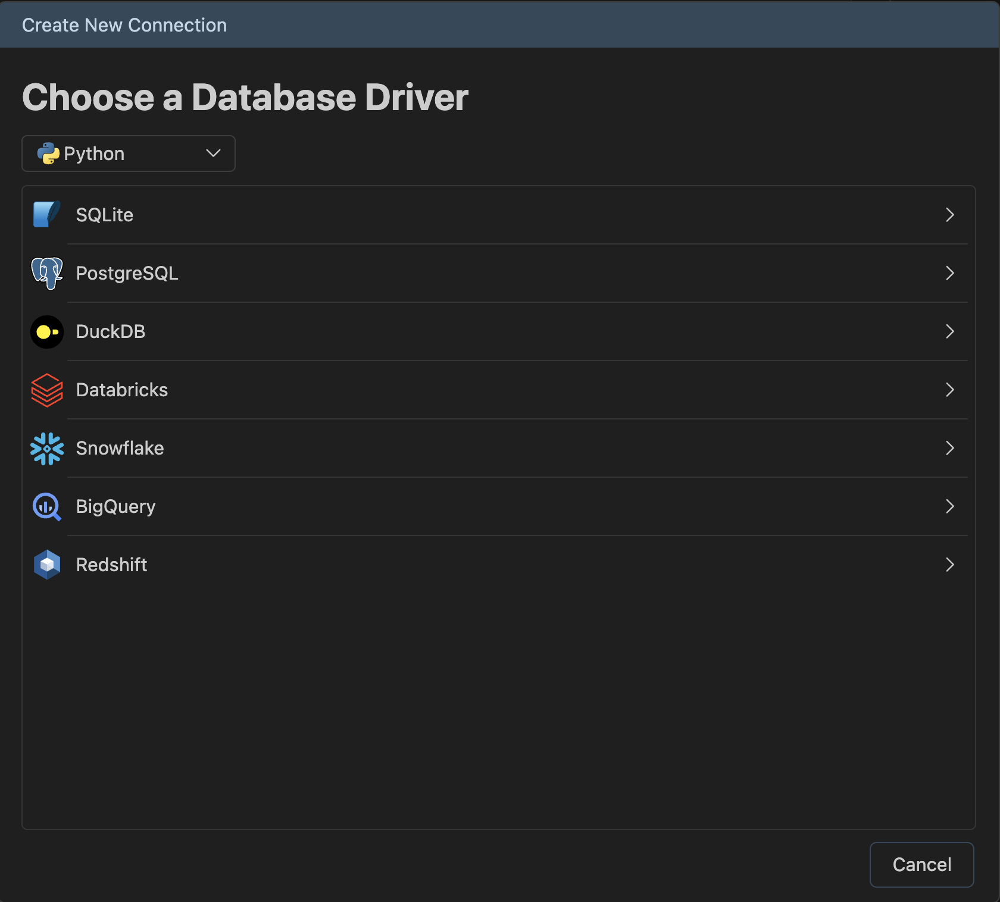

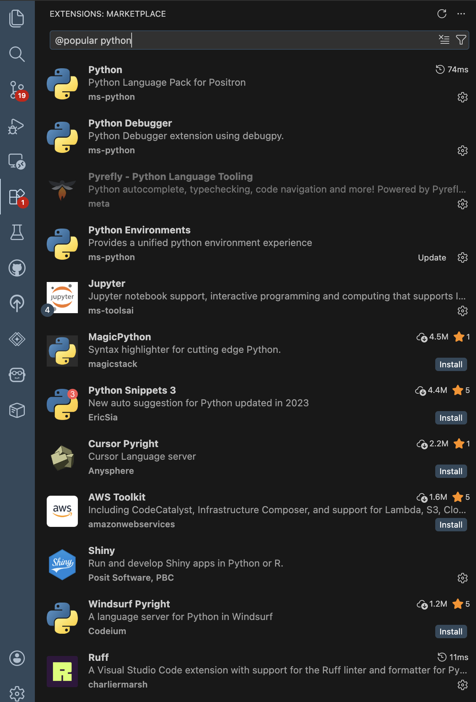

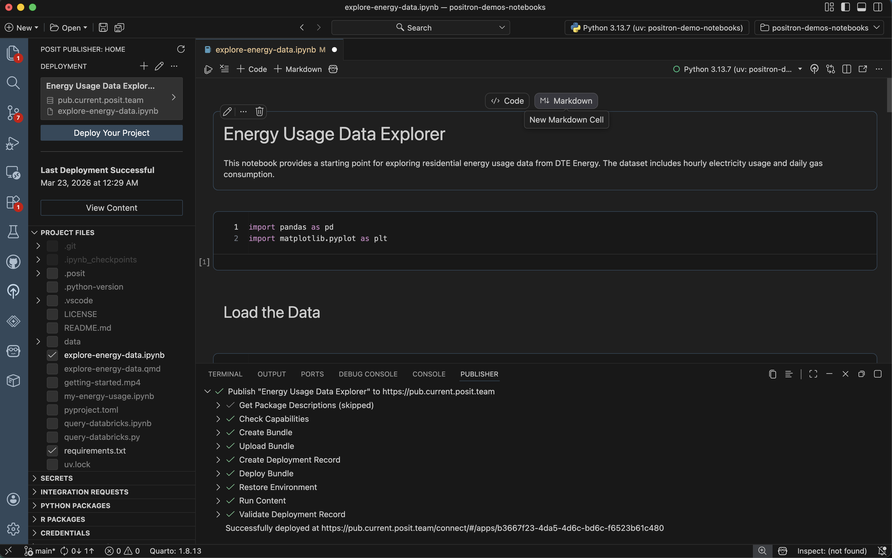

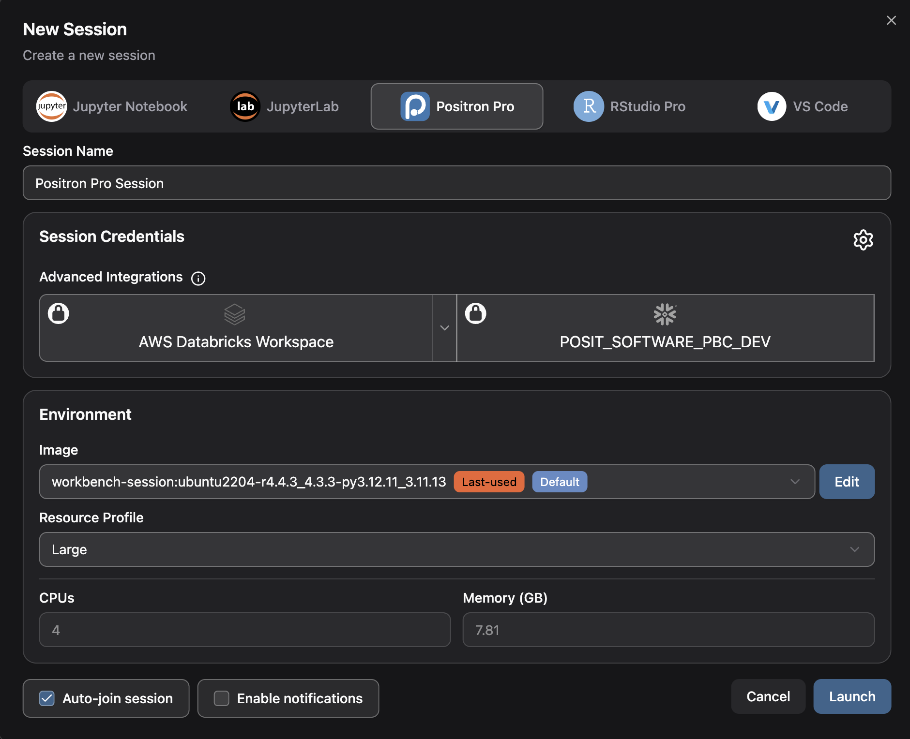

</section>

<!-- ======================== TESTIMONIALS ============================ -->
<section class="testimonials-section">

<h2>Hear from the community</h2>

<blockquote>"Positron feels like the perfect balance between VS Code and RStudio."</blockquote>

SP

Sam Parmar

Statistical Data Scientist, Pfizer

<blockquote>"Positron didn't just make Python accessible, it made it fun."</blockquote>

MH

Meghan S. Harris

Data Scientist, Memorial Sloan Kettering Cancer Center

<blockquote>"The combination of Positron and the AI Assistant makes switching between R &amp; Python incredibly smooth."</blockquote>

YR

Yanan Ren

Senior Statistician, Medtronic

</section>

<!-- ============================== FAQ =============================== -->
<section class="faq-section">

<h2>Frequently Asked Questions</h2>

::: {.content-visible unless-profile="workbench"}

Is Positron free?

Yes! Positron is free to download and use. It is source-available under the <a href="https://github.com/posit-dev/positron?tab=License-1-ov-file#readme">Elastic License 2.0</a>. <a href="licensing.qmd">Learn more</a> about what this license means and our decision to use it.

:::

What about RStudio?

RStudio is not going away. Posit is committed to maintaining it with security updates, stability improvements, and priority bug fixes. Positron builds on the data-science-first experience of RStudio and adds modern editor capabilities like extensions, AI assistance, and first-class Python support. Positron includes RStudio keybindings to make the transition easier. If you are new to R, we recommend starting with Positron. If you're happy with RStudio, you can continue using it. <a href="faqs.html#is-rstudio-going-away">Learn more</a>.

How is Positron different from VS Code?

Positron is purpose-built for data science with dedicated panes for data exploration, variables, plots, and a native console, all ready immediately with zero configuration. VS Code is a general purpose code editor that requires installing and configuring multiple extensions to approximate a data science workflow, and does not officially support R. Positron supports VS Code compatible extensions, so you can bring your existing tools with you. <a href="faqs.html#how-is-positron-different-from-rstudio-vs-code-or-jupyter-notebooks">Learn more</a>.

How is Positron different from Jupyter Notebook editors?

Positron is a full IDE that goes beyond notebook editing. You get a batteries-included native notebook editor for Jupyter, plus a built-in data explorer, variables pane, plots viewer, database connections, AI assistance, debugging, version control and more, all without having to manage your own extensions. <a href="faqs.html#how-is-positron-different-from-rstudio-vs-code-or-jupyter-notebooks">Learn more</a>.

What languages and tools does Positron support?

R and Python are first-class supported languages with a native console, data explorer, and variables pane. Additional languages like Rust, JavaScript, and C/C++ are supported through community extensions. SQL support is on the roadmap. Positron also supports Jupyter and Quarto notebooks, Shiny, Streamlit, and Dash apps, and thousands of extensions from the Open VSX marketplace. <a href="faqs.html#what-programming-languages-are-supported-in-positron">Learn more</a>.

<a href="faqs.qmd">View all frequently asked questions →</a>

</section>

<!-- ========================== CLOSING CTA =========================== -->
<section class="closing-cta-section">

<h2>Ready to get started?</h2>

::: {.content-visible unless-profile="workbench"}

Download Positron for free and start building with Python and R today.

:::

::: {.content-visible when-profile="workbench"}

Start building with Python and R in Positron today.

:::

::: {.content-visible unless-profile="workbench"}

<a href="download.qmd" class="btn btn-primary btn-lg">Download for Free</a>
<a href="features.qmd" class="btn btn-outline-primary btn-lg">Explore Features</a>
<a href="https://posit.co/positron-updates-signup/" class="btn btn-outline-primary btn-lg">Get Updates</a>

:::

::: {.content-visible when-profile="workbench"}

<a href="features.qmd" class="btn btn-outline-primary btn-lg">Features</a>
<a href="release-notes.qmd" class="btn btn-outline-primary btn-lg">Release Notes</a>
<a href="welcome.qmd" class="btn btn-outline-primary btn-lg">Guides</a>

:::

</section>

<!-- ========================= LICENSE NOTE =========================== -->
::: {.content-visible unless-profile="workbench"}

Positron™ is licensed under the <a href="https://github.com/posit-dev/positron?tab=License-1-ov-file#readme">Elastic License 2.0</a>, a source-available license. <a href="licensing.qmd">Read more</a> about what this license means and our decision to use it.

:::

<!-- ========================= TAB SCRIPT ============================ -->

