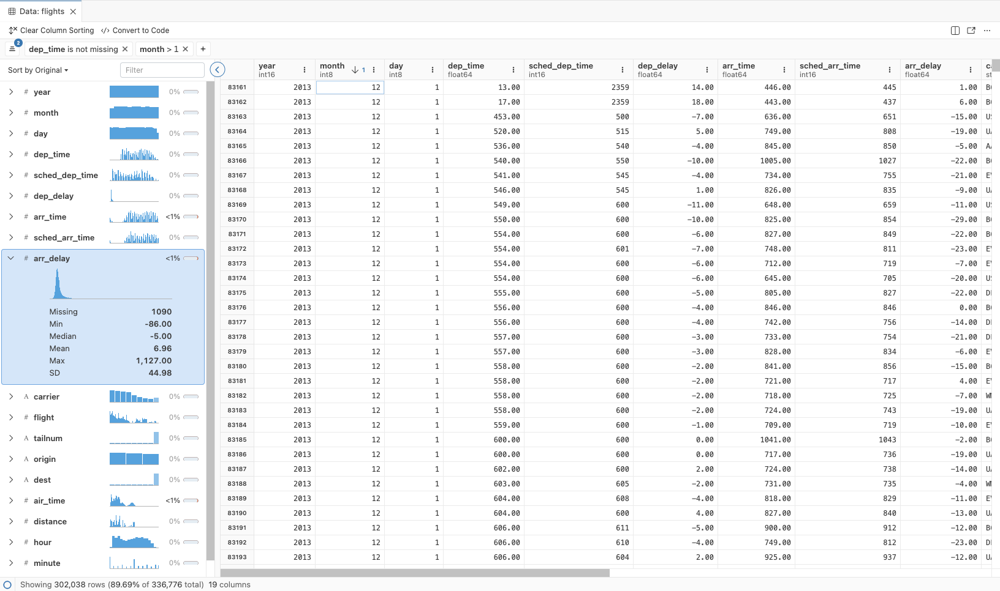
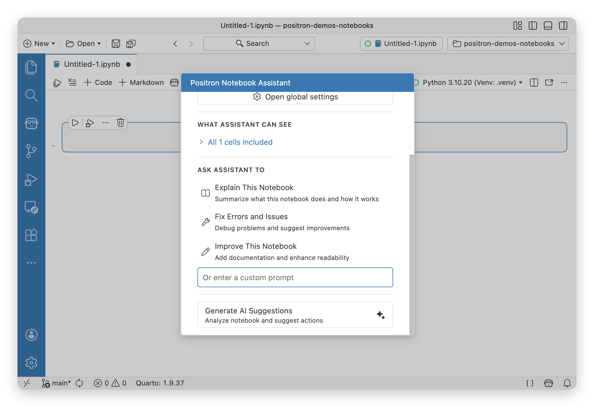
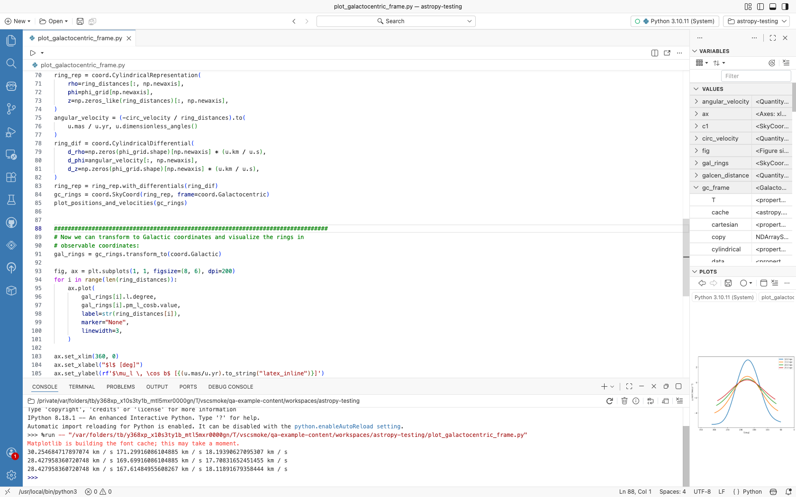

<!-- ============================== HERO ============================== -->
<section class="hero-section">

From <a href="https://posit.co/">Posit PBC</a>, the creators of RStudio

<h1>The Data Science IDE</h1>

Positron unifies exploration and production work in one free, AI-assisted environment, empowering the full spectrum of data science in Python and R.

::: {.content-visible unless-profile="workbench"}

<a href="download.qmd" class="btn btn-primary btn-lg">Download for Free</a>
<a href="features.qmd" class="btn btn-outline-primary btn-lg">Explore Features</a>

:::

::: {.content-visible when-profile="workbench"}

<a href="features.qmd" class="btn btn-outline-primary btn-lg">Features</a>
<a href="release-notes.qmd" class="btn btn-outline-primary btn-lg">Release Notes</a>
<a href="welcome.qmd" class="btn btn-outline-primary btn-lg">Guides</a>

:::

<button class="hero-tab active" role="tab" aria-selected="true" aria-controls="panel-data-explorer" id="tab-data-explorer" data-index="0">
<i class="bi bi-table"></i> Data Explorer
</button>
<button class="hero-tab" role="tab" aria-selected="false" aria-controls="panel-notebooks" id="tab-notebooks" data-index="1">
<i class="bi bi-journal-code"></i> Notebooks
</button>
<button class="hero-tab" role="tab" aria-selected="false" aria-controls="panel-ai-assistant" id="tab-ai-assistant" data-index="2">
<i class="bi bi-robot"></i> AI Assistant
</button>
<button class="hero-tab" role="tab" aria-selected="false" aria-controls="panel-plots" id="tab-plots" data-index="3">
<i class="bi bi-graph-up"></i> Plots
</button>

</section>

<!-- ========================= VALUE PROPS ========================== -->
<section class="value-props-section">

<h2>Why Positron?</h2>

<i class="bi bi-lightning-charge"></i>

### Move quickly from exploration to production

Bridge the gap between interactive analysis and production-ready code. Positron's integrated environment lets you iterate quickly and ship confidently.

<i class="bi bi-code-slash"></i>

### Explore and analyze data with Python and R

First-class support for both Python and R in a single IDE. Switch between languages seamlessly with a shared data explorer, variables pane, and plots viewer.

<i class="bi bi-robot"></i>

### Accelerate insights with AI assistance

AI that understands data science workflows. Get contextual help with code generation, debugging, and analysis — right where you work.

</section>

<!-- ========================== SUPADEMO ============================= -->
::: {.content-visible unless-profile="workbench"}
<section class="supademo-section">

<h2>See it in action</h2>

Take an interactive tour of Positron's key features and see how it streamlines your data science workflow.

<button class="btn btn-primary btn-lg" id="launch-supademo" onclick="launchSupademo()">Launch Interactive Tour</button>

</section>
:::

<!-- ============================== FAQ =============================== -->
<section class="faq-section">

<h2>Frequently Asked Questions</h2>

What is Positron?

Positron is a next-generation data science IDE built by <a href="https://posit.co/">Posit PBC</a>, the creators of RStudio. It is built on the foundations of VS Code and designed from the ground up for data science workflows in Python and R, with a built-in data explorer, variables pane, plots viewer, and more.

Is Positron free?

Yes! Positron is free to download and use. It is source-available under the [Elastic License 2.0](https://github.com/posit-dev/positron?tab=License-1-ov-file#readme).

::: {.content-visible unless-profile="workbench"}
Learn more about [what this license means](licensing.qmd) and our decision to use it.
:::

What languages does Positron support?

Positron provides first-class support for both Python and R, including language-specific features like the data explorer, variables pane, and integrated help. Since it is built on VS Code, you can also install extensions for other languages.

How is Positron different from RStudio or VS Code?

Positron combines the best of both worlds: the data-science-first experience of RStudio — with a built-in data explorer, variables pane, and plots viewer — and the modern editor capabilities of VS Code, including extensions, AI assistance, and multi-language support.

<a href="faqs.qmd">View all frequently asked questions →</a>

</section>

<!-- ========================= LICENSE NOTE =========================== -->
::: {.content-visible unless-profile="workbench"}

Positron™ is licensed under the <a href="https://github.com/posit-dev/positron?tab=License-1-ov-file#readme">Elastic License 2.0</a>, a source-available license. <a href="licensing.qmd">Read more</a> about what this license means and our decision to use it.

:::

<!-- ========================= TAB SCRIPT ============================ -->

