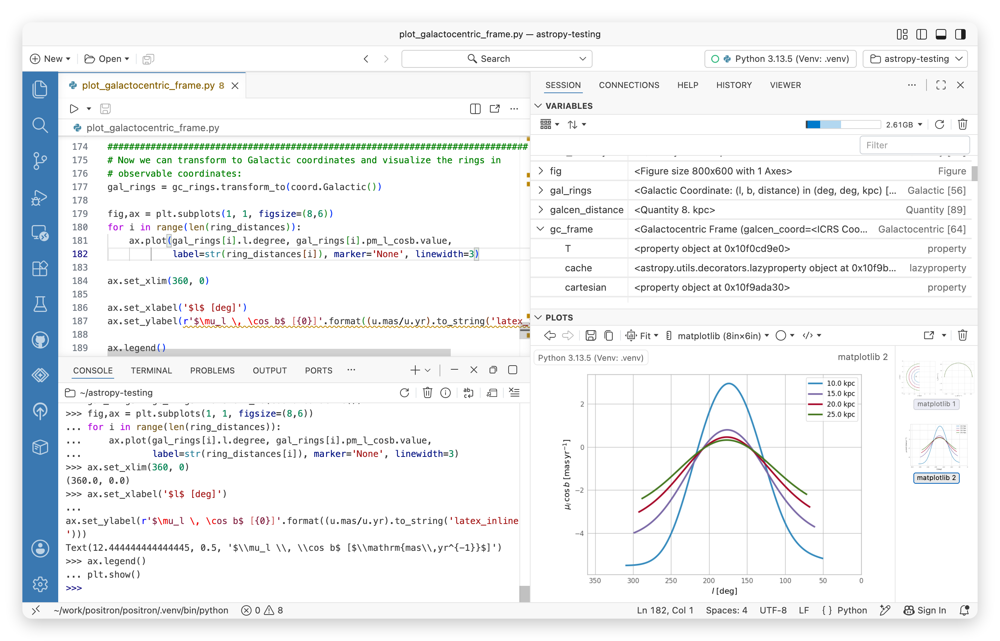

<!--Hero banner section-->

From <a href="https://posit.co/">Posit PBC</a>, the creators of RStudio, the tidyverse, and Shiny

<h1>The Data Science IDE</h1>

::: {.content-visible unless-profile="workbench"}

Positron is a free IDE purpose-built for Python and R, with transparent AI assistance, interactive data exploration, and everything you need to go from question to insight to application.

:::

::: {.content-visible when-profile="workbench"}

Positron is an IDE purpose-built for Python and R, with transparent AI assistance, interactive data exploration, and everything you need to go from question to insight to application.

:::

::: {.content-visible unless-profile="workbench"}
<a href="download.qmd" class="btn btn-outline-primary">Download</a>
<a href="features.qmd" class="btn btn-outline-primary">Explore Features</a>
<a href="https://posit.co/positron-updates-signup/" class="btn btn-outline-primary">Get Updates</a>
:::

::: {.content-visible when-profile="workbench"}
<a href="features.qmd" class="btn btn-outline-primary">Features</a>
<a href="release-notes.qmd" class="btn btn-outline-primary">Release Notes</a>
<a href="welcome.qmd" class="btn btn-outline-primary">Guides</a>
:::



::: {.content-visible when-profile="workbench"}
{fig-alt="Positron IDE showing Python code for astronomical data visualization with a galactic coordinate plot and Variables pane displaying data objects."}
:::

::: {.content-visible unless-profile="workbench"}
Positron™ is licensed under the [Elastic License 2.0](https://github.com/posit-dev/positron?tab=License-1-ov-file#readme), a source-available license. [Read more](licensing.qmd) about what this license means and our decision to use it.
:::

