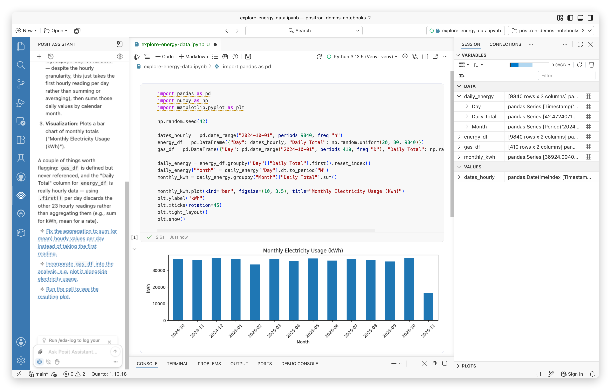
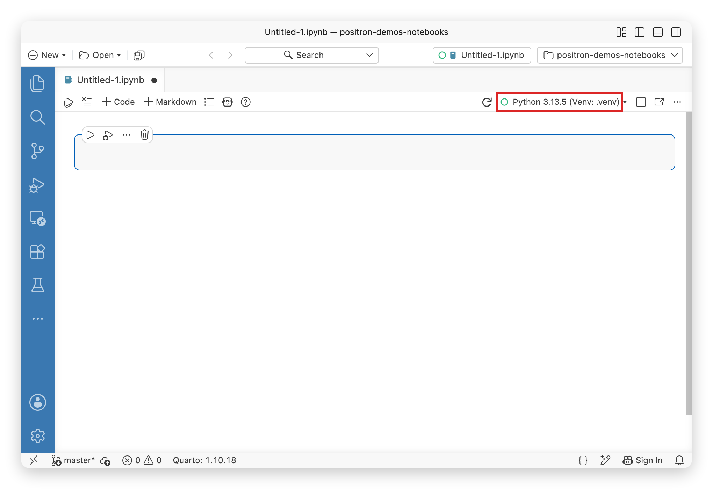

[Jupyter Notebooks](https://jupyter-notebook.readthedocs.io/en/latest/notebook.html) offer a flexible, interactive UI for combining code, prose, and visualizations.

Positron enhances Jupyter Notebooks in several key ways:

-   Notebooks work out of the box. You do not need to install any additional dependencies into your Python or R environments.
-   Notebooks are integrated into the IDE. You can manage data sources in the [Connections pane](connections-pane.qmd), view data at a glance in the [Variables pane](variables-pane.qmd), explore data in depth with the [Data Explorer](data-explorer.qmd), and browse documentation in the [Help pane](help-pane.qmd).
-   Language features such as autocompletion and go-to-definition work seamlessly across notebooks and plaintext files.

<!-- TODO(screenshot): re-capture the overview screenshot with the current Assistant UI -->

{width=800 fig-alt="Positron IDE showing a Jupyter notebook with Python code, a bar chart of monthly electricity usage, the Positron Assistant chat panel on the left, and Variables pane on the right."}

## Notebook editors

Positron offers two editors for working with Jupyter Notebooks: the [Positron Notebook Editor](positron-notebook-editor.qmd), which is the default, and the [legacy notebook editor](#legacy-notebook-editor), the VS Code based notebook editor.

### Positron Notebook Editor

The [Positron Notebook Editor](positron-notebook-editor.qmd) is a native notebook experience built specifically for Positron. It provides notebook-aware AI assistance, integrated data exploration, [debugging](notebook-debugging.qmd), and an improved user experience for data science workflows. Read the [launch blog post](https://posit.co/blog/announcing-the-positron-notebook-editor-for-jupyter-notebooks/) to learn more about why we built the Positron Notebook Editor.

Your `.ipynb` files open in the Positron Notebook Editor by default. To learn more, see the [setup instructions](positron-notebook-editor.qmd#use-the-positron-notebook-editor).

### Legacy notebook editor

The legacy notebook editor is the Code OSS based notebook editor. If you are familiar with Jupyter Notebooks in VS Code, this editor will feel familiar; see the [VS Code Jupyter Notebooks documentation](https://code.visualstudio.com/docs/datascience/jupyter-notebooks) for a general introduction. To use it, disable the [`positron.notebook.enabled`](positron://settings/positron.notebook.enabled) setting and `.ipynb` files will open in the legacy editor instead.

The legacy editor uses the same bundled Jupyter kernel support for R and Python as the Positron Notebook Editor, so no additional environment setup is needed. Select a kernel with the **Kernel Selector** button in the notebook action bar or the _Notebook: Select Notebook Kernel_ command from the Command Palette.

{fig-alt="Notebook Editor action bar with the kernel selector button highlighted, displaying a Python virtual environment as the current kernel."}

## Related features

- If you prefer to work in a notebook-like plain text file that mixes narrative and code, Positron has first class support for [Quarto `.qmd` documents](quarto.qmd).
- If you prefer to work in a plain `.py` or `.R` script with runnable cells, Positron has first class support for [code cells](code-cells.qmd).
