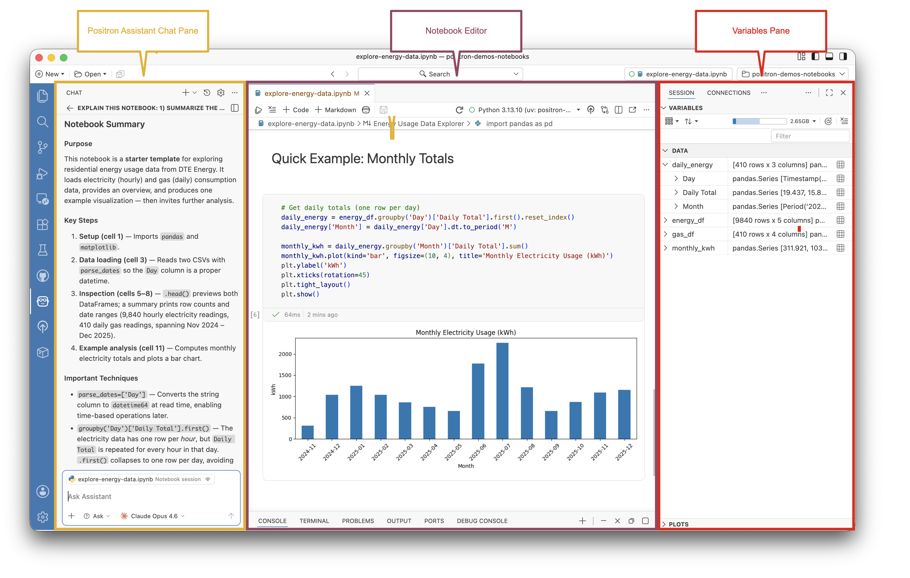
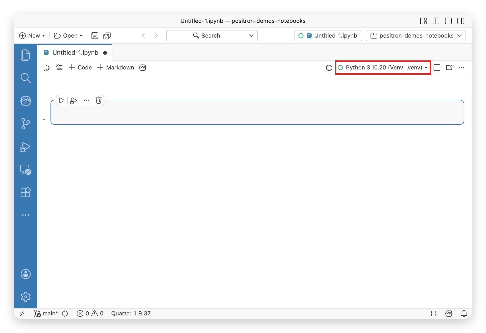

::: {.callout-note}
The Positron Notebook Editor is the default editor for Jupyter (`.ipynb`) files. We are actively working on improving the notebook experience in Positron and want to hear from you! Share your thoughts on [this Github discussion](https://github.com/posit-dev/positron/discussions/10047) or [schedule a call](https://scheduler.zoom.us/cindy-tong/improving-the-positron-notebook-experience) with our product and engineering team.
:::

The Positron Notebook Editor provides a familiar notebook experience for Jupyter (`.ipynb`) files. IDE features work out of the box in notebooks, including AI assistance, data exploration, and debugging.

## Key features

- **Batteries-included experience**: No extensions required for core features
- **Improved user experience**: Optimized for data science workflows
- **Notebook-aware AI assistance**: AI understands your notebook context, execution history, and execution order
- **Integrated data exploration**: Variables pane and Data Explorer work seamlessly
- **Debugging**: Works out of the box without additional setup
- **Improved version control**: Control what metadata is saved for better diffing and version control

## Use the Positron Notebook Editor

The Positron Notebook Editor is the default editor for Jupyter Notebooks, so your `.ipynb` files open in it automatically. If you prefer the [Legacy Notebook Editor](legacy-notebook-editor.qmd), disable the [`positron.notebook.enabled`](positron://settings/positron.notebook.enabled) setting, and `.ipynb` files will open in the Legacy Notebook Editor instead.

## Getting started

You can create and edit `.ipynb` files in Positron just as you would in other editors. To learn how to use the Positron Notebook Editor, check out our [demo notebook](https://github.com/posit-dev/positron-demos-notebooks/).

### Notebook layout

For the best experience, open the Command Palette with  and run the _View: Notebook Layout_ command. This layout arranges the IDE panes into a notebook-friendly setup, giving you quick access to your variables, plots, and other data science tools alongside your notebook.

{fig-alt="Positron IDE with labeled regions: Assistant Chat pane on left, Notebook Editor in center showing code and a bar chart, and Variables pane on right."}

To learn more about customizing the Positron interface, read the [Layout](layout.qmd) documentation.

### Setting up your environment

Positron comes bundled with Jupyter kernel support for R and Python. Once you have [configured a Python or R environment](managing-interpreters.qmd) for Positron, you do not need to install any additional dependencies into your environment before using a notebook.

If an environment installed on your computer is not available in Positron, you might want to read more about how Positron discovers [Python installations](python-installations.qmd) and [R installations](r-installations.qmd).



{fig-alt="Notebook Editor action bar with the kernel selector dropdown highlighted in red, showing a Python virtual environment selected."}

You can select a different interpreter for the notebook by selecting the **Kernel Selector** in the notebook editor action bar. The **Change Kernel...** option will display a list of all the registered interpreters. Select an interpreter from the list.

Alternatively, you can run the _Positron Notebook: Change Kernel..._ command from the Command Palette.

When a notebook is the active editor, the Interpreter picker also offers a **Change Notebook Session...** action that opens the same kernel-selection list.

You can restart the notebook session at any time by selecting the  icon in the notebook editor action bar.

## Version control

The Positron Notebook Editor controls what metadata is saved to the notebook file. This makes notebooks more version-control-friendly. By default, cell outputs are saved but execution counts are not. You can adjust this behavior with the [Saving settings](#saving) below.

## AI integration

The Positron Notebook Editor integrates with [Posit Assistant](assistant.qmd) to provide notebook-aware AI assistance:

- **Context-aware**: Assistant has access to rich context about your notebook, including cell states, execution history, code, and outputs including images and tables.
- **Dynamic Suggestions**: Assistant follows your work and dynamically suggests actions to improve your notebook.
- **Actionable Editing**: With your permission, Assistant can directly edit and run cells in your notebook.
- **Transparent**: You can inspect and control the specific context the Assistant is using.
- **Collaborative**: Use [Follow Assistant](#follow-assistant) to automatically scroll and highlight cells as they are edited.



### Enable Posit Assistant

To use the integrated notebook AI features, first configure a language model provider. See the [Getting Started](assistant-getting-started.qmd) guide for more details. We recommend using Anthropic for the best experience.

Once you are signed in, you will see assistant specific actions in the notebook editor action bar. To disable notebook AI features, set [`notebook.ai.enabled`](positron://settings/notebook.ai.enabled) to `false`. See [Configure AI features](ai-configuration.qmd) for other ways to turn AI features on and off.

{fig-alt="Notebook action bar showing the Assistant icon button."}

### Notebook Assistant panel

The Notebook Assistant panel provides a quick way to interact with Assistant directly from your notebook. To open it, select the **Assistant** icon button in the notebook editor action bar.

{fig-alt="Notebook Assistant panel showing context cells, quick actions like Fix, Explain, and Improve, and AI-generated suggestions based on the notebook state."}

From the panel, you can:

- **View context**: See which cells are included in the Assistant context
- **Quick actions**: Run common actions like explaining the contents of a notebook or fixing errors in a notebook
- **Generate suggestions**: View dynamically generated suggestions based on the current state of the notebook

Selecting an option from the panel will open a new [**Chat** pane](assistant-chat.qmd) with the notebook context already attached.

### Fix and explain cell errors {#notebook-fix-and-explain}

When a cell fails to run, Positron shows **Fix** and **Explain** buttons right on the error output. Choose one to send the error to Assistant for immediate help:

- **Fix:** Assistant diagnoses the error and suggests a corrected version of your code.
- **Explain:** Assistant describes what your code does, analyzes the error, and suggests possible solutions, without editing your notebook.



The main button starts a new chat with the error attached as context. Use the dropdown arrow next to it to send the error to your current chat instead.

### Ghost cell suggestions (experimental)

Ghost cell suggestions use AI to predict your next step after you execute a cell. A ghost cell appears below the current cell with a suggested action you can accept, edit, or dismiss.

To enable ghost cell suggestions, set [`positron.assistant.notebook.ghostCellSuggestions.enabled`](positron://settings/positron.assistant.notebook.ghostCellSuggestions.enabled) to `true`. By default, suggestions appear automatically after cell execution. To trigger suggestions yourself, disable [`positron.assistant.notebook.ghostCellSuggestions.automatic`](positron://settings/positron.assistant.notebook.ghostCellSuggestions.automatic) and click **Get Suggestion** or press .

### Follow assistant

When the Assistant is actively editing cells in your notebook, you may want to watch its progress. Select **Follow Assistant** in the notebook editor action bar to have the notebook automatically scroll to cells as they are edited. This lets you review changes in real-time.

## Customization & settings
#### General

- [`positron.notebook.enabled`](positron://settings/positron.notebook.enabled): Use the Positron Notebook Editor as the default editor for `.ipynb` files. Enabled by default.
- [`positron.notebook.experimental`](positron://settings/positron.notebook.experimental): Enable experimental Positron Notebook features. Experimental features might change or be removed in future releases.


#### Saving

- [`notebook.save.outputs`](positron://settings/notebook.save.outputs): Save outputs to the notebook file. Enabled by default.
- [`notebook.save.executionCounts`](positron://settings/notebook.save.executionCounts): Save execution counts to the notebook file for version-control-friendly notebooks.

#### Inline Data Explorer

- [`positron.notebook.inlineDataExplorer.enabled`](positron://settings/positron.notebook.inlineDataExplorer.enabled): Display data frames inline as interactive data grids. Enabled by default.
- [`positron.notebook.inlineDataExplorer.maxHeight`](positron://settings/positron.notebook.inlineDataExplorer.maxHeight): Set the maximum height in pixels for inline data explorers in notebook and Quarto outputs. Default to 300 pixels.

#### Assistant

- [`notebook.ai.enabled`](positron://settings/notebook.ai.enabled): Enable or disable all AI features in the Notebook Editor, including ghost cell suggestions, the Notebook Assistant panel, Visualize, and [cell Fix & Explain actions](#notebook-fix-and-explain). Enabled by default. Note: notebook AI features are active only when both `notebook.ai.enabled` and [`ai.enabled`](positron://settings/ai.enabled) are `true`.
- [`positron.assistant.notebook.suggestions.model`](positron://settings/positron.assistant.notebook.suggestions.model): Set the model used when generating AI suggestions in notebooks.
- [`positron.assistant.notebook.deletionSentinel.show`](positron://settings/positron.assistant.notebook.deletionSentinel.show): Show deletion sentinels when cells are deleted. When disabled, cells are deleted immediately without undo placeholders. Enabled by default.
- [`positron.assistant.notebook.deletionSentinel.timeout`](positron://settings/positron.assistant.notebook.deletionSentinel.timeout): Time in milliseconds before deletion sentinels auto-dismiss (0 to disable auto-dismiss).
- [`positron.assistant.notebook.showDiff`](positron://settings/positron.assistant.notebook.showDiff): Show a diff view for AI assistant edits to notebook cells. When disabled, the assistant applies changes directly without requiring approval. Enabled by default.

#### Ghost cell suggestions (experimental)

- [`positron.assistant.notebook.ghostCellSuggestions.enabled`](positron://settings/positron.assistant.notebook.ghostCellSuggestions.enabled): Show AI-generated suggestions for the next cell after successful cell execution. A ghost cell with a suggested next step will appear after a brief delay.
- [`positron.assistant.notebook.ghostCellSuggestions.automatic`](positron://settings/positron.assistant.notebook.ghostCellSuggestions.automatic): When enabled, suggestions appear automatically after cell execution. When disabled, a placeholder appears and you can request a suggestion by clicking **Get Suggestion** or pressing .
- [`positron.assistant.notebook.ghostCellSuggestions.delay`](positron://settings/positron.assistant.notebook.ghostCellSuggestions.delay): Time in milliseconds to wait after cell execution before showing ghost cell suggestions.
- [`positron.assistant.notebook.ghostCellSuggestions.maxVariables`](positron://settings/positron.assistant.notebook.ghostCellSuggestions.maxVariables): Maximum number of session variables to include in ghost cell suggestion context. Variables are prioritized by relevance (DataFrames and tables first, then collections and scalars). Set to 0 to disable variable context.
- [`positron.assistant.notebook.ghostCellSuggestions.model`](positron://settings/positron.assistant.notebook.ghostCellSuggestions.model): Model patterns for ghost cell suggestions. Patterns are tried in order until a match is found (case-insensitive partial matching). Falls back to the current chat session model, then the provider's model, then the first available model.

## Share your feedback

We'd love your feedback. Please [book time to chat with us](https://scheduler.zoom.us/cindy-tong/improving-the-positron-notebook-experience) or:

1. [File issues](https://github.com/posit-dev/positron/issues) for any bugs or improvements you want to see.

2. Upvote on [features](https://github.com/posit-dev/positron/issues?q=is%3Aissue%20state%3Aopen%20label%3A%22area%3A%20notebooks-jupyter%22) you want to see next.

