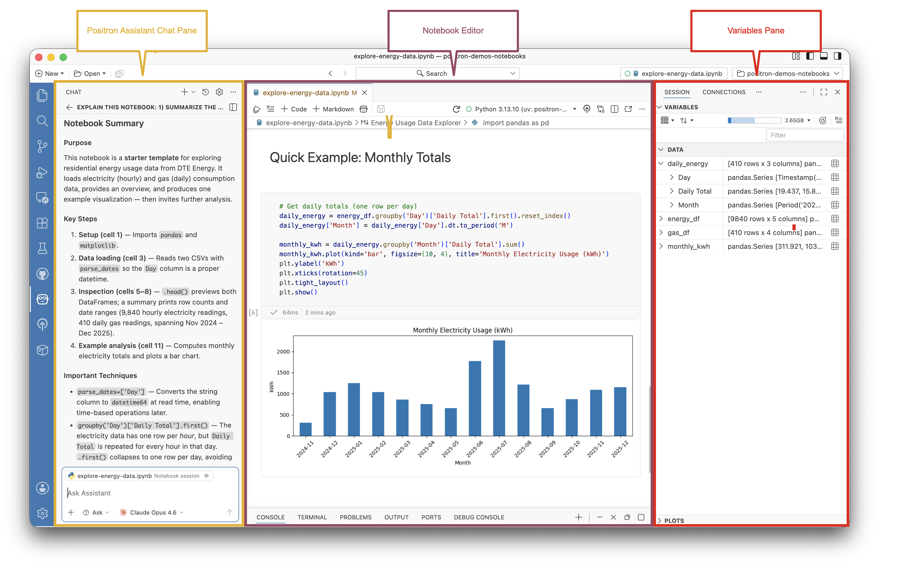
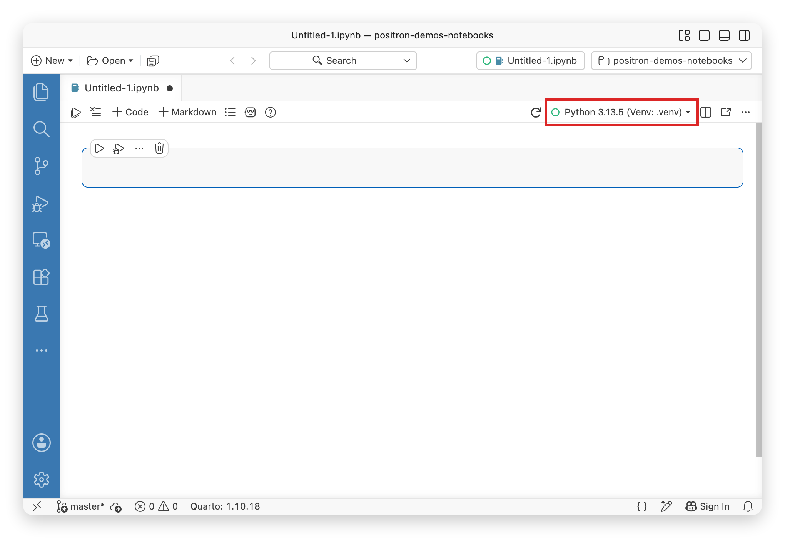
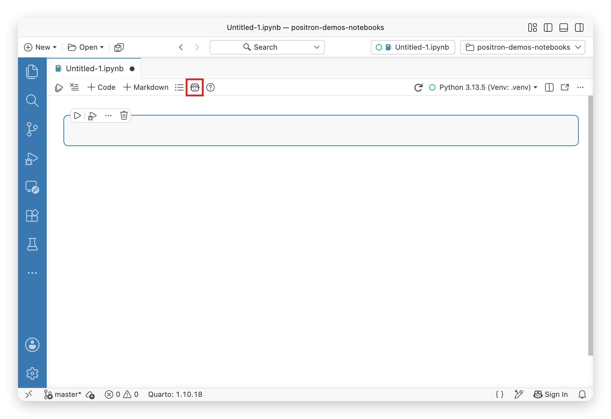
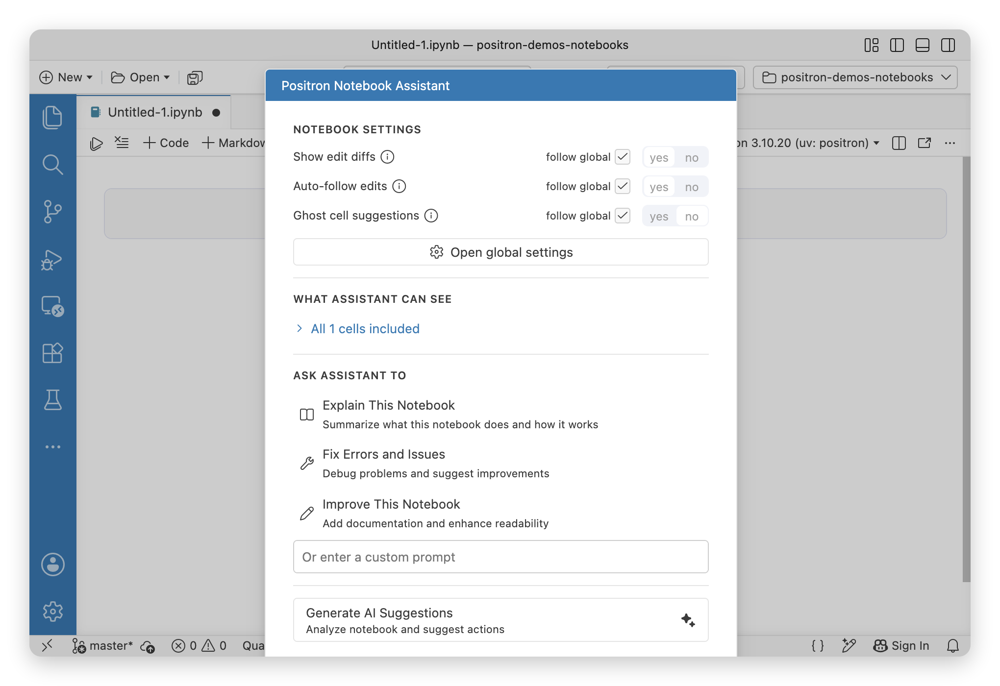

::: {.callout-note}
The Positron Notebook Editor is the default editor for Jupyter (`.ipynb`) files.
:::

The Positron Notebook Editor provides a familiar notebook experience for Jupyter (`.ipynb`) files. IDE features work out of the box in notebooks, including AI assistance, data exploration, and debugging.

## Key features

- **Batteries-included experience**: No extensions required for core features
- **Improved user experience**: Optimized for data science workflows
- **Notebook-aware AI assistance**: AI understands your notebook context, execution history, and execution order
- **Integrated data exploration**: Variables pane and Data Explorer work seamlessly
- **[Debugging](notebook-debugging.qmd)**: Works out of the box without additional setup
- **Improved version control**: Control what metadata is saved for better diffing and version control

## Use the Positron Notebook Editor

The Positron Notebook Editor is the default editor for Jupyter Notebooks, so your `.ipynb` files open in it automatically. If you prefer the [legacy notebook editor](jupyter-notebooks.qmd#legacy-notebook-editor), disable the [`positron.notebook.enabled`](positron://settings/positron.notebook.enabled) setting, and `.ipynb` files will open in the legacy notebook editor instead.

## Getting started

You can create and edit `.ipynb` files in Positron just as you would in other editors. To learn how to use the Positron Notebook Editor, check out our [demo notebook](https://github.com/posit-dev/positron-demos-notebooks/).

### Notebook layout

For the best experience, open the Command Palette with  and run the _View: Notebook Layout_ command. This layout arranges the IDE panes into a notebook-friendly setup, giving you quick access to your variables, plots, and other data science tools alongside your notebook.

<!-- TODO(screenshot): re-capture Notebook layout screenshot with the current Assistant UI -->

{fig-alt="Positron IDE with labeled regions: Assistant Chat pane on left, Notebook Editor in center showing code and a bar chart, and Variables pane on right."}

To learn more about customizing the Positron interface, read the [Layout](layout.qmd) documentation.

### Setting up your environment

Positron comes bundled with Jupyter kernel support for R and Python. Once you have [configured a Python or R environment](managing-interpreters.qmd) for Positron, you do not need to install any additional dependencies into your environment before using a notebook.

If an environment installed on your computer is not available in Positron, you might want to read more about how Positron discovers [Python installations](python-installations.qmd) and [R installations](r-installations.qmd).



{fig-alt="Notebook Editor action bar with the kernel selector dropdown highlighted in red, showing a Python virtual environment selected."}

You can select a different interpreter for the notebook by selecting the **Kernel Selector** in the notebook editor action bar. The **Change Kernel...** option will display a list of all the registered interpreters. Select an interpreter from the list.

Alternatively, you can run the _Positron Notebook: Change Kernel..._ command from the Command Palette.

When a notebook is the active editor, the Interpreter picker also offers a **Change Notebook Session...** action that opens the same kernel-selection list.

You can restart the notebook session at any time by selecting the  icon in the notebook editor action bar.

## Running cells

Each code cell has a **Run Cell** button in its action bar. The cell action bar also offers **Run Cells Above** and **Run Cells Below** to run everything before or after the current cell, and the notebook action bar has a **Run All Cells** button.

<!-- TODO(screenshot): a code cell with the cell action bar visible (Run Cell, Debug Cell, Run Cells Above/Below) -->

The most common ways to run code with the keyboard:

| Shortcut | Description |
| -------- | ----------- |
|  | Run the current cell |
|  | Run the current cell and select the cell below |
|  | Run the current cell and insert a new cell below |
|  | While editing a cell: run the selected code, or the current line if nothing is selected. Otherwise: run all cells |
|  | [Debug the current cell](notebook-debugging.qmd) |

While a cell is running, its **Run Cell** button becomes **Stop Cell Execution**, and the **Run All Cells** button becomes **Stop Execution**. To interrupt the kernel from the keyboard, press  twice while no cell editor is focused.

After a cell runs, its execution order appears as a numbered badge next to the cell, and a status footer below the cell shows whether the run succeeded, how long it took, and when it last ran.

<!-- TODO(screenshot): cell status footer showing success check mark, duration, and relative timestamp -->

## Cells

Notebooks are made up of code cells, markdown cells, and raw cells. Add a cell with the **Code** or **Markdown** buttons between cells, or press  /  to insert a code cell above/below the current cell while no cell editor is focused. Convert a cell to a different type with  (code),  (markdown), or  (raw).

### Markdown cells

Markdown cells render rich content, including:

- **Math**: Inline and block LaTeX math rendered with KaTeX, including `\begin{}`/`\end{}` environments
- **Diagrams**: Fenced code blocks with the `mermaid` language render as [Mermaid](https://mermaid.js.org/) diagrams
- **Images**: Local, relative, and remote image paths
- **Code blocks**: Syntax highlighting for fenced code blocks
- Tables, footnotes, superscript and subscript, and linkable headings

Double-click a rendered markdown cell (or press ) to edit it, and run it to render.

### Cell tags

Cell tags, used by tools like Quarto and papermill, are shown as pills below each cell. Select **Add Tag** from the cell's **...** menu (or run _Notebook: Add Tag_ from the Command Palette) to tag the current cell, click a tag to edit it, and use _Notebook: Toggle Cell Tag Visibility_ or _Notebook: Remove All Cell Tags_ to manage tags across the notebook. Tags are saved to the cell metadata in the notebook file.

<!-- TODO(screenshot): a code cell with tag pills visible in the cell footer -->

## Cell outputs

### Rich output support

The Positron Notebook Editor renders these output types natively:

| Output | MIME types |
| ------ | ---------- |
| Text, including terminal colors | `text/plain`, stdout and stderr streams |
| Errors and tracebacks | notebook error output |
| HTML | `text/html` |
| Markdown | `text/markdown` |
| Math | `text/latex` (rendered with KaTeX) |
| Images | `image/png`, `image/svg+xml` |
| JSON | `application/json` (interactive collapsible viewer) |
| Tables | Interactive inline data grids for supported data frame outputs |

Interactive outputs from libraries such as Plotly, Bokeh, HoloViews, and [Jupyter Widgets (ipywidgets)](https://ipywidgets.readthedocs.io/) are rendered in sandboxed webviews, so interactive figures and widgets work as expected.

### Inline Data Explorer

When a cell outputs a data frame, the Positron Notebook Editor displays it as an interactive data grid instead of a static table. You can scroll and explore the data inline, or select **Open in Data Explorer** in the grid's header to open the full [Data Explorer](data-explorer.qmd). Control this behavior with the [Inline Data Explorer settings](#settings-inline-data-explorer).

<!-- TODO(screenshot): inline data explorer grid in a notebook cell output with the Open in Data Explorer button visible -->

### Output actions

Hold the pointer over an output to reveal its action bar. From there (or from the output's right-click menu) you can:

- **Copy Output**: Copy the output's text content ( when the output is focused)
- **Copy Image**: Copy an image output, such as a plot, to the clipboard
- **Copy JSON**: Copy a JSON output to the clipboard
- **Collapse Output** / **Expand Output**: Hide or show the output ( while no cell editor is focused)
- **Truncate Output** / **Show Full Output**: Limit long text output to a scrollable region, or show all of it ()
- **Clear Output**: Remove the cell's output

To clear every output in the notebook, run _Notebook: Clear All Outputs_ or press  .

<!-- TODO(screenshot): output action bar shown on hover over a plot output, with Copy Image visible -->

## Notebook outline

Select the **Toggle Outline** button in the notebook action bar to open the Outline view, which shows a table of contents built from your markdown headings and code cells. Select an entry to jump to that cell. The same structure powers the editor breadcrumbs and the _Go to Symbol in Editor..._ command.

<!-- TODO(screenshot): Outline view next to a notebook showing nested markdown headings -->

## AI integration

The Positron Notebook Editor integrates with [Posit Assistant](assistant.qmd) to provide notebook-aware AI assistance:

- **Context-aware**: Assistant has access to rich context about your notebook, including cell states, execution history, code, and outputs including images and tables.
- **Dynamic Suggestions**: Assistant follows your work and dynamically suggests actions to improve your notebook.
- **Actionable Editing**: With your permission, Assistant can directly edit and run cells in your notebook.
- **Transparent**: You can inspect and control the specific context the Assistant is using.
- **Collaborative**: Use [Follow Assistant](#follow-assistant) to automatically scroll and highlight cells as they are edited.

<!-- TODO(video): verify notebook-ai-quick-actions.mp4 still matches the current Assistant UI; re-record if stale -->



### Enable Posit Assistant

To use the integrated notebook AI features, first configure a language model provider. See the [Getting Started](assistant-getting-started.qmd) guide for more details. We recommend using Anthropic for the best experience.

Once you are signed in, you will see assistant specific actions in the notebook editor action bar. To disable notebook AI features, set [`notebook.ai.enabled`](positron://settings/notebook.ai.enabled) to `false`. See [Configure AI features](ai-configuration.qmd) for other ways to turn AI features on and off.

<!-- TODO(screenshot): re-capture assistant action bar screenshot with the current UI -->

{fig-alt="Notebook action bar showing the Assistant icon button."}

### Notebook Assistant panel

The Notebook Assistant panel provides a quick way to interact with Assistant directly from your notebook. To open it, select the **Assistant** icon button in the notebook editor action bar.

<!-- TODO(screenshot): re-capture assistant panel screenshot with the current UI -->

{fig-alt="Notebook Assistant panel showing context cells, quick actions like Fix, Explain, and Improve, and AI-generated suggestions based on the notebook state."}

From the panel, you can:

- **View context**: See which cells are included in the Assistant context
- **Quick actions**: Run common actions like explaining the contents of a notebook or fixing errors in a notebook
- **Generate suggestions**: View dynamically generated suggestions based on the current state of the notebook

Selecting an option from the panel will open a new [**Chat** pane](assistant-chat.qmd) with the notebook context already attached.

### Fix and explain cell errors {#notebook-fix-and-explain}

When a cell fails to run, Positron shows **Fix** and **Explain** buttons right on the error output. Choose one to send the error to Assistant for immediate help:

- **Fix:** Assistant diagnoses the error and suggests a corrected version of your code.
- **Explain:** Assistant describes what your code does, analyzes the error, and suggests possible solutions, without editing your notebook.

<!-- TODO(video): verify notebook-fix-error.mp4 still matches the current UI; re-record if stale -->



The main button starts a new chat with the error attached as context. Use the dropdown arrow next to it to send the error to your current chat instead.

### Ghost cell suggestions (experimental)

Ghost cell suggestions use AI to predict your next step after you execute a cell. A ghost cell appears below the current cell with a suggested action you can accept, edit, or dismiss.

To enable ghost cell suggestions, set [`positron.assistant.notebook.ghostCellSuggestions.enabled`](positron://settings/positron.assistant.notebook.ghostCellSuggestions.enabled) to `true`. By default, suggestions appear automatically after cell execution. To trigger suggestions yourself, disable [`positron.assistant.notebook.ghostCellSuggestions.automatic`](positron://settings/positron.assistant.notebook.ghostCellSuggestions.automatic) and click **Get Suggestion** or press .

### Follow assistant

When the Assistant is actively editing cells in your notebook, you may want to watch its progress. Select **Follow Assistant** in the notebook editor action bar to have the notebook automatically scroll to cells as they are edited. This lets you review changes in real-time.

## Version control

The Positron Notebook Editor controls what metadata is saved to the notebook file. This makes notebooks more version-control-friendly. By default, cell outputs are saved but execution counts are not. You can adjust this behavior with the [Saving settings](#saving) below.

### Export to scripts and Quarto

To convert a notebook to another format, select **Export...** from the notebook editor's **...** menu. You can export a notebook to:

- A **Quarto document** (`.qmd`)
- A **Python script** (`.py`) with `# %%` cell markers
- An **R script** (`.R`) with `# %%` cell markers

The exported file opens in a new tab, ready to save. Exporting to Quarto is a convenient path to [publishing notebooks](publish-to-connect.qmd) or continuing your work in a version-control-friendly plain text format; see the [Quarto documentation](quarto.qmd) for more.

<!-- TODO(screenshot): the Export... format picker opened from the notebook toolbar -->

## Notebook console (experimental)

The notebook console gives a notebook its own Console session, so you can run ad hoc code against the notebook's kernel without adding cells. To try it, enable the [`console.showNotebookConsoleActions`](positron://settings/console.showNotebookConsoleActions) setting, then select **Open Notebook Console** from the kernel menu in the notebook action bar. Related experimental settings:

- [`console.showNotebookConsoles`](positron://settings/console.showNotebookConsoles): Automatically show a console for each open notebook.
- [`console.notebookPlotPreviewHeight`](positron://settings/console.notebookPlotPreviewHeight): Control the height of plot previews in the notebook console (0 to disable).

## Keyboard shortcuts

Press  in a notebook to open the **Notebook Help** panel, which lists all notebook shortcuts and commands. You can also run _Notebook: Show Notebook Commands_ from the Command Palette to search every notebook command.

Like Jupyter, the notebook has two modes: *edit mode* (typing inside a cell editor) and *command mode* (a cell is selected but the editor is not focused). Press  to edit the selected cell and  to return to command mode. Command mode shortcuts include:

| Shortcut | Description |
| -------- | ----------- |
|  /  or  /  | Move focus between cells |
|  /  | Insert a code cell above / below |
|  /  /  | Copy / cut / paste cell |
|  or   | Delete cell |
|  /  | Undo / redo |
|  /  /  | Change cell to code / markdown / raw |
| ... | Change cell to heading 1-6 |
|  /  | Move cell up / down |
|  | Join selected cells |
|  /  | Toggle cell output / output scrolling |
|   | Interrupt kernel |
|  | Select all cells |
|  | Find in notebook |
|  | Toggle line numbers |

While editing a cell, run the _Notebook: Split Cell_ command to split the cell at the cursor.

## Customization & settings
#### General

- [`positron.notebook.enabled`](positron://settings/positron.notebook.enabled): Use the Positron Notebook Editor as the default editor for `.ipynb` files. Enabled by default.
- [`positron.notebook.experimental`](positron://settings/positron.notebook.experimental): Enable experimental Positron Notebook features. Experimental features might change or be removed in future releases.


#### Saving

- [`notebook.save.outputs`](positron://settings/notebook.save.outputs): Save outputs to the notebook file. Enabled by default.
- [`notebook.save.executionCounts`](positron://settings/notebook.save.executionCounts): Save execution counts to the notebook file for version-control-friendly notebooks.

#### Outputs

- [`notebook.output.scrolling`](positron://settings/notebook.output.scrolling): Make long text outputs scrollable by default. Override per output with **Truncate Output** / **Show Full Output**.
- [`notebook.output.textLineLimit`](positron://settings/notebook.output.textLineLimit): Number of text lines to show before truncating an output.
- [`notebook.output.fontSize`](positron://settings/notebook.output.fontSize) and [`notebook.markup.fontSize`](positron://settings/notebook.markup.fontSize): Adjust output and markdown font sizes.

#### Inline Data Explorer {#settings-inline-data-explorer}

- [`positron.notebook.inlineDataExplorer.enabled`](positron://settings/positron.notebook.inlineDataExplorer.enabled): Display data frames inline as interactive data grids. Enabled by default.
- [`positron.notebook.inlineDataExplorer.maxHeight`](positron://settings/positron.notebook.inlineDataExplorer.maxHeight): Set the maximum height in pixels for inline data explorers in notebook and Quarto outputs. Default to 300 pixels.

#### Assistant

- [`notebook.ai.enabled`](positron://settings/notebook.ai.enabled): Enable or disable all AI features in the Notebook Editor, including ghost cell suggestions, the Notebook Assistant panel, Visualize, and [cell Fix & Explain actions](#notebook-fix-and-explain). Enabled by default. Note: notebook AI features are active only when both `notebook.ai.enabled` and [`ai.enabled`](positron://settings/ai.enabled) are `true`.
- [`positron.assistant.notebook.autoFollow`](positron://settings/positron.assistant.notebook.autoFollow): Automatically scroll to cells modified by the AI assistant. Enabled by default.
- [`positron.assistant.notebook.suggestions.model`](positron://settings/positron.assistant.notebook.suggestions.model): Set the model used when generating AI suggestions in notebooks.
- [`positron.assistant.notebook.deletionSentinel.show`](positron://settings/positron.assistant.notebook.deletionSentinel.show): Show deletion sentinels when cells are deleted. When disabled, cells are deleted immediately without undo placeholders. Enabled by default.
- [`positron.assistant.notebook.deletionSentinel.timeout`](positron://settings/positron.assistant.notebook.deletionSentinel.timeout): Time in milliseconds before deletion sentinels auto-dismiss (0 to disable auto-dismiss).
- [`positron.assistant.notebook.showDiff`](positron://settings/positron.assistant.notebook.showDiff): Show a diff view for AI assistant edits to notebook cells. When disabled, the assistant applies changes directly without requiring approval. Enabled by default.

#### Ghost cell suggestions (experimental)

- [`positron.assistant.notebook.ghostCellSuggestions.enabled`](positron://settings/positron.assistant.notebook.ghostCellSuggestions.enabled): Show AI-generated suggestions for the next cell after successful cell execution. A ghost cell with a suggested next step will appear after a brief delay.
- [`positron.assistant.notebook.ghostCellSuggestions.automatic`](positron://settings/positron.assistant.notebook.ghostCellSuggestions.automatic): When enabled, suggestions appear automatically after cell execution. When disabled, a placeholder appears and you can request a suggestion by clicking **Get Suggestion** or pressing .
- [`positron.assistant.notebook.ghostCellSuggestions.delay`](positron://settings/positron.assistant.notebook.ghostCellSuggestions.delay): Time in milliseconds to wait after cell execution before showing ghost cell suggestions.
- [`positron.assistant.notebook.ghostCellSuggestions.maxVariables`](positron://settings/positron.assistant.notebook.ghostCellSuggestions.maxVariables): Maximum number of session variables to include in ghost cell suggestion context. Variables are prioritized by relevance (DataFrames and tables first, then collections and scalars). Set to 0 to disable variable context.
- [`positron.assistant.notebook.ghostCellSuggestions.model`](positron://settings/positron.assistant.notebook.ghostCellSuggestions.model): Model patterns for ghost cell suggestions. Patterns are tried in order until a match is found (case-insensitive partial matching). Falls back to the current chat session model, then the provider's model, then the first available model.
