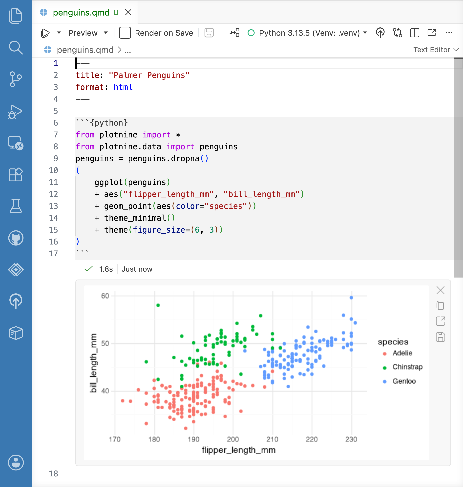

{width=800}

Positron can optionally display the output of Quarto cells in the source editor, similar to a [Jupyter Notebook](jupyter-notebooks.qmd) or RStudio's [R Notebooks](https://posit.co/blog/r-notebooks) feature. To enable inline output, turn on [`quarto.inlineOutput.enabled`](positron://settings/quarto.inlineOutput.enabled).

## Per-document kernels

When you turn off inline output, Positron's Quarto execution model is similar to RStudio's; running code from a Quarto cell sends it to the Console where you have Python or R running.

```{mermaid}
%%| fig-align: center
graph LR
q1[Quarto Doc 1] --> rc[Console]
q2[Quarto Doc 2] --> rc
q3[Quarto Doc 3] --> rc
```

When you turn on inline output, the execution model changes, and the Quarto document behaves more like a Jupyter Notebook. Positron creates an isolated Python or R session for each `.qmd` file. This matches typical render-time behavior, improves reproducibility by using a clean environment for each document, and resolves ambiguities around working directories.

```{mermaid}
%%| fig-align: center
graph LR
q1[Quarto Doc 1] --> rc1[Interpreter Session 1]
q2[Quarto Doc 2] --> rc2[Interpreter Session 2]
q3[Quarto Doc 3] --> rc3[Interpreter Session 3]
```

## Working directory

When you turn on inline output, code in a Quarto document runs with the document's folder as the working directory. This matches how Quarto sets the working directory when it renders a document, so relative file paths behave the same way when you run code interactively and when you render.

Because Positron starts each document's Python or R session in the document's folder, startup files in that folder take effect when the session starts. For example:

- **R:** an `.Rprofile` in the document's folder runs instead of your user-level `~/.Rprofile`. This includes renv activation scripts.
- **Python:** the document's folder is on the module search path, so you can import local modules that live alongside the document.

Untitled documents don't have a folder, so their sessions start in the first workspace folder, or in your home directory if no folder is open.

## Consoles

By default, a Quarto document with inline output enabled behaves like a Jupyter Notebook, and notebooks don't have consoles by default. To pair a console with your document, run the _Console: Show Notebook Console_ command. Notebook consoles let you execute code in the same session used by your Quarto document without changing the document itself, and they echo any code you run from the editor.

To always show a console for your Quarto documents as well as your Jupyter Notebooks, turn on [`console.showNotebookConsoles`](positron://settings/console.showNotebookConsoles).

## Managing outputs

Positron creates and saves output as you run code in the document. To clear the output for a document, run the _Quarto: Clear All Outputs_ command.

Positron caches Quarto cell outputs separately from the document in its global state directory. In typical situations, you don't need to manage the cache, but if you are concerned about space usage or need to reset the cache, run the _Quarto: Clear Inline Output Cache_ command.

## Fix and explain chunk errors {#quarto-fix-and-explain}

When a chunk errors while running with inline output enabled, Positron shows **Fix** and **Explain** buttons next to the error. Choose one to send the error to Posit Assistant for immediate help:

- **Fix:** Assistant diagnoses the error and suggests a corrected version of your code.
- **Explain:** Assistant describes what your code does, analyzes the error, and suggests possible solutions, without editing your document.

The main button starts a new chat with the error attached as context. Use the dropdown arrow next to it to send the error to your current chat instead. These buttons only appear for errors from a live run of the chunk, not ones restored from a previous session.

To use Fix and Explain, first [set up a language model provider](assistant-getting-started.qmd). See [Configure AI features](ai-configuration.qmd) for ways to turn AI features on and off.

## Limitations

Inline output for Quarto documents is a new feature in Positron, and has some differences from the RStudio implementation you may be familiar with. The following limitations apply; links go to GitHub issues.

- You [cannot share a single R or Python session among multiple Quarto documents](https://github.com/posit-dev/positron/issues/12732).
- Documents containing a mix of R and Python [are not executed with Reticulate](https://github.com/posit-dev/positron/issues/13161).
- Quarto documents in subfolders [don't run the parent .Rprofile or renv scripts](https://github.com/posit-dev/positron/issues/4695).
- Positron reads execution options (such as width and height) only from Quarto-style options (`#| width: foo`), not from Knitr-style chunk-header options (`{width=foo}`).
- `input()` in Python, `readline()` in R, and other [functions that read user input do not work](https://github.com/posit-dev/positron/issues/13050) in inline cells.
