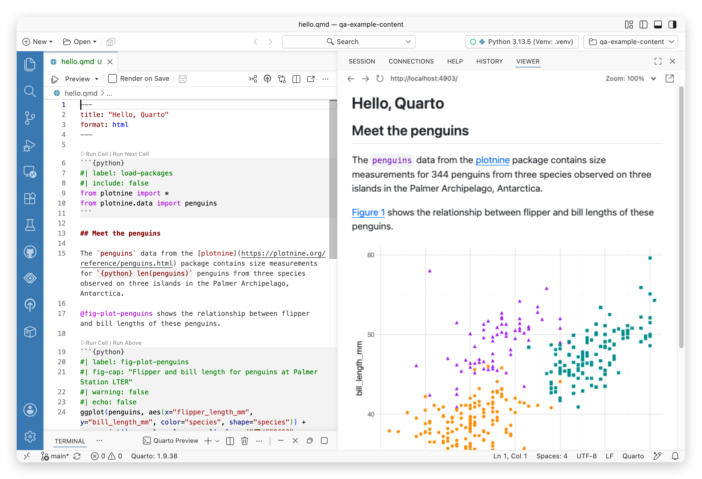

[Quarto](https://quarto.org/) is an open-source scientific and technical publishing system for creating reproducible documents that combine narrative and executable code.

Positron enhances how you can use Quarto in several important ways:

- Quarto works out of the box in Positron. The Quarto CLI is bundled in Positron, and the Quarto extension is included as a [bootstrapped extension](extensions.qmd#bootstrapped-extensions).
- Features such as statement execution work seamlessly in Positron's Console, and Positron supports integrated rendering and preview of Quarto documents.
- Positron provides rich UI via [custom action bars](action-bars.qmd) to preview your Quarto document, control rendering behavior, and switch between source and visual mode,

{width=700}

Learn more in the Quarto documentation about [getting started with Quarto and Positron](https://quarto.org/docs/get-started/hello/positron.html), or [the details of using Positron as a tool for working with Quarto](https://quarto.org/docs/tools/positron/).

:::{.callout-note}
Quarto's [visual editor](https://quarto.org/docs/tools/positron/visual-editor.html) has limited support in Positron. It is a great fit for rich text authoring, but statement execution and other language features are not supported. Consider switching to source mode when you need such features, and [follow along on GitHub for updates](https://github.com/posit-dev/positron/issues/1805) on this support.
:::

## Inline output

Positron can optionally display the output of Quarto cells in the source editor, similar to RStudio's [R Notebooks](https://posit.co/blog/r-notebooks) feature. To enable inline output, turn on [`positron.quarto.inlineOutput.enabled`](positron://settings/positron.quarto.inlineOutput.enabled).

### Per-document kernels

When inline output is disabled, Positron's Quarto execution model is similar to RStudio's; running code from a Quarto cell sends it to the R Console.

```{mermaid}
q1[Quarto Doc 1] --> rc[R Console]
q2[Quarto Doc 2] --> rc
q3[Quarto Doc 3] --> rc
```

When inline output is enabled, the execution model changes, and the Quarto document behaves more like a notebook. Positron creates an isolated R or Python session for each `.qmd` file. This matches typical render-time behavior, improves reproducibility by using a clean environment for each document, and resolves ambiguities around working directories.

```{mermaid}
q1[Quarto Doc 1] --> rc1[R Session 1]
q2[Quarto Doc 2] --> rc2[R Session 2]
q3[Quarto Doc 3] --> rc3[R Session 3]
```

### Consoles

By default, a Quarto document with inline output enabled behaves like a notebook, and notebooks don't have consoles by default. To pair a console with your document (like RStudio), run the _Console: Show Notebook Console_ command. Notebook consoles let you execute code in the same session used by your Quarto document without changing the document itself, and they echo any code you run from the editor.

To always show a console for your Quarto documents, enable the _Console: Show Notebook Consoles_ command.

### Managing outputs

Positron creates and saves output as you run code in the document. To clear the output for a document, run the _Quarto: Clear All Outputs_ command.

Positron caches Quarto cell outputs separately from the document in its global state directory. In typical situations, you don't need to manage the cache, but if you are concerned about space usage or need to reset the cache, run the _Quarto: Clear Inline Output Cache_ command.

### Limitations

Inline output for Quarto documents is a new feature in Positron, and has some differences from the RStudio implementation you may be familiar with. The following limitations apply; links go to GitHub issues.

- HTML widgets and other [interactive HTML content are not supported](https://github.com/posit-dev/positron/issues/4219).
- You [cannot share a single R or Python session among multiple Quarto documents](https://github.com/posit-dev/positron/issues/12732).
- Execution indicators in the gutter [do not track progress line by line](https://github.com/posit-dev/positron/issues/13505).
- There is [no real-time preview for LaTeX equations](https://github.com/posit-dev/positron/issues/13288).
- Documents containing a mix of R and Python [are not executed with Reticulate](https://github.com/posit-dev/positron/issues/13161).
- Quarto documents in subfolders [don't run the parent .Rprofile or renv scripts](https://github.com/posit-dev/positron/issues/4695).
- Positron reads execution options (such as width and height) only from Jupyter-style options (`#| width: foo`), not from Knitr-style chunk-header options (`{width=foo}`).
- `readline()` and other [functions that read user input do not work](https://github.com/posit-dev/positron/issues/13050) in inline cells.


## Support for R Markdown

Quarto provides Positron's support for [R Markdown](https://rmarkdown.rstudio.com/); there is limited specialized IDE support for R Markdown other than what is provided by Quarto. Some advanced `.Rmd` features like using `params` are not supported for interactive use. 

Positron's [Command Palette](command-palette.qmd) does provide commands for working with R Markdown: 

- _R: Render Document With R Markdown_ renders an `.Rmd` file using the R package [rmarkdown](https://pkgs.rstudio.com/rmarkdown/) instead of Quarto. This approach _does_ support all `.Rmd` features but does _not_ automatically open a preview of the rendered output.
- _R: New R Markdown from Template_ creates a new `.Rmd` file from an [R Markdown template](https://rstudio.github.io/rstudio-extensions/rmarkdown_templates.html) available in an installed R package, such as the GitHub flavored markdown template or the flexdashboard templates.

## Using the Quarto extension

The Quarto extension is included as a [bootstrapped extension](extensions.qmd#bootstrapped-extensions) in Positron. This means that it will behave just like you installed it yourself; this extension will update automatically when a new version is available from the [extension gallery](extensions.qmd#extension-gallery) and it can be uninstalled if desired.

## Managing Quarto installations

Positron bundles a version of the Quarto CLI, but you can also use a version of the Quarto CLI that you have installed yourself. This should typically work automatically, but you can manage exactly which Quarto to use via the [`quarto.path`](positron://settings/quarto.path) setting. Check the bottom status bar to see which version of Quarto is being used currently.[^1]

[^1]: If you change the version of Quarto you are using, you will need to restart Positron to see the status bar update.
