::: {.callout-note}
Is this the right tutorial to start with? It picks up where [First data analysis with Python in a Jupyter Notebook](tutorial-get-started-ipynb.qmd) and [Migrate from VS Code to Positron](tutorial-migrate-from-vscode.qmd) leave off. If you have not worked through those, start there. This tutorial assumes you already know how to: 

1. Install Positron
2. Use the Command Palette
3. Run a notebook cell

:::

Positron is a free, source-available IDE for data science, built on the same open source core as VS Code. In the earlier tutorials, you used Positron to build a notebook by hand. In this one, you will bring an AI assistant alongside you to write, extend, and improve an analysis, while you stay in control of the result.

You will work through a small analysis from raw data to a published dashboard, using the AI features you might reach for every day:

- Posit Assistant, the AI assistant built into Positron
- The `/notebook` and `/report` commands, which turn a conversation with Posit Assistant into a Jupyter notebook or a Quarto document
- Notebook-aware AI, including the Notebook Assistant panel and one-click cell fixes
- Ghost cell suggestions, which suggest the next cell for your notebook

The whole path runs on one dataset: a spreadsheet of retail orders that you will aggregate into quarterly sales, visualize, and ship as an interactive dashboard.

## Open the workshop project

The dataset you will use lives in a GitHub repository, alongside a `requirements.txt` file that lists the packages you will need.

You can clone a repository without leaving Positron. The **New Folder from Git** option, available on the Welcome screen or from the Command Palette, clones a remote repository and opens it as your project.

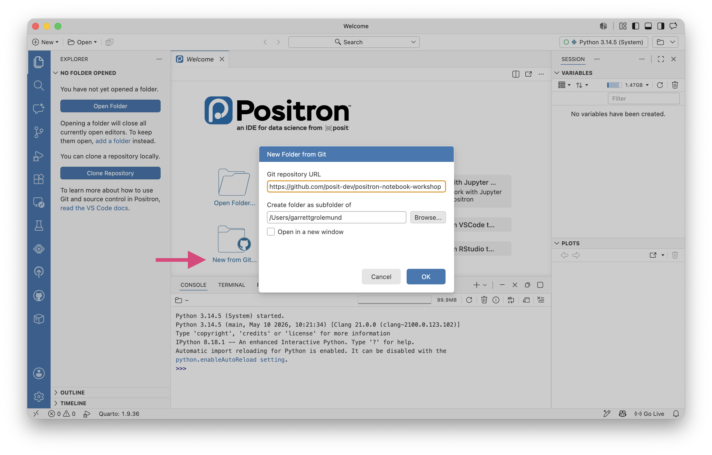{fig-alt="The Positron IDE displaying the New Folder from Git wizard."}

::: {.callout-tip title="Try it now"}
Open the Command Palette with , run _Workspaces: New Folder from Git_, and paste the repository URL when prompted:

```default
https://github.com/posit-dev/positron-notebook-workshop
```

Choose a location, then open the cloned folder when Positron offers to.

**You will know it worked when** the **Explorer** in the left sidebar shows the project files, including a `data` folder and `requirements.txt`.

:::

When the project opens, Positron detects the `requirements.txt` and offers, through a notification, to create an environment and install the packages for you. You can dismiss that notification for now. We will set the environment up deliberately in a later step so you can see what it does.

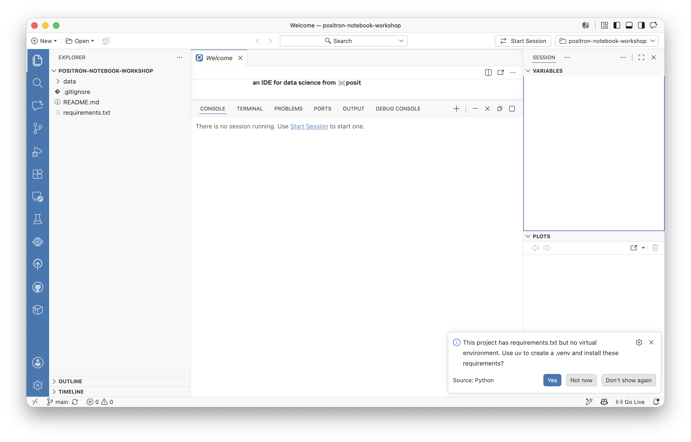{fig-alt="The new Positron window displaying a notification in the bottom right corner."}

## Explore the data in the Data Explorer

Let's take a look at the data before setting a goal. The dataset is an Excel file, `data/retail_sales.xlsx`. You can open Excel files directly in the Positron Data Explorer and inspect them without writing any code or converting the file first.

The Data Explorer is a sortable, filterable table with per-column summary statistics. It gives you four ways to get your bearings in an unfamiliar table:

- Scroll through the rows or columns to see cell values. Pin a row or column so it stays in view while you scroll.
- Sort on a column by clicking its header.
- Filter to a subset with the filter controls in the table header.
- View summary statistics for each column in the expandable sidebar.

::: {.callout-tip title="Try it now"}
In the **Explorer**, double-click `data/retail_sales.xlsx`. It opens in the Data Explorer as a table of retail orders.

1. Scroll down to get a feel for the roughly 9,800 rows.
2. Pin the `order_id` column so it stays visible.
3. Sort by `sales` to find the largest single order. On which date did it occur?

**You will know it worked when** you can name the two columns this analysis will need: `order_date` and `sales`.

:::

{width=600 fig-alt="The Positron Data Explorer showing a table of retail orders, with the order_id column pinned and the rows sorted by the sales column."}

## Set a goal

Now that you know the data, here is the goal: aggregate the orders into total sales per quarter, then visualize the trend.

To keep a reproducible record, you will express the work as Python code. That means the next step is to set Positron up to run Python for this project.

## Set up a reproducible Python environment

A virtual environment is a self-contained Python setup with its own packages. Let's add one to this project so its dependencies stay separate from everything else on your computer. The `requirements.txt` in the workshop repository pins the exact versions the analysis needs, including the pandas, openpyxl, itables, and plotnine packages.

You saw Positron offer to build this environment when the project opened. You can accept that notification anytime and it does the same thing as the steps below. Here you will run it from the Command Palette so you can see each choice.

The _Python: Create Environment_ command creates a virtual environment and, when it finds a `requirements.txt`, installs the packages listed there.

::: {.callout-tip title="Try it now"}
1. Run _Python: Create Environment_ from the Command Palette.
2. Choose **venv** (or **uv**, if it is available).
3. Select a Python version when prompted. The latest stable version is a good default.
4. When Positron asks which dependencies to install, select `requirements.txt`.

**You will know it worked when** a `.venv` folder appears in the **Explorer** and the packages from `requirements.txt` install without errors. The new environment also becomes the active interpreter, shown in the interpreter picker in the top right.

:::

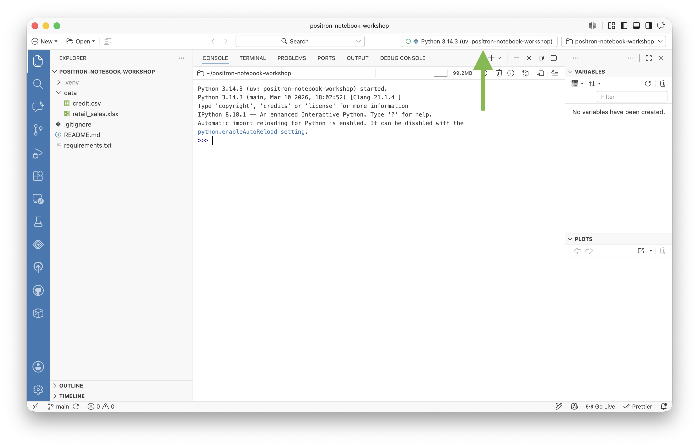{fig-alt="Positron displaying the new environment as the active interpreter, shown in the interpreter picker in the top right."}

::: {.callout-note}
If Positron does not pick up the environment, run _Interpreter: Discover All Interpreters_ to refresh the list. See [Python installations and environments](python-installations.qmd) for the full set of options.
:::

## Configure a language model provider

You are set up to run Python reproducibly. Now let's set up Positron to run a large language model (LLM).

Posit Assistant is the AI assistant built into Positron. It does not include a language model of its own. Instead, it sends your prompt, along with context such as your open files and your session's data, to a language model provider that you choose and sign in to. The provider runs the model and returns the response, which Posit Assistant shows in the chat. 

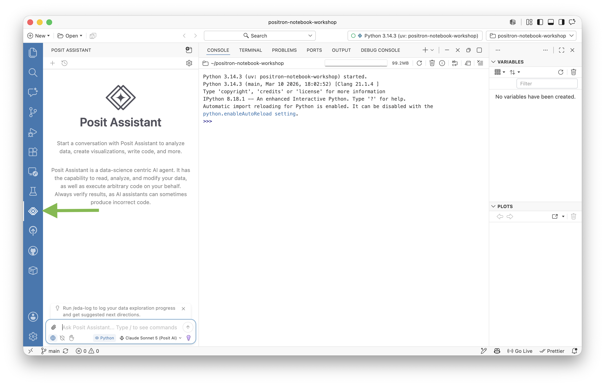{fig-alt="Positron with Posit Assistant loaded in the left sidebar."}

To use Posit Assistant, you must first log in to a model provider with _Authentication: Configure Language Model Providers_. Posit Assistant lists every provider by default, but none is active until you authenticate with it.

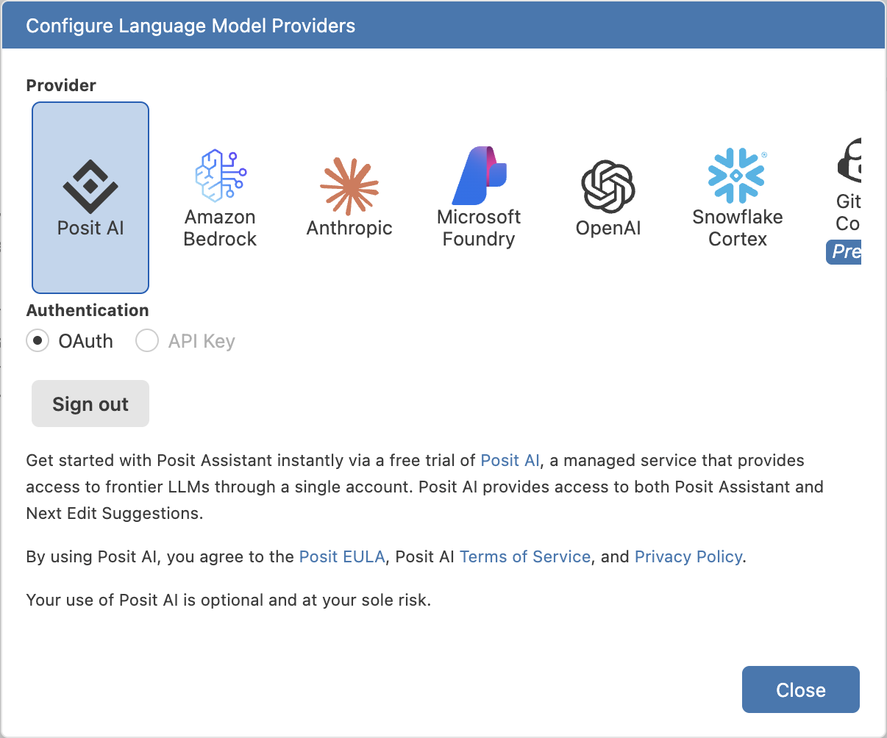{width=500 fig-alt="The Posit Assistant Configure Language Model Providers window."}

Because providers differ in what account and credentials they need, the steps below are deliberately general. Use whichever provider you already have access to. If you do not have one, [Posit AI](assistant-providers.qmd#posit-ai) is the most direct way to get started. You can start a free trial at [posit.ai](https://posit.ai/) and sign in through your browser, with no API keys to manage.

::: {.callout-tip title="Try it now"}
1. Run _Authentication: Configure Language Model Providers_ from the Command Palette.
2. Select your provider from the list.
3. Complete the sign-in or credential step the provider asks for. The [Language Model Providers](assistant-providers.qmd) reference lists what each one needs.

**You will know it worked when** the provider shows as connected and you can open a chat with _View: Show Posit Assistant_.
:::

::: {.callout-note}
For notebook work, we recommend an [Anthropic](assistant-providers.qmd#anthropic) model for the best experience. You can connect it directly, or reach Anthropic models through Posit AI.
:::

## Ask Posit Assistant to write the analysis

With a provider connected, describe the analysis in plain language and let Posit Assistant draft the code. A good request names three things:

- the files to work with
- the packages to use
- the outputs you want

so the assistant knows what to do and how to do it.

Before you send the request, predict what a correct answer looks like. You want the orders grouped by quarter, one row per quarter, and a chart with a bar and a line over the same quarterly totals. Holding that picture in mind makes it easy to judge whether the generated code did the right thing.

{width=500 fig-alt="A bar chart showing quarterly sales over time, with a superimposed line chart."}

::: {.callout-tip title="Try it now"}
Open Posit Assistant with _View: Show Posit Assistant_ and send this request:

```default
Read data/retail_sales.xlsx into a pandas DataFrame using openpyxl.
Parse order_date as a date and aggregate total sales by calendar quarter.
Then:
1. Show the quarterly totals as an interactive table with itables.
2. Plot quarterly sales as a plotnine bar chart with a line overlaying the same values.
Run the code and show me the results.
```

Posit Assistant proposes code and, with your permission, runs it in your environment. Review each step before you approve it.

**You will know it worked when** you see an interactive table of quarterly totals and a bar-and-line chart of sales over time.

:::

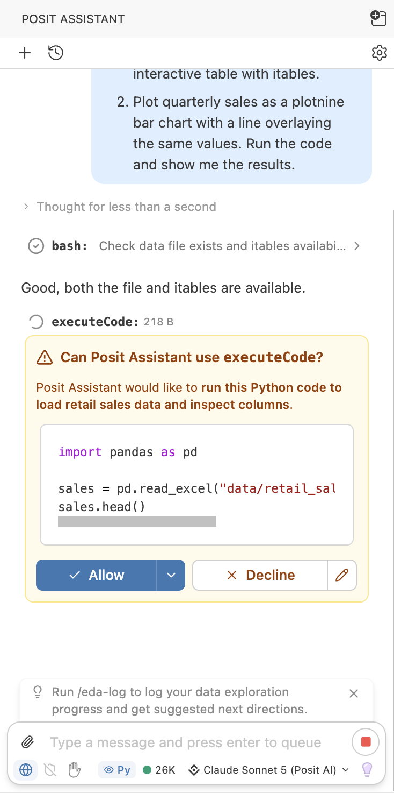{width=400 fig-alt="A chat with Posit Assistant asking permission to run lines of code."}

Your generated code will vary, but it will resemble this:

```python
import pandas as pd
from itables import show
from plotnine import ggplot, aes, geom_col, geom_line, labs

df = pd.read_excel("data/retail_sales.xlsx", engine="openpyxl")
df["order_date"] = pd.to_datetime(df["order_date"])
df["quarter"] = df["order_date"].dt.to_period("Q").astype(str)

quarterly = df.groupby("quarter", as_index=False)["sales"].sum()

show(quarterly)

(ggplot(quarterly, aes(x="quarter", y="sales", group=1))
 + geom_col(fill="#447099")
 + geom_line(color="#EE6331")
 + labs(title="Quarterly retail sales", x="Quarter", y="Sales"))
```

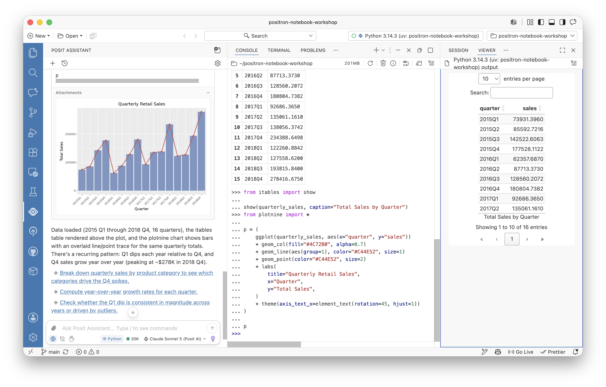{fig-alt="The Positron IDE showing a chart in the chat and a table in the viewer sidebar."}

If a result looks off, say so in the same conversation. Posit Assistant keeps the context as it makes revisions, so you can steer it toward the picture you predicted rather than starting over.

## Export the conversation as a notebook

The analysis works, but right now it lives in a chat. To save it as a reproducible artifact, type `/notebook` into the chat to export the conversation as a Jupyter notebook. Posit Assistant collects the code from your conversation into a `.ipynb` file that you can rerun, edit, and commit.

::: {.callout-tip title="Try it now"}
In the same conversation, type `/notebook` and send it. Posit Assistant exports the conversation's code as a Jupyter notebook and opens it in the Positron Notebook Editor.

**You will know it worked when** a new `.ipynb` file opens with your analysis laid out in cells.
:::

{fig-alt="Positron in Notebook Layout mode with a notebook open."}

Check the kernel selector in the notebook's action bar. The notebook runs on the `.venv` you created, so it uses the same pinned packages as the rest of the project. That is what makes the exported notebook reproducible rather than tied to whatever Python happened to be active.

## Work with AI inside the notebook

Posit Assistant is notebook-aware: Posit Assistant can see your cells, their outputs, and the order you ran them. That context powers a set of AI features you can reach without leaving the notebook. For the best view of them, run _View: Notebook Layout_ to arrange the assistant, the notebook, and the Variables pane side by side, as in the previous screenshot.

The notebook offers four AI entry points:

- The **Notebook Assistant panel**, opened from the **Assistant** button in the action bar, shows which cells are in context and offers quick actions to explain, fix, or improve the notebook. **Follow Assistant** scrolls the notebook to each cell as Posit Assistant edits it, so you can watch changes land.
- **Fix** and **Explain** buttons appear on any cell that errors, sending the failure straight to Posit Assistant.
- Ghost cell suggestions predict the next cell after you run one.
- Posit Assistant can edit the notebook when prompted from the chat.

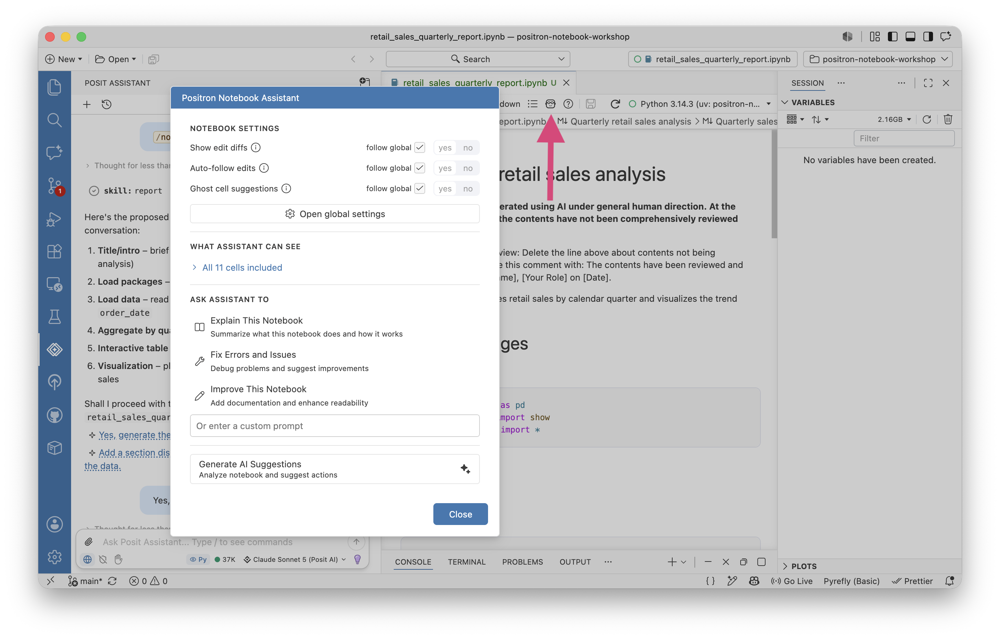{fig-alt="Notebook Assistant panel showing context cells, quick actions like Fix, Explain, and Improve, and AI-generated suggestions based on the notebook state."}

The next two sections put two of these to work.

## Fix a cell error with one click

Errors are a normal part of notebook work, and the fastest AI win is fixing one without copying the traceback anywhere. When a cell fails, Positron shows **Fix** and **Explain** buttons right on the error output. **Fix** sends the code and the error to Posit Assistant and proposes a corrected cell. **Explain** describes the cause without editing anything.

::: {.callout-tip title="Try it now"}
Introduce a small, deliberate error so you can practice the recovery. In any cell, misspell a column name, for example change `"sales"` to `"sale"`, and run it. When the cell fails:

1. Click **Fix** on the error output.
2. Read the correction Posit Assistant proposes.
3. Accept it and rerun the cell.

**You will know it worked when** Posit Assistant identifies the wrong column name, restores `"sales"`, and the cell runs cleanly.

:::

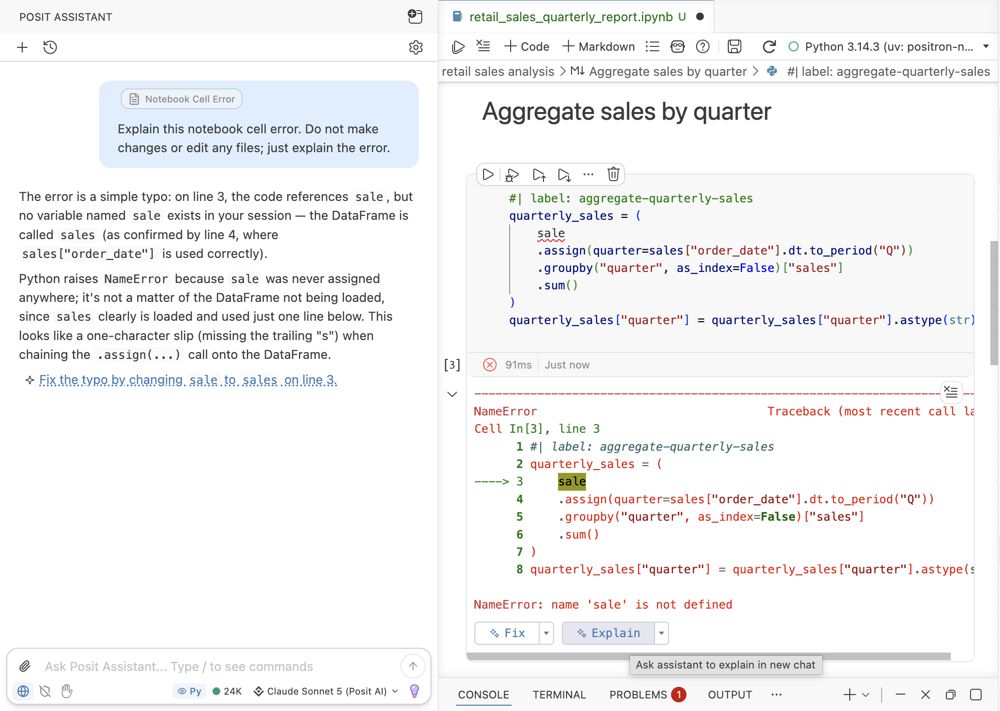{width=600 fig-alt="A Posit Assistant chat that explains the cause of the error seen in the notebook beside it."}

## Extend the notebook with a ghost cell

Ghost cell suggestions predict your next step after you run the final cell. A ghost cell appears below the current one with a suggested action you can accept, edit, or dismiss. The notebook proposes where to go next instead of waiting for a blank cell. Ghost cell suggestions are experimental and off by default, so you enable them first.

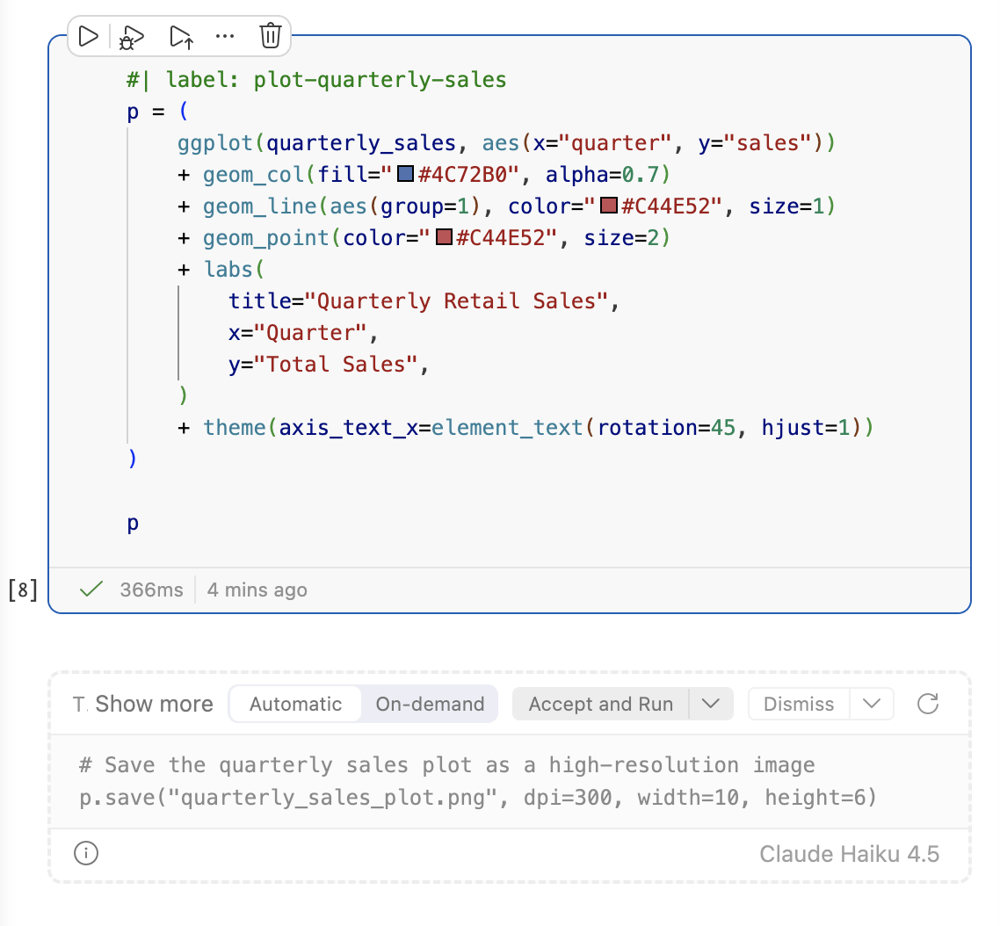{width=500 fig-alt="A notebook that displays a ghost cell below a regular cell."}

::: {.callout-tip title="Try it now"}
1. Run _Preferences: Open User Settings_.
2. Search for [`positron.assistant.notebook.ghostCellSuggestions.enabled`](positron://settings/positron.assistant.notebook.ghostCellSuggestions.enabled) in the settings. Set it to `true`.
3. Run the cell that builds your `quarterly` table.
4. Wait for the ghost cell to appear below it. To trigger it yourself instead, disable [`positron.assistant.notebook.ghostCellSuggestions.automatic`](positron://settings/positron.assistant.notebook.ghostCellSuggestions.automatic) and press .
5. Accept a suggestion that adds something useful, such as the quarter with the highest sales, or edit it before accepting.

**You will know it worked when** a suggested cell appears in faded text and becomes a real, runnable cell once you accept it.

:::


## Turn the notebook into a Quarto report

A notebook is a great place to work, but when you want to share results as a document, a Quarto report is a better container. It can render the same code and prose to HTML, PDF, Word, and more, so one source can become whatever format your audience needs.

The `/report` command in Posit Assistant creates a Quarto document from your conversation, the same way `/notebook` creates the Jupyter notebook.

If you already have a Jupyter notebook that you want to convert to a Quarto document, you can convert it to Quarto with _Notebook: Convert to .qmd_.

::: {.callout-tip title="Try it now"}
Run _Notebook: Convert to .qmd_ from the Command Palette.

**You will know it worked when** a `.qmd` file opens containing your code and explanatory prose. Click **Preview** at the top of the file to render an HTML version of the report.
:::

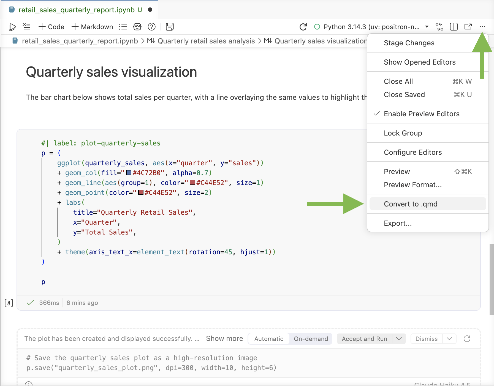{width=500 fig-alt="The Convert to .qmd item highlighted in the menu of the notebook pane."}

::: {.callout-note}
New to the format? See [Quarto](quarto.qmd) for how Positron renders and previews `.qmd` files.
:::

## Convert the report into a dashboard

Quarto can render that same document as a dashboard, a layout of cards arranged in rows and columns, built for at-a-glance reading. Because the analysis is already Quarto, turning it into a dashboard is a change to how the content is laid out, not a rewrite. Ask Posit Assistant to make that change.

::: {.callout-tip title="Try it now"}
With the `.qmd` open, ask Posit Assistant:

```default
Convert this Quarto document into a dashboard with format: dashboard.
Use a two-column layout, and add a toggle to switch between light and dark mode.
```

When Posit Assistant has finished, press **Preview** to render the dashboard and preview it.

**You will know it worked when** the report renders as a two-column dashboard with a control to switch between light and dark themes. The dashboard appears as an HTML file saved in your project folder.

:::

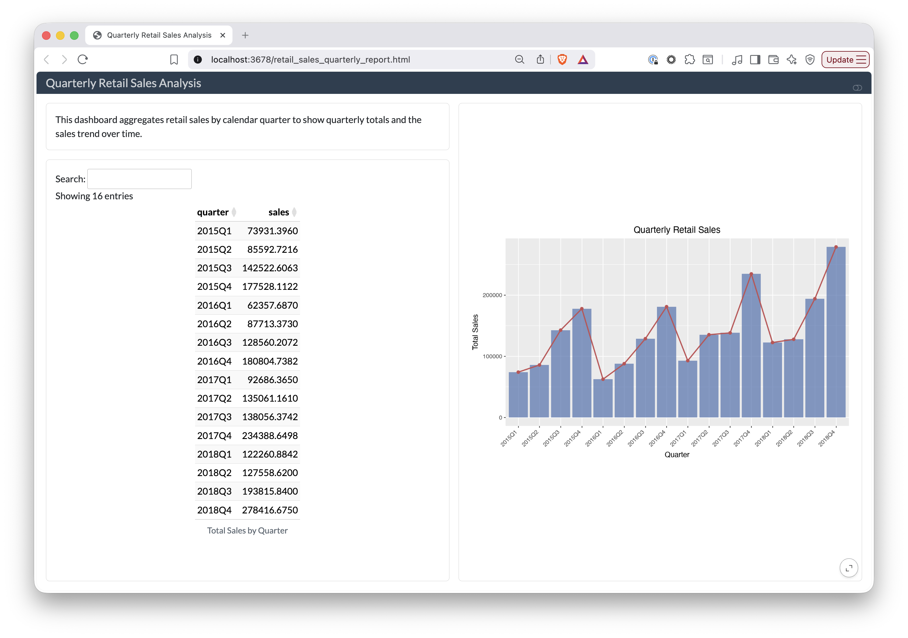{fig-alt="A two-column Quarto dashboard showing a quarterly sales table and a bar-and-line chart of sales over time, with a light and dark mode toggle."}

## Publish your dashboard

Your dashboard is a single file you can share several ways, all from inside Positron:

- Commit and push it with the Git client to store it in a repository like the one you cloned. See [Using Git in Positron](git.qmd).
- Publish it to [Posit Connect](publish-to-connect.qmd) or to Posit Connect Cloud with the Publisher extension, which deploys the rendered dashboard to a server your colleagues can open in a browser.

## Wrap up

You took one spreadsheet from raw data to a published dashboard, with AI as a collaborator. Along that path, you did the following:

- Explored `retail_sales.xlsx` in the Data Explorer and set a reproducible goal
- Built a virtual environment from `requirements.txt`
- Configured a language model provider for Posit Assistant
- Had Posit Assistant write the quarterly aggregation, an itables table, and a plotnine chart
- Exported the conversation with `/notebook`, then fixed a cell and extended it with a ghost cell
- Turned the analysis into a Quarto report and reshaped it into a publishable dashboard

Throughout, the AI drafted and the choices stayed yours: you reviewed each step, accepted or edited it, and kept a reproducible record you can rerun and share.

From here, dig deeper into the tools you used:

- [Posit Assistant](assistant.qmd)
- [Positron Notebook Editor](positron-notebook-editor.qmd)
- [Completions](assistant-completions.qmd)


