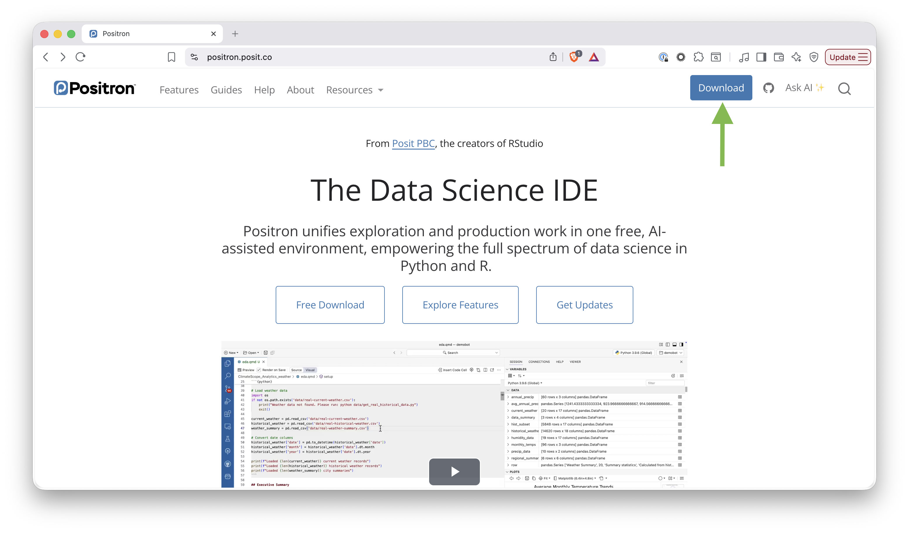
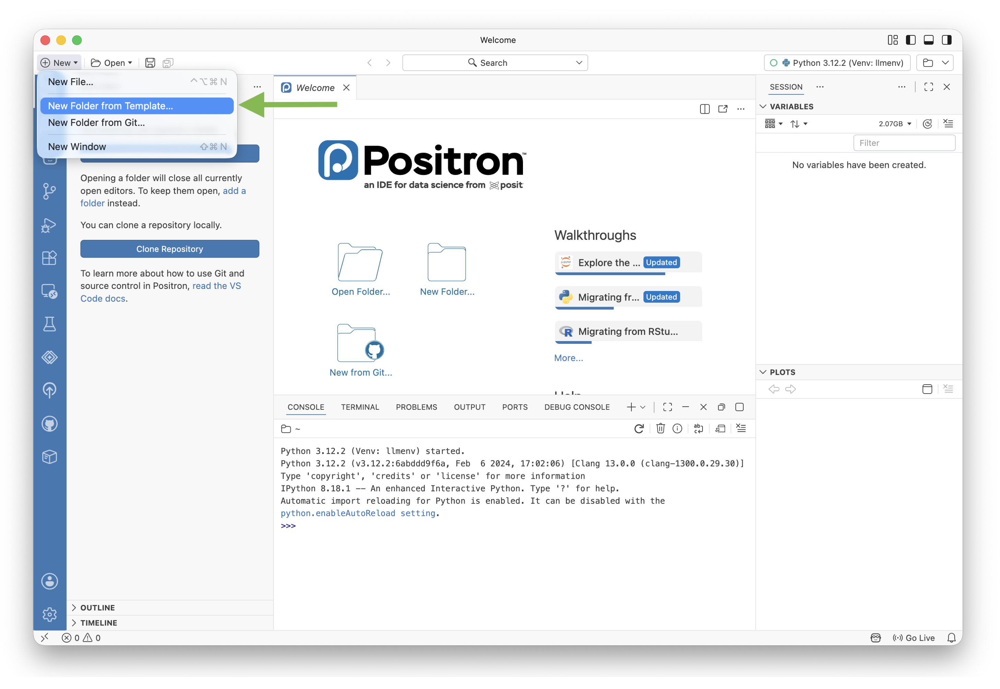
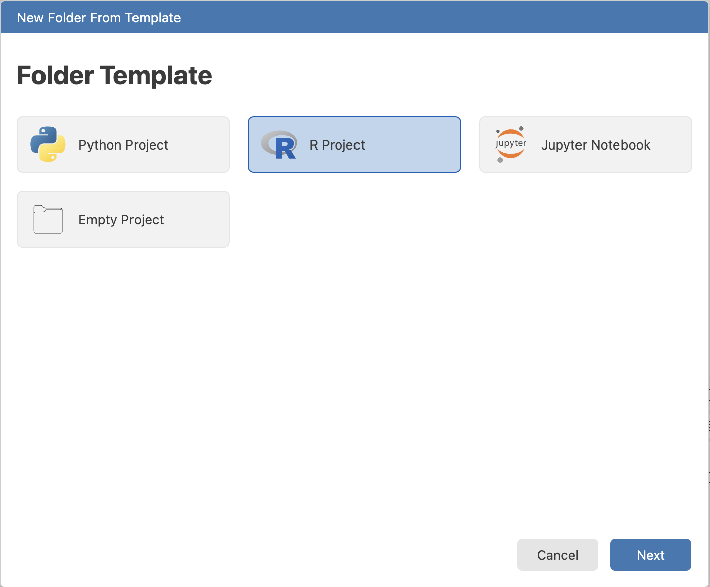
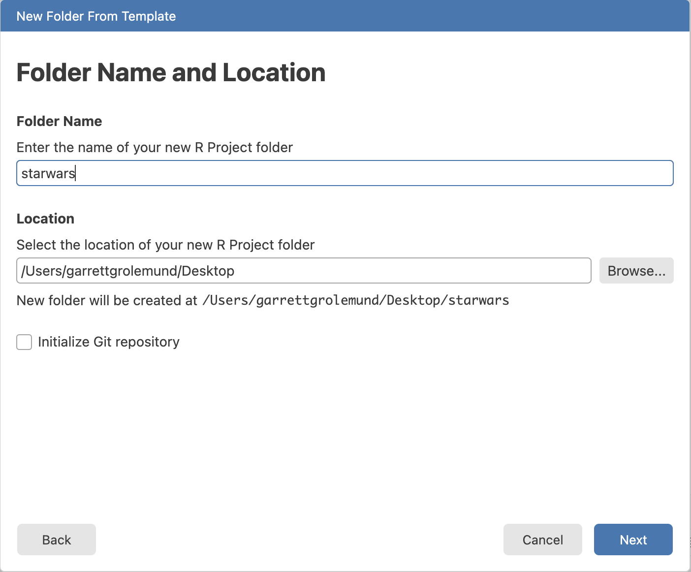
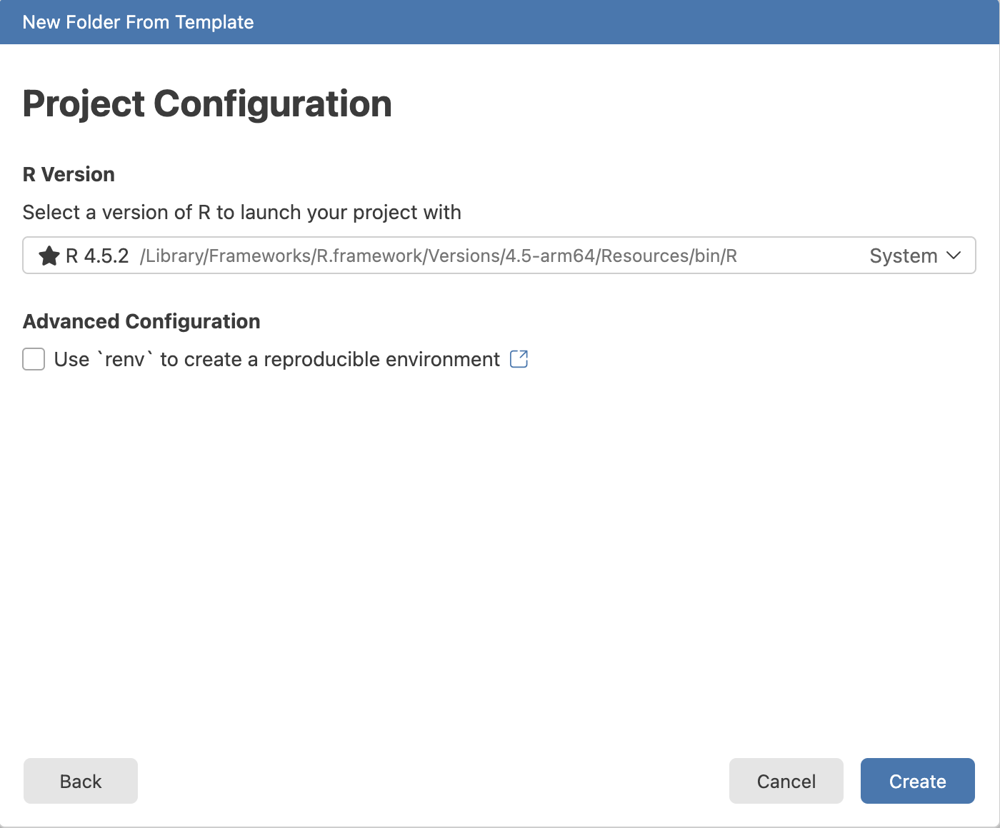
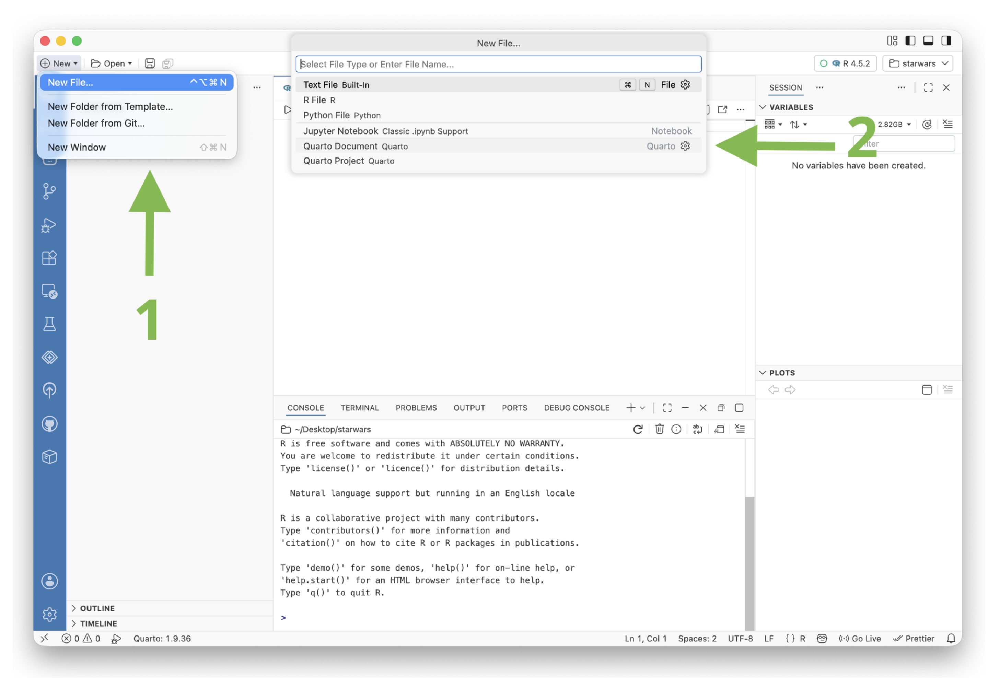
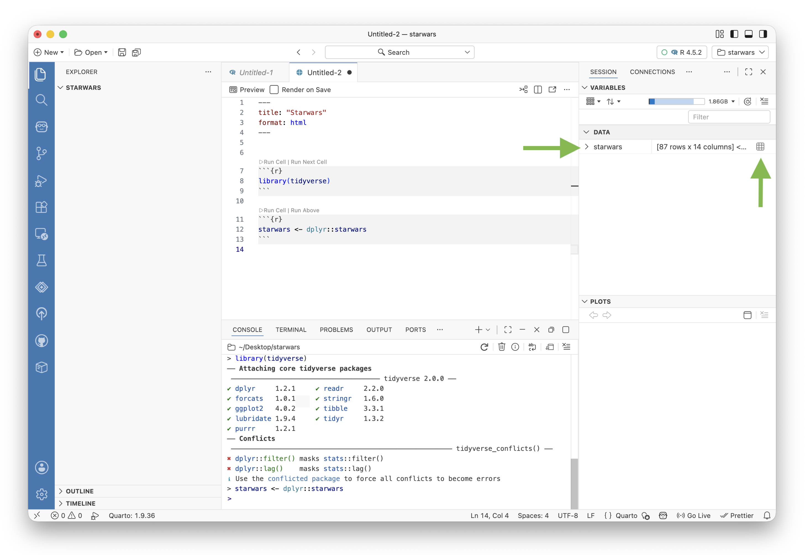

This quick tutorial will show you how to use [Quarto documents](quarto.qmd) within Positron. We will:

- Install Positron
- Create an R project
- Install the packages we need for our analysis
- Open a Quarto document
- Explore some data


## Install Positron

Positron is a free and source available code editor for data scientists. To install Positron on your computer, visit our [download page](download.qmd) and click **Download**.

{width=700 fig-alt="The Positron download page with the Download button."}

Follow the instructions to install Positron.

## Make a folder for your analysis

It is good practice to give each analysis its own folder. A folder keeps your scripts, data, and outputs together in one tidy place. Positron makes it easy to create one.

Follow these steps:

1. Open Positron
2. Select **New > New Folder from Template**

{width=700 fig-alt="New Folder from Template option in the File menu."}

3. Select **R Project** from the template list

{.drop-shadow width=450 fig-alt="R Project template option in the New Folder from Template dialog."}

4. Select a location for your project folder and give it a name. Then click **Next**.

{.drop-shadow width=450 fig-alt="Create R Project dialog."}

On the next screen, select a version of R to use from those available on your computer. Then click **Create**. Positron scaffolds the folder for you and launches an R console session automatically.

{.drop-shadow width=450 fig-alt="Create R Environment dialog."}

## Install packages

Now that we have a project set up, we need to install the packages we will use for our analysis. For this tutorial, we will use the tidyverse package, which includes dplyr for data manipulation and ggplot2 for visualization.

tidyverse is a collection of R packages designed for data science. It includes packages that share a common design philosophy and cover the basic data science tasks: data import, tidying, transformation, visualization, and more.

To install tidyverse, navigate to the R Console in Positron (**View > Console**) and run:

```r
install.packages("tidyverse")
```

You only need to install a package once. After that, you load it with `library()` each time you start a new R session.

## Open a Quarto document

Now that we have our project set up and the packages we need installed, we can open a Quarto document to start our analysis.

To create a new Quarto document in Positron:

1. Select **New > New File**
2. Select **Quarto Document** from the list of file types

{width=700 fig-alt="New Quarto Document option in the New File dialog."}

This opens a new `.qmd` file in your source editor. You can now start writing text and code.

A Quarto document is a plain text file that mixes markdown text with code cells. It is similar to an R Markdown document, but with more features and support for multiple languages. Learn more at the [Quarto documentation](https://quarto.org).

A Quarto document begins with a YAML header enclosed in `---` marks. This header contains metadata like the document's title and output format. Below the header, you write markdown text and insert code cells to run R code.

To insert a new R code cell, use the keyboard shortcut . This inserts a fenced code block that looks like this:

````markdown
```{{r}}

```
````

You can type your R code inside the cell and click ** Run** at the top right of the cell to execute it. The output appears directly below the cell in the editor.

## Explore some data

Now that we have our Quarto document open, we can start exploring some data. For this tutorial, we will use the `starwars` dataset, which is a built-in dataset in the dplyr package. It contains information about Star Wars characters, including their name, height, mass, species, and more.

Insert a new code cell with  and add the following code, then click **Run**:

```r
library(tidyverse)
```

This loads the tidyverse packages into your R session. Next, insert another code cell and run:

```r
starwars <- dplyr::starwars
```

Notice that the Variables pane to the right of the editor shows the `starwars` dataset. You can use the Variables pane to explore the columns in the dataset. Or you can click the grid-like icon to open the dataset in the Positron Data Explorer.

{width=700 fig-alt="Variables pane showing the starwars dataset variable."}

The Data Explorer allows you to sort and filter the data, as well as view summary statistics. If you would like to recreate a filter, click **Convert to Code** to copy the code for that filter to your clipboard. You can then paste that code into a cell in your Quarto document to run it.

Narrow the dataset down to human characters using the code generated by the Data Explorer:

```r
starwars_humans <- starwars |>
  filter(species == "Human")
```

This video shows how to open a Quarto document and use the Data Explorer to generate the filtering code above.

<script src="https://fast.wistia.com/player.js" async></script><script src="https://fast.wistia.com/embed/slcoszmj6l.js" async type="module"></script><style>wistia-player[media-id='slcoszmj6l']:not(:defined) { background: center / contain no-repeat url('https://fast.wistia.com/embed/medias/slcoszmj6l/swatch'); display: block; filter: blur(5px); padding-top:62.71%; }</style> <wistia-player media-id="slcoszmj6l" aspect="1.5946843853820598"></wistia-player>

Next we will visualize the relationship between height and mass for human Star Wars characters using ggplot2:

```r
ggplot(starwars_humans, aes(x = height, y = mass)) +
  geom_point(aes(color = gender), size = 3, alpha = 0.7) +
  geom_smooth(method = "lm", se = FALSE) +
  labs(
    title = "Star Wars Humans: Height vs Mass",
    x = "Height (cm)",
    y = "Mass (kg)"
  )
```

And then make a quick summary table showing average height and mass by gender:

```r
starwars_humans |>
  group_by(gender) |>
  summarize(
    avg_height = mean(height, na.rm = TRUE),
    avg_mass = mean(mass, na.rm = TRUE),
    n = n()
  ) |>
  arrange(desc(avg_height))
```

We can also write text in markdown between our code cells. For example, we can explain our work or add section headers. This is also a good time to change the title of your document, if you have not already.

Watch as we run the code above.

<script src="https://fast.wistia.com/player.js" async></script><script src="https://fast.wistia.com/embed/4vv88ac02n.js" async type="module"></script><style>wistia-player[media-id='4vv88ac02n']:not(:defined) { background: center / contain no-repeat url('https://fast.wistia.com/embed/medias/4vv88ac02n/swatch'); display: block; filter: blur(5px); padding-top:62.71%; }</style> <wistia-player media-id="4vv88ac02n" aspect="1.5946843853820598"></wistia-player>

## Save your document

To save your document, click **Save** in the toolbar or use the keyboard shortcut . The `.qmd` file appears in the File Explorer on the left.

::: {.callout-note}
If your project is version-controlled with Git, you can commit and push straight from the Git pane in Positron. This is handy for sharing your analysis or keeping a backup on GitHub.

Learn more about [using Git in Positron](git.qmd).
:::

## Render and preview your document

A major benefit of Quarto is that you can render your saved document into a polished report with a single shortcut. Press , or click **Preview** at the top of the editor.

Positron renders your `.qmd` file into an HTML document and displays a live preview in the Viewer pane alongside your source code. Every time you render, Quarto executes all of the code cells in order and produces a complete report with your text, code, and outputs.

The new HTML file is saved in the project folder beside your `.qmd` file. You can open this file in any web browser to view your report, or share it with others.

See this process unfold in the video.

<script src="https://fast.wistia.com/player.js" async></script><script src="https://fast.wistia.com/embed/vpzc1n2uhp.js" async type="module"></script><style>wistia-player[media-id='vpzc1n2uhp']:not(:defined) { background: center / contain no-repeat url('https://fast.wistia.com/embed/medias/vpzc1n2uhp/swatch'); display: block; filter: blur(5px); padding-top:62.71%; }</style> <wistia-player media-id="vpzc1n2uhp" aspect="1.5946843853820598"></wistia-player>

Turn on **Render on Save** (in Settings, via the checkbox on the editor action bar, or by adding `editor: render-on-save: true` to the YAML header) and your report refreshes every time you save the file.

## Conclusion

Well done! You have set up an R project in Positron, installed packages, and built a small data analysis inside a Quarto document. To learn more about Quarto, see the [Quarto documentation](https://quarto.org).


